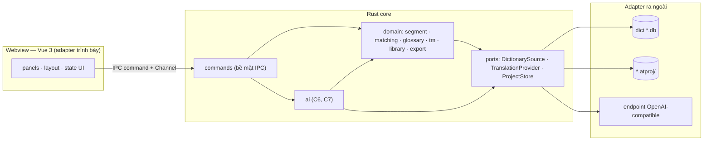
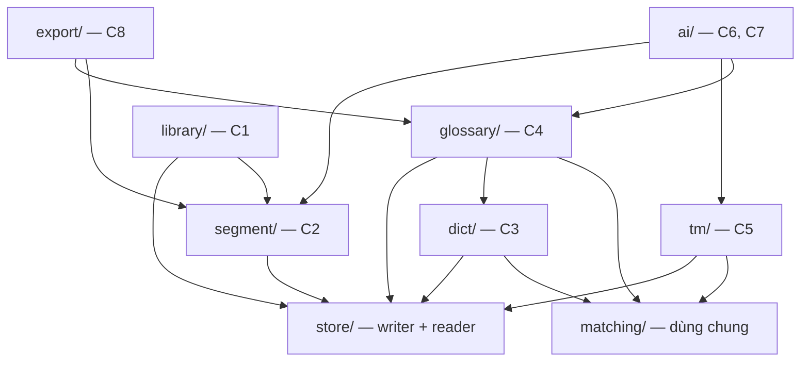
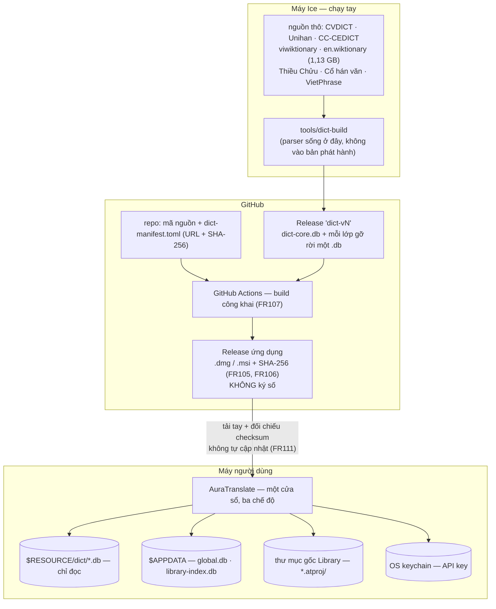
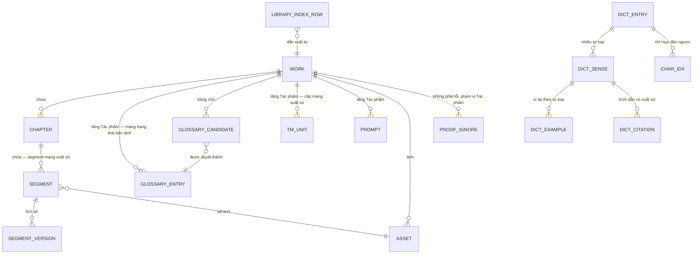

# Architecture Spine — AuraTranslate

## Design Paradigm

**Hexagonal liều thấp trong Rust core; webview là một adapter mỏng.**

Toàn bộ quy tắc nghiệp vụ sống trong Rust. Frontend Vue chỉ render và giữ state UI. Hexagonal áp ở **đúng ba cổng** — nơi ba yêu cầu khó nhất của sản phẩm trở thành hệ quả của cấu trúc thay vì lời hứa trong tài liệu:

| Cổng | Adapter | Biến FR nào thành hệ quả cấu trúc |
|---|---|---|
| `DictionarySource` | mỗi file `.db` từ điển | FR36 — gỡ lớp không làm hỏng tra cứu |
| `TranslationProvider` | endpoint tương thích OpenAI (cloud BYOK / Ollama / LM Studio) | FR77 — chạy đầy đủ khi không cấu hình AI |
| `ProjectStore` | `.atproj` trên đĩa | FR96–FR98 — nguồn sự thật vs chỉ mục dẫn xuất |

Ngoài ba cổng đó là module Rust thường, **không trait hoá**. Một người duy trì không nuôi nổi một rừng trait, và mười nhóm năng lực C1–C10 chồng lấn nhau quá nặng để làm ranh giới kỹ thuật.



## Invariants & Rules

### AD-1 — Mọi quy tắc nghiệp vụ nằm ở Rust; webview mỏng

- **Binds:** tất cả
- **Prevents:** hai bản cài đặt của cùng một quy tắc (tách câu, khớp ngôn ngữ) lệch nhau qua các giai đoạn → TM khớp sai âm thầm; quy tắc nghiệp vụ nằm trong vùng Tauri v2 mặc định coi là không đáng tin.
- **Rule:** frontend chỉ render và giữ state UI (focus, cuộn, vùng chọn, bố cục panel). Không cài đặt lại bất kỳ quy tắc nghiệp vụ nào ở TypeScript. Ngoại lệ duy nhất, tường minh: văn bản đang gõ trong Editor là state cục bộ frontend, chỉ qua IPC khi auto-save, xác nhận segment, hoặc rời segment.

### AD-2 — Đúng ba cổng, không hơn

- **Binds:** tất cả
- **Prevents:** FR36 và FR77 thoái hoá thành kỷ luật cá nhân; đồng thời tránh trait hoá tràn lan.
- **Rule:** chỉ `DictionarySource`, `TranslationProvider`, `ProjectStore` là port. Thêm port thứ tư là một quyết định kiến trúc, phải ghi thành `AD` mới.

### AD-3 — Segment mang ID bền, không bao giờ tái dùng

- **Binds:** C2, C5, C7, C9
- **Prevents:** định danh theo vị trí → tách một segment làm lịch sử phiên bản và ghi nhớ proofreader của mọi segment sau nó trỏ sai chỗ, không có thông báo lỗi. Định danh theo băm nội dung → trong truyện dài, câu lặp hàng trăm lần dùng chung danh tính.
- **Rule:** `segment.id` bất biến, không tái dùng sau khi về hưu. Thứ tự trong Chương là cột riêng (`ord`), sắp lại được mà không đụng `id`. Mọi dữ liệu gắn theo segment (lịch sử phiên bản, ghi nhớ proofreader, trạng thái xác nhận) tham chiếu `id`, không bao giờ tham chiếu vị trí.

### AD-4 — Ranh giới segment tính một lần lúc nhập, không bao giờ tính lại

- **Binds:** C2, C5, C7, C9
- **Prevents:** một lần cải thiện quy tắc tách câu (FR23 `[A4]`) âm thầm tách lại toàn bộ Thư viện, làm lịch sử phiên bản, trạng thái xác nhận và ghi nhớ proofreader của mọi Chương cũ trỏ sai chỗ.
- **Rule:** tách segment chạy khi nhập Chương và kết quả **lưu xuống** `.atproj`. Đường nhập song ngữ (FR115) tính ranh giới ở **cả hai phía** cùng lúc — khác đường nhập thường vốn chỉ tạo phía nguồn — nhưng vẫn đúng bất biến: tính **một lần** lúc nhập, không bao giờ tính lại. Không có đường mã nào tính lại ranh giới lúc nạp Chương. Quy tắc tách câu mới chỉ áp dụng qua thao tác **tái tách chủ động** của người dùng trên từng Chương, kèm cảnh báo về dữ liệu sẽ về hưu.

### AD-5 — Gộp/tách segment là về hưu + tạo mới

- **Binds:** C2, C5, C7, C9
- **Prevents:** segment ghép từ hai segment đã xác nhận tự nhận là đã xác nhận dù chưa ai đọc nó.
- **Rule:** segment cũ đánh dấu về hưu (lịch sử phiên bản của nó vẫn tra lại được); segment mới bắt đầu ở trạng thái **chưa xác nhận** với lịch sử rỗng. Cặp TM đã ghi ở lại nguyên. Cùng triết lý FR58: hệ thống không bao giờ tự coi một segment là đã xong.

  **Không áp cho FR116.** Thao tác nối câu lúc nhập song ngữ xảy ra **trước khi segment được ghi xuống đĩa**, trong màn xem trước — chưa có segment nào tồn tại để cho về hưu. Cài FR116 thành thao tác gộp *sau khi* nhập sẽ tạo rồi cho về hưu ngay hàng nghìn segment.

### AD-6 — Translation Memory khoá theo cặp văn bản, không theo segment

- **Binds:** C5, C2, C6, C8
- **Prevents:** TM vỡ mỗi khi segment bị gộp, tách hay tái tách.
- **Rule:** một mục TM là `(văn bản nguồn, văn bản đích) + metadata`, độc lập hoàn toàn với `segment.id`. Sửa bản dịch của một segment đã xác nhận thì **ghi thêm** cặp mới, không sửa cặp cũ (khớp FR63). Đây cũng là điều kiện để xuất TMX (FR64) có nghĩa.

### AD-7 — Năm loại kho, ranh giới sở hữu cứng

- **Binds:** tất cả
- **Prevents:** bảy giai đoạn xây dựng cách nhau nhiều tháng chọn lệch nhau về nơi dữ liệu sống.
- **Rule:**

  | Kho | Vai trò | Quyền lúc chạy |
  |---|---|---|
  | `dict-core.db` + mỗi `<lớp gỡ rời>.db` | dữ liệu từ điển | **chỉ đọc**, luôn luôn |
  | `<Tên>.atproj/` | **nguồn sự thật** của một Tác phẩm | đọc + ghi |
  | `global.db` | nguồn sự thật của tầng Global | đọc + ghi |
  | `library-index.db` | **dẫn xuất** | đọc + ghi, chỉ bởi Indexer |
  | OS keychain | chỉ API key | đọc + ghi, chỉ bởi Rust |

### AD-8 — Chỉ mục Library là dẫn xuất, một đường ghi duy nhất

- **Binds:** C1, C9
- **Prevents:** có chỗ ghi thẳng vào chỉ mục cho nhanh → FR98 và NFR10 mất hiệu lực; hoặc thao tác sửa chữa hiển nhiên nhất (xoá chỉ mục hỏng rồi dựng lại) xoá luôn Glossary/TM toàn cục người dùng tích luỹ hàng năm.
- **Rule:** `library-index.db` là **file riêng**, không nằm chung `global.db`. Chỉ component `Indexer` được ghi vào nó, và chỉ ghi **sau khi** `.atproj` đã ghi xong. Xoá `library-index.db` phải luôn là thao tác an toàn. Danh sách, lọc, sắp xếp và tìm kiếm của Library **đọc từ `library-index.db`**; `meta.json` là thứ `Indexer` đọc khi quét (FR99) và là đường dựng lại khi chỉ mục vắng mặt — không phải nguồn Library đọc trực tiếp lúc chạy.

### AD-9 — `.atproj` là một thư mục

- **Binds:** C1, C2, C9
- **Prevents:** Library phải mở hàng trăm database chỉ để lấy tên, bìa và tiến độ (đe doạ NFR4 `< 3 s` với 5.000 Chương); ảnh phải qua IPC mỗi lần render (FR42, FR43).
- **Rule:** `<Tên>.atproj/` chứa `meta.json` (metadata Library đọc được **không cần mở SQLite**), `project.db`, và `assets/` (ảnh là file thật, hiển thị qua asset protocol). Sao lưu = copy thư mục (FR102, đúng nguyên văn).

### AD-10 — Mỗi lớp từ điển gỡ rời là một file `.db` độc lập

- **Binds:** C3, C10
- **Prevents:** FR112 (chính sách gỡ bỏ) biến thành thay đổi mã nguồn + dựng lại 150–200 MB; FR36 chỉ nghiệm thu được bằng suy luận thay vì bằng test thật.
- **Rule:** năm nguồn nền sạch gộp trong `dict-core.db`; Thiều Chửu, Cổ hán văn, VietPhrase, HVTĐTD mỗi nguồn một file riêng. Runtime **không có mã riêng cho từng nguồn** — mọi nguồn đi qua cùng một adapter `DictionarySource`. Gỡ một lớp = xoá một file. Nghiệm thu FR36 bằng test thật: xoá file, chạy lại bộ test tra cứu. Mỗi file `.db` **tự mang metadata giấy phép và ghi công của chính nó**; màn hình Attribution (FR109) và ghi công trong bản phát hành (FR38) dựng từ các file có mặt — nên gỡ một lớp cũng gỡ luôn ghi công của nó, không để lại ghi công mồ côi khi thực thi FR112. Trường giấy phép phải biểu diễn được **cả giấy phép mở** (CC-BY-SA, Unicode License) **lẫn phép sử dụng riêng do tác giả cấp** — HVTĐTD thuộc loại thứ hai và **không thuộc GPL v3**; mô hình hoá trường này thành enum các giấy phép mở sẽ khiến nó bị gán nhãn sai ngay trên màn hình Attribution.

### AD-11 — Một writer duy nhất cho mỗi kho ghi được

- **Binds:** mọi module ghi dữ liệu
- **Prevents:** writer starvation và gai trễ không dự đoán được → NFR2 mất hiệu lực mà không lần ra được nguyên nhân.
- **Rule:** mỗi kho ghi được (`project.db`, `global.db`, `library-index.db`) có **đúng một** kết nối ghi, đặt sau một hàng đợi nối tiếp. Đọc dùng pool nhiều kết nối song song (WAL). **Không module nào được tự mở kết nối ghi.**

### AD-12 — Thời điểm checkpoint là quyết định của ứng dụng

- **Binds:** C9, C2
- **Prevents:** auto-checkpoint mặc định (1000 trang) rơi đúng lúc người dùng đang gõ → vi phạm NFR2. *(WAL2 mà báo cáo technical research đề xuất **không tồn tại** như tính năng đã phát hành — xem `.memlog.md`.)*
- **Rule:** `PRAGMA journal_mode = WAL`, `PRAGMA wal_autocheckpoint = 0`, `PRAGMA busy_timeout` đặt tường minh. Một luồng nền trên **kết nối riêng** gọi `wal_checkpoint(PASSIVE)` khi người dùng ngừng gõ một khoảng, và `wal_checkpoint(TRUNCATE)` khi đóng Tác phẩm hoặc thoát ứng dụng. Phải có ngưỡng kích thước WAL buộc checkpoint để `.db-wal` không phình vô hạn khi gõ liên tục hàng giờ.

### AD-13 — Không module nào ngoài `ai/` được phụ thuộc `ai/`

- **Binds:** tất cả
- **Prevents:** FR77 thoái hoá thành kỷ luật cá nhân qua bảy giai đoạn; lỗi chỉ lộ ra khi một người dùng không có API key thử.
- **Rule:** chiều phụ thuộc một chiều, có **test tự động** cưỡng chế (hoặc `ai/` là crate riêng để trình biên dịch cưỡng chế). Chiều ngược lại hợp lệ: `ai/` đọc `glossary/`, `tm/`, `segment/` để phục vụ FR70.



### AD-14 — Lắp prompt là một hàm thuần

- **Binds:** C6, C7
- **Prevents:** FR71 (xem prompt cuối cùng đã gửi) trở thành công việc đắt và không bao giờ chính xác 100% — mà đó lại là công cụ chẩn đoán duy nhất khi AI không tuân thủ Glossary.
- **Rule:** Smart RAG Injector là một hàm thuần nhận (câu nguồn, scope, Glossary, TM) và trả về **prompt đã lắp hoàn chỉnh**. Lời gọi AI nhận prompt đã lắp làm đầu vào. Không nối chuỗi rải rác ở chỗ gọi.

### AD-15 — Đúng hai điểm ra mạng trong toàn bộ ứng dụng

- **Binds:** tất cả
- **Prevents:** NFR12 (không telemetry) bị vi phạm vô tình qua crash reporter, thư viện analytics, hoặc một font CDN trong frontend.
- **Rule:** (1) adapter `TranslationProvider`; (2) kiểm tra phiên bản mới (FR111, chỉ kiểm tra và thông báo). **Không có điểm thứ ba.** CSP của Tauri cấm mọi origin từ xa — không CDN, không font ngoài, không ảnh ngoài. Mọi tài nguyên frontend đóng gói trong bản cài.

### AD-16 — Nội dung nhập từ ngoài không bao giờ render thành HTML

- **Binds:** C8, C1, C2
- **Prevents:** XSS trong một webview có quyền gọi IPC — mối đe doạ thật đứng sau đề xuất tách cửa sổ của research.
- **Rule:** `.docx`, `.md`, `.txt` từ reviewer được Rust phân tích thành **mô hình dữ liệu có cấu trúc**; Vue render từ mô hình đó. Không tồn tại đường nào đưa chuỗi từ file ngoài vào `v-html` hoặc tương đương.

### AD-17 — Một component Matcher dùng chung

- **Binds:** C3, C4, C5, C6
- **Prevents:** ba lần cài đặt riêng ở ba giai đoạn khác nhau → Glossary bắt được biến thể mà TM không bắt được, không ai biết vì sao.
- **Rule:** FR40 (từ điển), FR51 (Glossary), FR61 (TM) dùng **chung một** component. Tiếng Trung: khớp chính xác + n-gram ký tự, tách từ qua `jieba-rs` khi cần. Tiếng Anh: stemming rồi token n-gram. Giới hạn đã tuyên bố: là stemming, không phải lemmatization (FR40).

### AD-18 — Một ScopeResolver, ngữ nghĩa khai báo tường minh

- **Binds:** C4, C5, C6, C9
- **Prevents:** FR103 phát biểu chung là *"tầng dự án ghi đè tầng toàn cục"* → mỗi giai đoạn cài lại theo cách hiểu riêng, và TM toàn cục không bao giờ được dùng tới.
- **Rule:** mọi phân giải hai tầng đi qua một component. Ngữ nghĩa khai báo theo từng loại dữ liệu:

  | Loại | Ngữ nghĩa | FR |
  |---|---|---|
  | Glossary | **ghi đè** — tầng Tác phẩm thắng theo từng thuật ngữ | FR46 |
  | Prompt | **ghi đè** | FR69 |
  | Cấu hình AI | **ghi đè** | FR68 |
  | Translation Memory | **hợp nhất** — trả kết quả cả hai tầng | FR57 |

  **Thứ tự sắp xếp kết quả TM có hai khoá, khai tường minh vì hai chiều này chồng lên nhau:** khoá **chính** là **xuất xứ** (cặp *của tôi* trước, FR118); khoá **phụ** là **tầng** (Tác phẩm trước Global). Xuất xứ thắng vì một cặp TM toàn cục do **chính người dùng** dịch vẫn giống văn phong của họ hơn một cặp Tác phẩm do người khác dịch — mà mục đích của FR70 là học văn phong. Không khai thứ tự này thì Giai đoạn 4 và Giai đoạn 6 sẽ cài lệch nhau.

  Xác nhận segment (FR56) **chỉ** ghi vào TM Tác phẩm. TM toàn cục chỉ nhận qua thao tác chủ động (nhập TMX, hoặc đẩy lên tầng toàn cục).

### AD-19 — Không tồn tại bước hợp nhất nguồn từ điển

- **Binds:** C3
- **Prevents:** ai đó thêm một bước khử trùng lặp cho gọn UI và làm mất FR31/FR32 — nguyên tắc nền, không phải tuỳ chọn hiển thị.
- **Rule:** đường tra cứu trả về **kết quả theo từng nguồn**, giữ nguyên bất đồng. Trong toàn bộ hệ thống không có hàm nào hợp nhất nghĩa giữa các nguồn. Cột `source` bắt buộc trên mọi bản ghi nghĩa.

### AD-20 — Đề xuất tự động vào bảng chờ, không bao giờ vào Glossary

- **Binds:** C4, C8
- **Prevents:** FR55 (*không cơ chế nào được tự ghi vào Glossary*) thoái hoá thành kỷ luật — đây là trụ định vị #1 phát biểu dưới dạng cấu trúc dữ liệu.
- **Rule:** FR52 (quét khi nhập) và FR54 (thu hoạch từ bản review) ghi vào **bảng chờ riêng**. Chỉ thao tác duyệt của người dùng mới chuyển một mục từ bảng chờ sang Glossary, và mục đó mang trường xuất xứ (FR47).

### AD-21 — Rust không bao giờ trả về văn bản hiển thị

- **Binds:** tất cả
- **Prevents:** NFR16 (*chuỗi giao diện ngoài mã nguồn ngay từ dòng code đầu tiên*) bị thủng ở tầng lỗi — chỗ dễ quên nhất và đắt nhất để sửa sau.
- **Rule:** mọi lỗi và thông báo qua IPC có hình dạng `{ code, message_key, params, retryable }`. Frontend phân giải `message_key` trong file tài nguyên chuỗi. Không có chuỗi tiếng Việt nào trong mã Rust hay mã Vue.

### AD-22 — Streaming AI qua Channel, không tự kết nối lại

- **Binds:** C6, C7
- **Prevents:** auto-reconnect tạo ra một yêu cầu mới hoàn toàn → với BYOK, người dùng bị tính phí hai lần và nhận về văn bản trùng lặp.
- **Rule:** dùng Tauri Channel API (không dùng event rời) cho luồng token. Không dùng client SSE tự kết nối lại. Đứt luồng là quyết định tường minh của ứng dụng; thử lại **do người dùng chủ động** (FR75). Mọi lời gọi AI huỷ được giữa chừng (FR73).

### AD-23 — Phạm vi filesystem hai tầng, cưỡng chế bởi Tauri

- **Binds:** tất cả
- **Prevents:** *"không ai đọc được tài liệu của bạn"* thoái hoá thành lời hứa thay vì ràng buộc do framework cưỡng chế.
- **Rule:** scope **tĩnh** khai trong capabilities — `$RESOURCE/dict/**` (chỉ đọc), `$RESOURCE/fonts/**` (chỉ đọc, font nhúng), `$APPDATA/**` (đọc + ghi, cho `global.db` và `library-index.db`). Scope **động** cấp lúc chạy chỉ khi người dùng chọn qua hộp thoại — thư mục gốc Library (mặc định `~/Documents/AuraTranslate/`) và đường dẫn export từng lần. Không đường mã nào chạm path ngoài scope.

### AD-24 — Một cửa sổ OS, ba chế độ

- **Binds:** C1, C2, C8
- **Prevents:** tách cửa sổ để lấy bảo mật là trả bằng chính thứ sản phẩm bán (FR16 — *một cửa sổ thay cho bốn năm cửa sổ*). Mối đe doạ thật đã được AD-15 và AD-16 bịt đúng chỗ.
- **Rule:** Library, Workspace và Chế độ đọc là ba **chế độ** trong cùng một cửa sổ. Review Mode (FR92) là một bố cục dockview, không phải cửa sổ thứ hai.

### AD-25 — Dữ liệu từ điển là artifact có phiên bản và checksum

- **Binds:** C3, C9, C10
- **Prevents:** nguồn thô 1,13 GB hoặc `.db` 150–200 MB lọt vào git; đồng thời giữ FR107 (build công khai, kiểm chứng được).
- **Rule:** build tool chạy tay sinh các file `.db` và đẩy lên một GitHub Release riêng có phiên bản. Repo chứa **mã build tool** + `dict-manifest.toml` ghi URL, SHA-256 và phiên bản nguồn thô của từng file. CI tải theo manifest, đối chiếu checksum, rồi đóng gói. **Parser định dạng từ điển chỉ nằm trong build tool, không vào bản phát hành** — nên giấy phép parser không ràng buộc sản phẩm.

### AD-26 — Ba nhánh truy vấn tiếng Trung `[ADOPTED]`

- **Binds:** C3, C1
- **Prevents:** truy vấn 1–2 ký tự trả về rỗng trong 0,01 ms mà **không báo lỗi** — biểu hiện thành *"tra từ không ra kết quả"*, rất khó lần ra nguyên nhân.
- **Rule:** tra chính xác đầu mục → chỉ mục B-tree (0,02 ms, đường nóng Auto-Lookup). Chuỗi con 1–2 ký tự → bảng đảo ngược `char_idx` (0,15–4,5 ms). Chuỗi con 3+ ký tự → FTS5 `trigram` (0,13–0,19 ms). `LIKE` **cấm** trên đường nóng (đo được 20–50 ms).

### AD-27 — Chỉ mục FTS chính phân biệt dấu `[ADOPTED]`

- **Binds:** C1, C3
- **Prevents:** `unicode61` mặc định gộp `má / ma / mà / mả / mã / mạ` thành một kết quả — lỗi phá vỡ độ chính xác của toàn bộ tìm kiếm trong một công cụ dịch tiếng Việt.
- **Rule:** chỉ mục FTS **chính** dùng `remove_diacritics 0`. Chỉ mục xoá dấu chỉ tồn tại như chỉ mục **phụ** cho chế độ khoan dung (FR9), **không bao giờ là mặc định**. Hệ thống thử chế độ chính xác trước, chỉ nới lỏng khi không có kết quả hoặc người dùng yêu cầu. Chi phí đã biết: ~17 MB mỗi chỉ mục.

### AD-28 — Tác phẩm mang UUID; Chương và Segment mang id cục bộ

- **Binds:** C1, C9
- **Prevents:** nhân bản một `.atproj` làm hai mục đụng nhau trong chỉ mục Library.
- **Rule:** `work.id` là UUID sinh lúc tạo, lưu trong `meta.json` (vì `library-index.db` tham chiếu xuyên `.atproj`, và người dùng copy `.atproj` sang máy khác — FR97). `chapter.id` và `segment.id` là số nguyên **cục bộ** trong `project.db`. Indexer phải phát hiện và cảnh báo hai Tác phẩm trùng UUID (FR99).

### AD-29 — Khoá API chỉ tồn tại trong Rust

- **Binds:** C6
- **Prevents:** một bề mặt tấn công tự tạo ra; vi phạm NFR11/FR67.
- **Rule:** dùng crate `keyring` **trực tiếp trong Rust**, không dùng `tauri-plugin-keyring` — một Tauri plugin tồn tại để phơi API ra JavaScript, đúng thứ NFR11 cấm. Khoá không bao giờ đi qua IPC. Frontend chỉ biết trạng thái *"đã cấu hình / chưa cấu hình"* và nhận token đang stream.

### AD-30 — Lược đồ có phiên bản; mở tiến, không bao giờ mở lùi

- **Binds:** C9, C1, tất cả
- **Prevents:** trụ định vị #3 (*dữ liệu phải sống lâu hơn phần mềm*) chết ở đúng chỗ nó được kiểm chứng. Một `.atproj` sống qua bảy giai đoạn xây dựng và hai đến ba năm; FR97 hứa copy sang máy khác mở được — nhưng máy đó chạy bản khác. Không có quy tắc, mỗi giai đoạn sẽ đổi lược đồ theo cách riêng và làm hỏng dữ liệu cũ **im lặng**.
- **Rule:** `meta.json`, `project.db` và `global.db` mỗi cái mang một số **phiên bản lược đồ**. Khi mở, ứng dụng chạy các bước di trú **chỉ tiến** cho tới phiên bản hiện tại, trong một giao dịch, sau khi đã sao lưu. Gặp phiên bản **mới hơn** ứng dụng thì **từ chối mở** và báo rõ, không bao giờ ghi vào. `library-index.db` không di trú — xoá và dựng lại (AD-8).

### AD-31 — Vòng đời trạng thái segment là một máy trạng thái tường minh

- **Binds:** C2, C5, C7, C9
- **Prevents:** hai hố thật. (1) Nếu mỗi lần auto-save đều tạo một `SegmentVersion`, gõ một giờ sinh hàng trăm phiên bản và FR101 thành vô dụng; nếu không bao giờ tạo thì FR101 không có gì để khôi phục. (2) Nếu sửa văn bản của một segment **đã xác nhận** mà nó vẫn ở trạng thái đã xác nhận, thì không lần xác nhận nào nữa xảy ra và **cặp TM mới không bao giờ được ghi** (AD-6 nói ghi thêm, nhưng không nói cái gì kích hoạt).
- **Rule:**

  | Sự kiện | Trạng thái | `SegmentVersion` |
  |---|---|---|
  | Auto-save (FR100) | không đổi | **không** tạo |
  | Xác nhận segment (FR24) | → đã xác nhận | **tạo một** phiên bản |
  | Sửa văn bản của segment đã xác nhận | → **chưa xác nhận** | không tạo |
  | Điền sẵn từ TM khớp 100% (FR58) | chưa xác nhận, gắn nhãn *gợi ý* | không tạo |
  | Chấp nhận thay đổi từ Review Mode (FR94) | → chưa xác nhận | không tạo |
  | Về hưu do gộp/tách (AD-5) | về hưu | không tạo |

  **Xuất xứ (FR117) ghi cùng lúc với cặp TM, tại đúng chuyển tiếp sang đã xác nhận:**

  | Trạng thái văn bản đích lúc xác nhận | Xuất xứ ghi vào segment và vào cặp TM |
  |---|---|
  | Khác bản lúc nạp segment | **tôi dịch** |
  | Y hệt bản lúc nạp segment | **người khác dịch** hoặc **nhập từ tài liệu song ngữ**, giữ nguyên xuất xứ nạp vào |

  **Hợp đồng phụ bắt buộc:** hệ thống so **văn bản đích hiện tại với bản lúc nạp segment**, không dùng cờ *dirty*. Hai cách này cho kết quả khác nhau ở ca người dùng gõ rồi hoàn tác về nguyên trạng — cờ dirty nói *đã sửa*, so sánh văn bản nói *không đổi*, và so sánh văn bản mới đúng ý nghĩa "câu này là chữ của ai".

  Cặp TM (FR56) ghi **đúng tại chuyển tiếp sang đã xác nhận**, không ở chỗ nào khác.

### AD-32 — Gộp/tách Chương giữ nguyên segment

- **Binds:** C1, C2, C5, C9
- **Prevents:** FR15 (gộp/tách Chương) được cài như "tạo lại segment", phá sạch lịch sử phiên bản và trạng thái xác nhận của những Chương đã dịch xong — trong khi FR15 chỉ là thao tác **tổ chức**.
- **Rule:** gộp hoặc tách Chương **chỉ** đổi `chapter_id` và `ord` của các segment liên quan. `segment.id`, lịch sử phiên bản, trạng thái xác nhận và mọi dữ liệu gắn theo segment **giữ nguyên**. Đây là điểm khác biệt cố ý so với AD-5: gộp/tách *segment* đổi ranh giới văn bản nên phải về hưu; gộp/tách *Chương* không đụng tới văn bản của segment nào.

### AD-33 — `meta.json` là bản cache dẫn xuất, một đường ghi

- **Binds:** C1, C9
- **Prevents:** hai chủ sở hữu cho cùng một dữ liệu. Tiến độ (FR7) suy ra từ trạng thái các Chương trong `project.db`, nhưng `meta.json` giữ một bản cho Library đọc nhanh (AD-9) — nếu để ngỏ, Library sẽ hiện tiến độ cũ và không ai biết bản nào đúng.
- **Rule:** `meta.json` là **dẫn xuất từ `project.db`**, dựng lại được hoàn toàn. Nó được ghi bởi **chính** `store::Writer` của Tác phẩm đó, trong cùng thao tác logic với thay đổi sinh ra nó. Không thành phần nào khác ghi vào `meta.json`, và không thành phần nào coi `meta.json` là nguồn sự thật.

### AD-34 — Sàn khả năng tiếp cận là cấu trúc, không phải kỷ luật

- **Binds:** C1, C2, C8, toàn bộ frontend
- **Prevents:** NFR17 thoái hoá thành kỷ luật cá nhân qua bảy giai đoạn xây dựng — đúng cách AD-13 phải cưỡng chế FR77 và AD-21 phải cưỡng chế NFR16. Lỗi loại này chỉ lộ ra khi có người thử dùng bằng bàn phím, và tới lúc đó đã quá muộn để sửa rẻ.
- **Rule:**
  1. **Mọi thao tác đi qua một `CommandRegistry` duy nhất.** Handler chuột chỉ được `dispatch` một command đã đăng ký, không được tự cài đặt thao tác tại chỗ. Nhờ vậy "thao tác nào chưa gán được phím" trở thành câu hỏi **liệt kê được tự động**, và FR22 (phím tắt cấu hình lại được) là hệ quả của cấu trúc thay vì một danh sách phải bảo trì tay.
  2. **Mỗi chế độ và mỗi panel khai báo điểm vào focus.** Chuyển panel trong dockview phải **dời focus DOM tường minh**; không chế độ nào được để focus rơi về `body`.
  3. **Màu chỉ đến từ bộ token đã kiểm tương phản** ở cả hai theme. Cấm giá trị màu viết thẳng trong component — cùng hình dạng với AD-21: thứ cần kiểm tra tập trung thì không được rải rác.

  Command id dùng **khoá chấm có tiền tố miền**, cùng hình dạng với khoá chuỗi i18n (`lookup.search_selection`, `review.accept_change`) — hai giai đoạn cách nhau nhiều tháng đăng ký trùng id trần sẽ ghi đè nhau âm thầm.

  Trình đọc màn hình **ngoài phạm vi v1** (PRD §3.2). AD này không đòi ARIA đầy đủ; nó chỉ bảo đảm sàn bàn phím và tương phản không thể bị đánh mất trong im lặng.

### AD-35 — Hợp đồng flush của Editor

- **Binds:** C2, C9
- **Prevents:** AD-1 cho phép văn bản đang gõ là state cục bộ frontend nhưng **không định nghĩa nhịp flush**. Giai đoạn 2 dựng Editor và chọn debounce thuần — mà **debounce thuần bị reset bởi mỗi phím gõ nên không bao giờ kích hoạt khi người dùng gõ liên tục**, mất không giới hạn công việc trong khi vẫn "đúng đặc tả auto-save". NFR18 chết ở đúng chỗ không ai nhìn.
- **Rule:** văn bản Editor flush xuống Rust khi: (a) người dùng **ngừng gõ khoảng 2 giây**; (b) **trần cứng 5 giây** kể từ lần flush trước — **đồng hồ trần không được reset bởi phím gõ**; (c) xác nhận segment; (d) rời segment; (e) đóng Tác phẩm hoặc thoát ứng dụng. Flush đi qua **đúng `store::Writer` nối tiếp của AD-11**, không mở kết nối riêng. Một flush chỉ được coi là xong **sau khi đã ghi vào WAL** — nếu chỉ vào hàng đợi trong bộ nhớ thì ngưỡng 5 giây của NFR18 không bảo đảm gì. Không tạo `SegmentVersion` (AD-31).

  **Thao tác rời rạc ghi ngay, không đi qua bộ đệm gõ:** chấp nhận thay đổi từ Review Mode (FR94) và điền sẵn từ TM khớp 100% (FR58) là **một hành động dứt khoát của người dùng**, không phải văn bản đang soạn — định tuyến chúng qua bộ đệm gõ sẽ khiến một thao tác đã hoàn tất nằm chờ tới 5 giây và biến mất nếu app sập, dù người dùng thấy nó đã xong trên màn hình.

### AD-36 — Vòng đời mục Glossary ba trạng thái; chỉ trạng thái cuối được chèn vào prompt

- **Binds:** C4, C6, C3
- **Prevents:** (1) một giai đoạn sau truy vấn thẳng bảng Glossary rồi chèn cả mục *chờ chốt* vào prompt — FR70 gửi đi một trường trống, và tệ hơn là gợi ý cho mô hình rằng thuật ngữ đó **không có** bản dịch quy ước; (2) âm Hán Việt bị cài lại lần thứ hai bên trong `glossary/` thay vì đọc qua cổng `DictionarySource`, sinh hai nguồn sự thật cho cùng một dữ kiện.
- **Rule:** ba trạng thái, một chiều: **ứng viên** (bảng chờ riêng, AD-20) → **chờ chốt bản dịch** (FR114) → **đã chốt**. Trường bản dịch **nullable** cho tới khi chốt.

  `glossary/` phơi ra **đúng một** truy vấn trả về mục **đủ điều kiện chèn**; `ai/` không có đường nào khác chạm dữ liệu Glossary. Điều kiện chèn nằm ở `glossary/` — nơi sở hữu dữ liệu — chứ không nằm ở chỗ gọi.

  Âm Hán Việt cho đề xuất bản dịch (FR113) đọc **qua cổng `DictionarySource`**, không cài lại. Thêm cạnh `glossary/ → dict/` vào đồ thị phụ thuộc; không tạo chu trình.

## Consistency Conventions

| Concern | Convention |
|---|---|
| **Đặt tên thực thể** | Thuật ngữ §5.2 PRD ánh xạ cố định sang định danh tiếng Anh trong mã: Tác phẩm → `Work` · Chương → `Chapter` · Segment → `Segment` · Chế độ đọc → `ReadingMode` · Review Mode → `ReviewMode` · Panel Lookup → `LookupPanel` · Smart RAG Injector → `RagInjector` · Chỉ mục Library → `LibraryIndex` · Lớp nền / lớp gỡ rời → `BaseLayer` / `DetachableLayer` · Hán Việt → `HanViet` · Segment alignment → `Alignment`. Cấm dùng `Project`, `Book`, `Novel`, `Document` cho `Work` *(đuôi file `.atproj` là ngoại lệ lịch sử, không kéo theo tên thực thể)* |
| **Module Rust** | Một module cho một khái niệm miền, không phải cho một nhóm năng lực: `segment/ matching/ glossary/ tm/ dict/ library/ export/ ai/ store/ scope/ i18n/`. Nhóm năng lực C1–C10 là từ vựng sản phẩm, không xuất hiện trong tên module |
| **File & thư mục** | Rust `snake_case`; Vue component `PascalCase.vue`; tài nguyên chuỗi `vi.json` phẳng theo khoá chấm (`lookup.empty_result`) |
| **Định danh** | `Work` = UUID v4 · `Chapter`, `Segment`, mục Glossary, mục TM = số nguyên cục bộ trong database chứa nó. Id đã về hưu không bao giờ tái dùng |
| **Ghi nhớ proofreader** | Khoá theo `(work, chữ ký phát hiện)`, **không** theo `segment.id` — FR84 nói phạm vi là *"trong cùng Tác phẩm"*, và nhờ vậy ghi nhớ sống sót qua gộp/tách segment |
| **Segment alt-text** | Alt-text của ảnh là một `Segment` bình thường, mang `ord` **đúng vị trí ảnh** trong Chương, không phải một danh sách rời (FR42, FR43, FR44) |
| **Ngày giờ** | Lưu ISO-8601 UTC trong database; định dạng hiển thị chỉ ở frontend |
| **Thao tác giao diện** | Luôn đăng ký trong `CommandRegistry` rồi mới bind vào chuột/phím (AD-34). Không thao tác nào chỉ tồn tại trong một handler chuột |
| **Màu** | Chỉ từ token đã kiểm tương phản WCAG AA ở cả hai theme; không giá trị màu trong component (AD-34) |
| **Flush Editor** | Luôn theo hợp đồng AD-35 — idle 2 s, trần cứng 5 s không reset, xác nhận, rời segment, đóng Tác phẩm |
| **Hình dạng lỗi** | `{ code, message_key, params, retryable }` qua mọi ranh giới IPC. Không văn bản hiển thị trong Rust (AD-21) |
| **Chuỗi giao diện** | Toàn bộ nằm trong file tài nguyên từ dòng code đầu tiên (NFR16). Không chuỗi tiếng Việt trong `.rs` hay `.vue` |
| **Ghi dữ liệu** | Mọi ghi qua `store::Writer` của kho tương ứng (AD-11). `.atproj` ghi trước, `library-index.db` ghi sau (AD-8) |
| **Tra cứu** | Kết quả luôn mang `source`; không hợp nhất giữa nguồn (AD-19) |
| **Phân giải hai tầng** | Luôn qua `ScopeResolver`; ngữ nghĩa ghi đè hay hợp nhất tra ở AD-18 |
| **Gọi AI** | Luôn qua prompt đã lắp bởi `RagInjector` (AD-14); luôn huỷ được; không bao giờ tự thử lại |
| **Nội dung ngoài** | Luôn phân tích thành mô hình dữ liệu trước khi render (AD-16) |
| **Giấy phép** | Mỗi phụ thuộc mới phải rà tương thích GPLv3 **trước khi** thêm vào (NFR15) và ghi vào bảng Stack |

## Stack

Kiểm chứng trên crates.io và tài liệu chính thức ngày 2026-08-02.

| Name | Version | Giấy phép |
|---|---|---|
| Rust | edition 2024 | — |
| `tauri` | 2.11.5 | Apache-2.0 OR MIT |
| Vue | 3.5.40 | MIT |
| TypeScript | 5.x | Apache-2.0 |
| `dockview-vue` | 7.0.4 *(peer `vue ^3.4.0`)* | MIT |
| Vite | 8.2.0 | MIT |
| `rusqlite` *(feature `bundled`)* | 0.40.1 | MIT |
| `libsqlite3-sys` | 0.38.1 | MIT |
| `jieba-rs` | 0.10.3 | MIT |
| `tantivy-stemmers` | 0.4.0 | BSD-3-Clause |
| `docx-rs` | 0.4.22 | MIT |
| `keyring` | 4.1.6 | MIT OR Apache-2.0 |
| `reqwest` | mới nhất lúc dựng | Apache-2.0 OR MIT |
| `similar` **hoặc** `dissimilar` | 3.1.1 / mới nhất | Apache-2.0 / Apache-2.0 OR MIT |

SQLite đến từ `libsqlite3-sys` feature `bundled` — phiên bản do crate ghim, không phải SQLite của hệ điều hành. Sàn tối thiểu mà kiến trúc cần: FTS5 `trigram` (≥ 3.34) và `remove_diacritics 0` (≥ 3.27); mọi bản `bundled` hiện hành đều vượt xa.

**Không dùng, đã loại có lý do:** `tauri-plugin-stronghold` (đã khai tử) · `tauri-plugin-keyring` (AD-29) · `tauri-wire` (payload 679 byte) · WAL2 (không phải tính năng đã phát hành) · `LIKE` trên đường nóng tra cứu (AD-26).

## Structural Seed

### Bản đồ container & vỏ vận hành



Không có server, không có môi trường staging, không có hạ tầng chạy. "Vận hành" của dự án này gồm đúng ba thứ: **pipeline dữ liệu từ điển**, **CI phát hành**, và **hướng dẫn vượt Gatekeeper/SmartScreen** (FR108).

### Thực thể lõi



`DICT_*` và `CHAR_IDX` nằm trong các file từ điển chỉ đọc. `WORK` và mọi thứ dưới nó nằm trong `.atproj`. Bản sao tầng Global của `GLOSSARY_ENTRY`, `TM_UNIT`, `PROMPT` nằm trong `global.db`. `LIBRARY_INDEX_ROW` nằm trong `library-index.db` và **dẫn xuất hoàn toàn**.

### Cây nguồn

```text
AuraTranslate/
  src-tauri/
    src/
      commands/        # bề mặt IPC — adapter, không chứa quy tắc nghiệp vụ
      core/
        segment/       # tách, gộp, tách đôi, về hưu (AD-3, AD-4, AD-5)
        matching/      # jieba + stemmer — DÙNG CHUNG (AD-17)
        glossary/      # + bảng chờ đề xuất (AD-20)
        tm/            # khoá theo cặp văn bản (AD-6)
        dict/          # đường tra cứu ba nhánh (AD-26), không hợp nhất (AD-19)
        library/       # chỉ mục + quét lại (AD-8)
        export/        # docx/md/TMX + alignment
        ai/            # C6, C7 — KHÔNG module nào khác import (AD-13)
        scope/         # ScopeResolver (AD-18)
        store/         # Writer nối tiếp + Reader pool + checkpoint (AD-11, AD-12)
      ports/           # DictionarySource · TranslationProvider · ProjectStore (AD-2)
    capabilities/      # scope tĩnh (AD-23)
    resources/dict/    # dict-core.db + mỗi lớp gỡ rời một .db (AD-10)
  src/                 # Vue 3 — chỉ render + state UI (AD-1)
    modes/             # Library · Workspace · ReadingMode · ReviewMode (AD-24)
    panels/            # Source · Lookup · AiTranslation · Editor
    layout/            # dockview: dock/undock/tab/preset (FR17, FR18)
    commands/          # CommandRegistry — MỌI thao tác đăng ký ở đây (AD-34, FR22)
    tokens/            # token màu đã kiểm tương phản WCAG AA cả hai theme (AD-34)
    i18n/vi.json       # toàn bộ chuỗi giao diện (NFR16, AD-21)
  tools/dict-build/    # parser sống ở đây, không vào bản phát hành (AD-25)
  dict-manifest.toml   # URL + SHA-256 + phiên bản nguồn thô (AD-25)
```

## Capability → Architecture Map

| Nhóm năng lực | Lives in | Governed by |
|---|---|---|
| **C1** Library | `core/library/`, `core/segment/`, `src/modes/Library`, `ReadingMode` | AD-7, AD-8, AD-9, AD-24, AD-27, AD-28, AD-32, AD-33, AD-34 |
| **C2** Workspace | `core/segment/`, `src/panels/`, `src/layout/` | AD-1, AD-3, AD-4, AD-5, AD-24, AD-31, AD-32, AD-34, AD-35 |
| **C3** Dictionary & Lookup | `core/dict/`, `ports/DictionarySource`, `resources/dict/` | AD-2, AD-10, AD-19, AD-25, AD-26, AD-27 |
| **C4** Glossary | `core/glossary/`, `core/scope/`, `core/matching/`, `core/dict/` | AD-17, AD-18, AD-20, AD-36 |
| **C5** Translation Memory | `core/tm/`, `core/matching/`, `core/scope/` | AD-6, AD-17, AD-18, AD-31 |
| **C6** AI & Smart RAG Injector | `core/ai/`, `ports/TranslationProvider` | AD-2, AD-13, AD-14, AD-15, AD-22, AD-29, AD-36 |
| **C7** AI Proofreader | `core/ai/`, `core/segment/` | AD-3, AD-13, AD-14, AD-22 |
| **C8** Cầu nối Reviewer | `core/export/`, `src/modes/ReviewMode` | AD-6, AD-16, AD-20, AD-24, AD-31, AD-34 |
| **C9** Dự án & dữ liệu | `core/store/`, `ports/ProjectStore`, `core/scope/` | AD-7, AD-8, AD-9, AD-11, AD-12, AD-23, AD-28, AD-30, AD-31, AD-32, AD-33, AD-35 |
| **C10** Phát hành & tin cậy | `tools/dict-build/`, `dict-manifest.toml`, GitHub Actions | AD-10, AD-15, AD-25 |

## Deferred

| Hoãn cái gì | Vì sao chờ được | Điều kiện mở lại |
|---|---|---|
| **`similar` vs `dissimilar`** cho Diff Viewer | Cả hai tương thích GPLv3; đánh đổi (diff cấp grapheme vs semantic cleanup) chỉ phân xử được bằng dữ liệu thật | Giai đoạn 5 — thử cả hai trên bản review thật |
| **Thuật toán segment alignment** (FR91) | Mẫu ngành đã chốt (*máy khớp, người sửa*); chi tiết thuật toán không tạo ra divergence giữa các đơn vị khác | Giai đoạn 5 |
| **Ngưỡng kích thước WAL buộc checkpoint** (AD-12) **+ nhịp flush cụ thể** (AD-35) | Chỉ dò được bằng đo trên Editor thật, giống cách Giai đoạn 0 xử lý trigram. Hai thứ này đo trên **cùng một** Editor và đánh đổi lẫn nhau — phải dò cùng lúc sao cho đạt NFR18 (mất ≤ 5 s) mà không phạm NFR2 (không frame nào vượt 50 ms) | Giai đoạn 2 |
| **Ngưỡng NFR3, NFR4, NFR5** (`[A6] [A7] [A8]`) | Ngưỡng tạm đã đủ để nghiệm thu; PRD đã ghi đường đóng | Q4 — đo trên thư viện thật ở Giai đoạn 3 |
| ~~**HVTĐTD** (Q3)~~ | ✅ **Đã đóng 2026-08-02** — tác giả đồng ý bằng văn bản. Đúng như dự liệu: chỉ thêm một file lớp gỡ rời, AD-10 đã bao, **không đổi kiến trúc**. Lớp này vào Giai đoạn 1. Ràng buộc kèm theo đã ghi vào Rule của AD-10: dữ liệu dùng theo **phép riêng của tác giả, không thuộc GPL v3** | — |
| **Thư viện editor cho panel Editor** | Editor theo segment, không phải rich text tự do — yêu cầu hẹp hơn nhiều so với dự đoán ban đầu. AD-31 đã cố định hợp đồng trạng thái mà editor phải tuân, nên lựa chọn thư viện không lan ra ngoài module | Giai đoạn 2 |
| **Cách phân tích khung SSE** | `reqwest` đã ghim; các crate SSE mà research nêu (`reqwest-sse`, `sseer`) **chưa xác nhận giấy phép** — không được đưa vào Stack khi chưa rà GPLv3 (NFR15). Phân tích khung SSE bằng tay cũng là phương án hợp lệ và tránh hẳn một phụ thuộc chưa vetted. AD-22 đã cố định phần bất biến (Channel, không auto-reconnect, huỷ được) | Giai đoạn 2 — rà giấy phép trước khi thêm |
| **Chiến lược ảo hoá danh sách dài** (2000 Chương, Chương nhiều nghìn segment) | Là quyết định trình bày trong một module, không phải hợp đồng giữa các module | Giai đoạn 3 |
| **Dung lượng và giấy phép font nhúng** | Hệ font đã chốt (Source Serif 4 · Source Han Serif Regular · Source Sans 3) nhưng **chưa đo và chưa rà**. Ước 30–50 MB trên nền database đã đo 130 MB, trần NFR6 là 150–200 MB. Nếu vượt trần thì là thay đổi **tầng PRD**, không phải tầng kiến trúc | Mũi thăm dò đo thật `.dmg`/`.msi` trước và sau, kèm rà SIL OFL theo NFR15 — **trước Giai đoạn 1** |
| **Biến thể vùng cho Source Han Serif** | TC hay SC: coverage như nhau vì phủ theo Unicode, chỉ khác dáng chữ ưu tiên ở mã chung | Cùng mũi thăm dò font |
| **Nhiều thư mục gốc Library** | AD-23 đã cho phép về mặt cấu trúc; có cần hay không là câu hỏi sản phẩm | Sau khi dùng thật |
| **Cấu trúc chi tiết chỉ mục FTS cho tìm kiếm Library** | AD-27 đã cố định phần bất biến (phân biệt dấu là chính); phần còn lại là hình dạng bảng mà code sở hữu | Giai đoạn 3 |
| **Nguyên nhân gốc vòng phản hồi đứt** (Q1) | PRD để ngỏ có chủ ý; FR95 + AD-20 khiến câu trả lời không chặn tiến độ | — |
