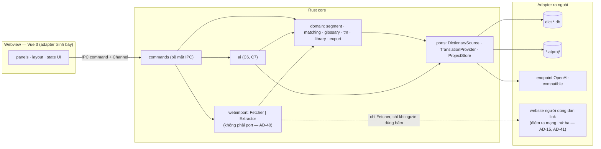
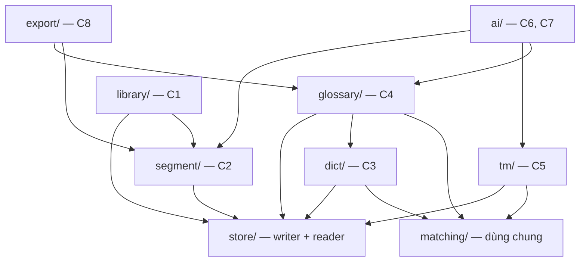
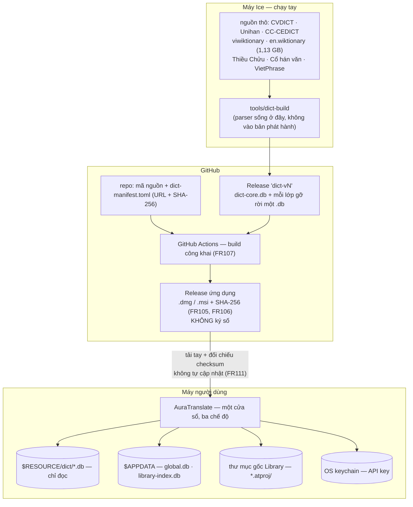
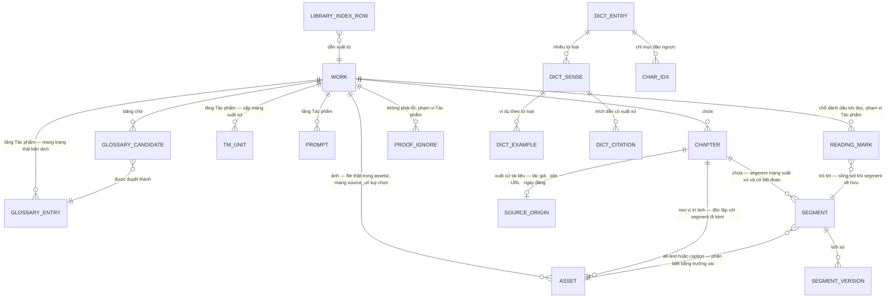

# Architecture Spine — AuraTranslate

## Design Paradigm

**Hexagonal liều thấp trong Rust core; webview là một adapter mỏng.**

Toàn bộ quy tắc nghiệp vụ sống trong Rust. Frontend Vue chỉ render và giữ state UI. Hexagonal áp ở **đúng ba cổng** — nơi ba yêu cầu khó nhất của sản phẩm trở thành hệ quả của cấu trúc thay vì lời hứa trong tài liệu:

| Cổng | Adapter | Biến FR nào thành hệ quả cấu trúc |
|---|---|---|
| `DictionarySource` | mỗi file `.db` từ điển | FR36 — gỡ lớp không làm hỏng tra cứu |
| `TranslationProvider` | endpoint tương thích OpenAI (cloud BYOK / Ollama / LM Studio) | FR77 — chạy đầy đủ khi không cấu hình AI |
| `ProjectStore` | `.atproj` trên đĩa | FR96–FR98 — nguồn sự thật vs chỉ mục dẫn xuất |

Ngoài ba cổng đó là module Rust thường, **không trait hoá**. Một người duy trì không nuôi nổi một rừng trait, và mười nhóm năng lực C1–C10 chồng lấn nhau quá nặng để làm ranh giới kỹ thuật.



`webimport` **không đi qua cổng** — nó nạp nội dung vào `core`, và `core` mới ghi qua `ProjectStore`. Đó là hình dạng của quyết định ở AD-40: ba cổng giữ nguyên, điểm ra mạng thứ ba được **đặt tên và cô lập** thay vì được trait hoá.

## Invariants & Rules

### AD-1 — Mọi quy tắc nghiệp vụ nằm ở Rust; webview mỏng

- **Binds:** tất cả
- **Prevents:** hai bản cài đặt của cùng một quy tắc (tách câu, khớp ngôn ngữ) lệch nhau qua các giai đoạn → TM khớp sai âm thầm; quy tắc nghiệp vụ nằm trong vùng Tauri v2 mặc định coi là không đáng tin.
- **Rule:** frontend chỉ render và giữ state UI (focus, cuộn, vùng chọn, bố cục panel). Không cài đặt lại bất kỳ quy tắc nghiệp vụ nào ở TypeScript. Ngoại lệ duy nhất, tường minh: văn bản đang gõ trong Editor là state cục bộ frontend, chỉ qua IPC khi auto-save, xác nhận segment, hoặc rời segment.

### AD-2 — Đúng ba cổng, không hơn

- **Binds:** tất cả
- **Prevents:** FR36 và FR77 thoái hoá thành kỷ luật cá nhân; đồng thời tránh trait hoá tràn lan.
- **Rule:** chỉ `DictionarySource`, `TranslationProvider`, `ProjectStore` là port. Thêm port thứ tư là một quyết định kiến trúc, phải ghi thành `AD` mới.

  **Đường nhập từ URL (FR122) đã được xét theo thủ tục này và KHÔNG nâng thành cổng** — xem AD-40. Số cổng giữ nguyên **ba**.

### AD-3 — Segment mang ID bền, không bao giờ tái dùng

- **Binds:** C2, C5, C7, C9
- **Prevents:** định danh theo vị trí → tách một segment làm lịch sử phiên bản và ghi nhớ proofreader của mọi segment sau nó trỏ sai chỗ, không có thông báo lỗi. Định danh theo băm nội dung → trong truyện dài, câu lặp hàng trăm lần dùng chung danh tính.
- **Rule:** `segment.id` bất biến, không tái dùng sau khi về hưu. Thứ tự trong Chương là cột riêng (`ord`), sắp lại được mà không đụng `id`. Mọi dữ liệu gắn theo segment (lịch sử phiên bản, ghi nhớ proofreader, trạng thái xác nhận) tham chiếu `id`, không bao giờ tham chiếu vị trí.

### AD-4 — Ranh giới segment tính một lần lúc nhập, không bao giờ tính lại

- **Binds:** C2, C5, C7, C9
- **Prevents:** một lần cải thiện quy tắc tách câu (FR23 `[A4]`) âm thầm tách lại toàn bộ Thư viện, làm lịch sử phiên bản, trạng thái xác nhận và ghi nhớ proofreader của mọi Chương cũ trỏ sai chỗ.
- **Rule:** tách segment chạy khi nhập Chương và kết quả **lưu xuống** `.atproj`. Đường nhập song ngữ (FR115) tính ranh giới ở **cả hai phía** cùng lúc — khác đường nhập thường vốn chỉ tạo phía nguồn — nhưng vẫn đúng bất biến: tính **một lần** lúc nhập, không bao giờ tính lại. Không có đường mã nào tính lại ranh giới lúc nạp Chương. Quy tắc tách câu mới chỉ áp dụng qua thao tác **tái tách chủ động** của người dùng trên từng Chương, kèm cảnh báo về dữ liệu sẽ về hưu.

  **Văn bản đưa vào bước tách là văn bản đã đi hết pipeline nhập (AD-39)** — đã giải mã bảng mã (FR126), đã làm sạch (FR124), đã chuẩn hoá đoạn và khoảng trắng (FR125). Không bước nào trong ba bước đó được cài thành lớp hiển thị đắp lên sau: ranh giới đã lưu sẽ không khớp thứ người dùng nhìn thấy, và không có gì báo.

### AD-5 — Gộp/tách segment là về hưu + tạo mới

- **Binds:** C2, C5, C7, C9
- **Prevents:** segment ghép từ hai segment đã xác nhận tự nhận là đã xác nhận dù chưa ai đọc nó.
- **Rule:** segment cũ đánh dấu về hưu (lịch sử phiên bản của nó vẫn tra lại được); segment mới bắt đầu ở trạng thái **chưa xác nhận** với lịch sử rỗng. Cặp TM đã ghi ở lại nguyên. Cùng triết lý FR58: hệ thống không bao giờ tự coi một segment là đã xong.

  **Không áp cho FR116.** Thao tác nối câu lúc nhập song ngữ xảy ra **trước khi segment được ghi xuống đĩa**, trong màn xem trước — chưa có segment nào tồn tại để cho về hưu. Cài FR116 thành thao tác gộp *sau khi* nhập sẽ tạo rồi cho về hưu ngay hàng nghìn segment.

  **Chỗ đánh dấu khi đọc (FR119) trỏ tới segment về hưu thì ở lại, không bị xoá im lặng** — hiện kèm ghi chú *câu này đã đổi*, vẫn mở được về đúng vị trí trong Chương. Cùng triết lý FR58 mà quy tắc này đang mang: hệ thống không tự quyết thay người dùng rằng một thứ đã hết giá trị.

### AD-6 — Translation Memory khoá theo cặp văn bản, không theo segment

- **Binds:** C5, C2, C6, C8
- **Prevents:** TM vỡ mỗi khi segment bị gộp, tách hay tái tách.
- **Rule:** một mục TM là `(văn bản nguồn, văn bản đích) + metadata`, độc lập hoàn toàn với `segment.id`. Sửa bản dịch của một segment đã xác nhận thì **ghi thêm** cặp mới, không sửa cặp cũ (khớp FR63). Đây cũng là điều kiện để xuất TMX (FR64) có nghĩa.

### AD-7 — Năm loại kho, ranh giới sở hữu cứng

- **Binds:** tất cả
- **Prevents:** bảy giai đoạn xây dựng cách nhau nhiều tháng chọn lệch nhau về nơi dữ liệu sống.
- **Rule:**

  | Kho | Vai trò | Quyền lúc chạy |
  |---|---|---|
  | `dict-core.db` + mỗi `<lớp gỡ rời>.db` | dữ liệu từ điển | **chỉ đọc**, luôn luôn |
  | `<Tên>.atproj/` | **nguồn sự thật** của một Tác phẩm | đọc + ghi |
  | `global.db` | nguồn sự thật của tầng Global | đọc + ghi |
  | `library-index.db` | **dẫn xuất** | đọc + ghi, chỉ bởi Indexer |
  | OS keychain | chỉ API key | đọc + ghi, chỉ bởi Rust |

### AD-8 — Chỉ mục Library là dẫn xuất, một đường ghi duy nhất

- **Binds:** C1, C9
- **Prevents:** có chỗ ghi thẳng vào chỉ mục cho nhanh → FR98 và NFR10 mất hiệu lực; hoặc thao tác sửa chữa hiển nhiên nhất (xoá chỉ mục hỏng rồi dựng lại) xoá luôn Glossary/TM toàn cục người dùng tích luỹ hàng năm.
- **Rule:** `library-index.db` là **file riêng**, không nằm chung `global.db`. Chỉ component `Indexer` được ghi vào nó, và chỉ ghi **sau khi** `.atproj` đã ghi xong. Xoá `library-index.db` phải luôn là thao tác an toàn. Danh sách, lọc, sắp xếp và tìm kiếm của Library **đọc từ `library-index.db`**; `meta.json` là thứ `Indexer` đọc khi quét (FR99) và là đường dựng lại khi chỉ mục vắng mặt — không phải nguồn Library đọc trực tiếp lúc chạy.

### AD-9 — `.atproj` là một thư mục

- **Binds:** C1, C2, C9
- **Prevents:** Library phải mở hàng trăm database chỉ để lấy tên, bìa và tiến độ (đe doạ NFR4 `< 3 s` với 5.000 Chương); ảnh phải qua IPC mỗi lần render (FR42, FR43).
- **Rule:** `<Tên>.atproj/` chứa `meta.json` (metadata Library đọc được **không cần mở SQLite**), `project.db`, và `assets/` (ảnh là file thật, hiển thị qua asset protocol). Sao lưu = copy thư mục (FR102, đúng nguyên văn).

  **Ảnh tải từ web (FR127) là file thật trong `assets/` như mọi ảnh khác** — không có loại ảnh thứ hai chỉ mang link. URL gốc là **metadata đi kèm** trong `project.db`, có thể rỗng với ảnh người dùng tự thêm. Đây là điều kiện để FR45 (mang đi được) và mệnh đề *không ảnh ngoài* của AD-15 cùng đúng.

### AD-10 — Mỗi lớp từ điển gỡ rời là một file `.db` độc lập

- **Binds:** C3, C10
- **Prevents:** FR112 (chính sách gỡ bỏ) biến thành thay đổi mã nguồn + dựng lại toàn bộ payload (nay 343.991.430 byte — NFR6 sửa lần hai 2026-08-05); FR36 chỉ nghiệm thu được bằng suy luận thay vì bằng test thật.
- **Rule:** năm nguồn nền sạch gộp trong `dict-core.db`; Thiều Chửu, Cổ hán văn, VietPhrase, HVTĐTD mỗi nguồn một file riêng. Runtime **không có mã riêng cho từng nguồn** — mọi nguồn đi qua cùng một adapter `DictionarySource`. Gỡ một lớp = xoá một file. Nghiệm thu FR36 bằng test thật: xoá file, chạy lại bộ test tra cứu. Mỗi file `.db` **tự mang metadata giấy phép và ghi công của chính nó**; màn hình Attribution (FR109) và ghi công trong bản phát hành (FR38) dựng từ các file có mặt — nên gỡ một lớp cũng gỡ luôn ghi công của nó, không để lại ghi công mồ côi khi thực thi FR112. Trường giấy phép phải biểu diễn được **cả giấy phép mở** (CC-BY-SA, Unicode License) **lẫn phép sử dụng riêng do tác giả cấp** — HVTĐTD thuộc loại thứ hai và **không thuộc GPL v3**; mô hình hoá trường này thành enum các giấy phép mở sẽ khiến nó bị gán nhãn sai ngay trên màn hình Attribution.

### AD-11 — Một writer duy nhất cho mỗi kho ghi được

- **Binds:** mọi module ghi dữ liệu
- **Prevents:** writer starvation và gai trễ không dự đoán được → NFR2 mất hiệu lực mà không lần ra được nguyên nhân.
- **Rule:** mỗi kho ghi được (`project.db`, `global.db`, `library-index.db`) có **đúng một** kết nối ghi, đặt sau một hàng đợi nối tiếp. Đọc dùng pool nhiều kết nối song song (WAL). **Không module nào được tự mở kết nối ghi.**

### AD-12 — Thời điểm checkpoint là quyết định của ứng dụng

- **Binds:** C9, C2
- **Prevents:** auto-checkpoint mặc định (1000 trang) rơi đúng lúc người dùng đang gõ → vi phạm NFR2. *(WAL2 mà báo cáo technical research đề xuất **không tồn tại** như tính năng đã phát hành — xem `.memlog.md`.)*
- **Rule:** `PRAGMA journal_mode = WAL`, `PRAGMA wal_autocheckpoint = 0`, `PRAGMA busy_timeout` đặt tường minh. Một luồng nền trên **kết nối riêng** gọi `wal_checkpoint(PASSIVE)` khi người dùng ngừng gõ một khoảng, và `wal_checkpoint(TRUNCATE)` khi đóng Tác phẩm hoặc thoát ứng dụng. Phải có ngưỡng kích thước WAL buộc checkpoint để `.db-wal` không phình vô hạn khi gõ liên tục hàng giờ.

### AD-13 — Không module nào ngoài `ai/` được phụ thuộc `ai/`

- **Binds:** tất cả
- **Prevents:** FR77 thoái hoá thành kỷ luật cá nhân qua bảy giai đoạn; lỗi chỉ lộ ra khi một người dùng không có API key thử.
- **Rule:** chiều phụ thuộc một chiều, có **test tự động** cưỡng chế (hoặc `ai/` là crate riêng để trình biên dịch cưỡng chế). Chiều ngược lại hợp lệ: `ai/` đọc `glossary/`, `tm/`, `segment/` để phục vụ FR70.



### AD-14 — Lắp prompt là một hàm thuần

- **Binds:** C6, C7
- **Prevents:** FR71 (xem prompt cuối cùng đã gửi) trở thành công việc đắt và không bao giờ chính xác 100% — mà đó lại là công cụ chẩn đoán duy nhất khi AI không tuân thủ Glossary.
- **Rule:** Smart RAG Injector là một hàm thuần nhận (câu nguồn, scope, Glossary, TM) và trả về **prompt đã lắp hoàn chỉnh**. Lời gọi AI nhận prompt đã lắp làm đầu vào. Không nối chuỗi rải rác ở chỗ gọi.

### AD-15 — Đúng ba điểm ra mạng trong toàn bộ ứng dụng

- **Binds:** tất cả
- **Prevents:** NFR12 (không telemetry) bị vi phạm vô tình qua crash reporter, thư viện analytics, hoặc một font CDN trong frontend.
- **Rule:** (1) adapter `TranslationProvider`; (2) kiểm tra phiên bản mới (FR111, chỉ kiểm tra và thông báo); (3) `Fetcher` của đường nhập từ URL (FR122, AD-40). **Không có điểm thứ tư.**

  **Cả ba chỉ chạy theo một thao tác người dùng.** Điểm thứ ba mang thêm ràng buộc của NFR19: **không tải nền, không prefetch, không kiểm tra ngầm, không tải lại ảnh đã có** *(khoá so sánh khai ở AD-41)*, và danh sách domain đã gọi phải **xem được trong ứng dụng**. Cưỡng chế ở AD-41.

  CSP của Tauri **giữ nguyên, không nới**: cấm mọi origin từ xa — không CDN, không font ngoài, **không ảnh ngoài**. Mọi tài nguyên frontend đóng gói trong bản cài. Mệnh đề *không ảnh ngoài* chính là lý do FR127 tải ảnh về `.atproj` thay vì giữ link, nên điểm ra mạng thứ ba **củng cố** CSP chứ không xin ngoại lệ khỏi nó.

  > **Điểm thứ ba khác hai điểm kia ở một chỗ:** đích đến của (1) và (2) là **host do ứng dụng biết trước**; đích đến của (3) là **host do người dùng dán vào lúc chạy**. Khác biệt này là toàn bộ lý do AD-41 tồn tại.

### AD-16 — Nội dung nhập từ ngoài không bao giờ render thành HTML

- **Binds:** C8, C1, C2
- **Prevents:** XSS trong một webview có quyền gọi IPC — mối đe doạ thật đứng sau đề xuất tách cửa sổ của research.
- **Rule:** **mọi** nội dung từ ngoài — `.docx`, `.md`, `.txt` từ reviewer, **và HTML tải từ internet (FR122)** — được Rust phân tích thành **mô hình dữ liệu có cấu trúc**; Vue render từ mô hình đó. Không tồn tại đường nào đưa chuỗi từ nguồn ngoài vào `v-html` hoặc tương đương.

  **HTML từ internet là ca nặng nhất và được siết thêm một bậc.** File từ reviewer đến từ một người quen biết; trang web đến từ một host bất kỳ người dùng dán vào. Ba ràng buộc bổ sung:

  1. **Phân tích và bóc chạy trọn ở Rust** (`Extractor`, AD-40). Không byte HTML thô nào đi qua IPC — thứ đi qua IPC là mô hình đã bóc.
  2. **Mô hình nội dung không có nhánh nào mang HTML.** Nó mang đoạn, câu, ảnh, caption — không mang chuỗi đánh dấu. Không có trường nào để một giai đoạn sau nhét HTML vào rồi render.
  3. **Ảnh trong nội dung tham chiếu file trong `assets/`, không bao giờ tham chiếu URL từ xa** — cùng một hàng rào với mệnh đề *không ảnh ngoài* của AD-15, phát biểu ở tầng mô hình dữ liệu.

### AD-17 — Một component Matcher dùng chung

- **Binds:** C3, C4, C5, C6
- **Prevents:** ba lần cài đặt riêng ở ba giai đoạn khác nhau → Glossary bắt được biến thể mà TM không bắt được, không ai biết vì sao.
- **Rule:** FR40 (từ điển), FR51 (Glossary), FR61 (TM) dùng **chung một** component. Tiếng Trung: khớp chính xác + n-gram ký tự, tách từ qua `jieba-rs` khi cần. Tiếng Anh: stemming rồi token n-gram. Giới hạn đã tuyên bố: là stemming, không phải lemmatization (FR40).

  ⚠️ **AD này nói *mọi nơi cần khớp ngôn ngữ dùng chung MỘT cài đặt* — nó KHÔNG nói mọi đường đều phải gọi Matcher.** Đường tra cứu **từ điển** tiếng Anh không gọi, và AD-44 ③ ghi số đo làm lý do: đầu ra stemmer không phải một từ nên nó khớp vào hư không, trong khi corpus từ điển đã có sẵn mọi dạng biến thể làm đầu mục riêng. Glossary (FR51) và TM (FR61) thì **có** — ở đó thuật ngữ do **người dùng tự viết**, corpus không mang tính chất đó, và stemming thật sự đáng tiền. Phân biệt này không nới lỏng AD-17: vẫn **đúng một** cài đặt, chỉ là không phải đường nào cũng là người tiêu thụ nó.

### AD-18 — Một ScopeResolver, ngữ nghĩa khai báo tường minh

- **Binds:** C4, C5, C6, C9
- **Prevents:** FR103 phát biểu chung là *"tầng dự án ghi đè tầng toàn cục"* → mỗi giai đoạn cài lại theo cách hiểu riêng, và TM toàn cục không bao giờ được dùng tới.
- **Rule:** mọi phân giải hai tầng đi qua một component. Ngữ nghĩa khai báo theo từng loại dữ liệu:

  | Loại | Ngữ nghĩa | FR |
  |---|---|---|
  | Glossary | **ghi đè** — tầng Tác phẩm thắng theo từng thuật ngữ | FR46 |
  | Prompt | **ghi đè** | FR69 |
  | Cấu hình AI | **ghi đè** — *theo từng **trường**, không theo cả struct* | FR68 |
  | Translation Memory | **hợp nhất** — trả kết quả cả hai tầng | FR57 |
  | Luật làm sạch khi nhập | **hợp nhất** — luật toàn cục **cộng** luật Tác phẩm cùng áp | FR124 |
  | Tên người dịch | **ghi đè** | FR131 |
  | Phím tắt | **chỉ toàn cục** | FR103 |
  | Preset bố cục | **chỉ toàn cục** | FR103 |
  | Lựa chọn ứng dụng (theme, chế độ cuối) | **chỉ toàn cục** | FR103 |

  > **Ngữ nghĩa thứ ba — *chỉ toàn cục* — thêm ở Story 1.8, Ice phê chuẩn 2026-08-04.**
  > FR103 đặt phím tắt và preset bố cục ở tầng Global **và không cho chúng đối ứng ở tầng
  > Tác phẩm**; `mockups/settings.html:246` nói thẳng: *"Phím tắt chỉ tồn tại ở tầng Toàn
  > cục — một thao tác không nên đổi phím theo từng Tác phẩm."* Khai chúng bằng một trong
  > hai ngữ nghĩa cũ đều sai, và sai **im lặng**: *ghi đè* mở một tầng Tác phẩm mà UX đã
  > cấm, nên Story 1.14/1.21 sẽ dựng thanh chuyển phạm vi cho một thứ không nên có; *hợp
  > nhất* thì vô nghĩa. Một tầng Tác phẩm cho các loại này trả lỗi, không bị bỏ qua im
  > lặng — bỏ qua im lặng là cách một tầng bị cấm vẫn được ghi xuống đĩa rồi không bao giờ
  > có tác dụng.
  >
  > **Cấu hình AI ghi đè theo từng *trường*, không theo cả struct** *(làm rõ ở Story 1.8,
  > cùng lượt ký)*. Bảng này trước đây chỉ ghi *"ghi đè"*, và Story 4.2 cũng chỉ nói *"ghi
  > đè được theo Tác phẩm đó"*. Chỉ `mockups/settings.html` lộ ra rằng trong **cùng một**
  > cấu hình có trường `ghi đè` và trường `kế thừa` cùng lúc (`:172`, `:188`, `:200`) — tức
  > Epic 4 phân giải nó như một map `khoá trường → giá trị`, y hệt Glossary.
  >
  > **`ngôn ngữ nguồn` KHÔNG phải một loại ở bảng này.** FR103 liệt kê nó ở tầng Tác
  > phẩm, nhưng Story 5.1 định nghĩa nó là trường **bất biến** trong `meta.json` — đặt lúc
  > tạo, không đổi được (`prd.md:765-774`: *"cố định, đặt lúc tạo"*, mệnh đề mà
  > `epics.md:296` làm rơi mất) — và nó **không có đối ứng ở tầng Global**, nên không có gì
  > để ghi đè. Nó là thuộc tính của `Work`, không phải cấu hình hai tầng.
  >
  > **Cưỡng chế:** bảng này sống bằng máy ở `src-tauri/src/core/scope/kinds.rs`, sinh từ
  > macro `scope_kinds!` — **không tồn tại cú pháp nào khai được một loại mà không kèm ngữ
  > nghĩa**. `tests/scope_contract.rs::the_semantics_table_matches_ad_18_row_by_row` đối
  > chiếu từng hàng; `tests/scope_boundary.rs` cấm mọi module ngoài `core/scope/**` mang từ
  > vựng phân giải hai tầng.

  > **Vì sao luật làm sạch là *hợp nhất* chứ không *ghi đè*:** rác web chia làm hai loại có vòng đời khác nhau — loại chung cho mọi nguồn (dòng *"nguồn: xxx"*, lời nhắn người đăng) thuộc tầng toàn cục, loại riêng của một site hay một bộ truyện thuộc tầng Tác phẩm. Ngữ nghĩa *ghi đè* buộc người dùng chép lại toàn bộ luật chung vào từng Tác phẩm chỉ để thêm một mẫu riêng. Đây là loại dữ liệu **cộng dồn**, giống TM chứ không giống Glossary.

  **Thứ tự sắp xếp kết quả TM có hai khoá, khai tường minh vì hai chiều này chồng lên nhau:** khoá **chính** là **xuất xứ** (cặp *của tôi* trước, FR118); khoá **phụ** là **tầng** (Tác phẩm trước Global). Xuất xứ thắng vì một cặp TM toàn cục do **chính người dùng** dịch vẫn giống văn phong của họ hơn một cặp Tác phẩm do người khác dịch — mà mục đích của FR70 là học văn phong. Không khai thứ tự này thì Giai đoạn 4 và Giai đoạn 6 sẽ cài lệch nhau.

  Xác nhận segment (FR56) **chỉ** ghi vào TM Tác phẩm. TM toàn cục chỉ nhận qua thao tác chủ động (nhập TMX, hoặc đẩy lên tầng toàn cục).

### AD-19 — Không tồn tại bước hợp nhất nguồn từ điển

- **Binds:** C3
- **Prevents:** ai đó thêm một bước khử trùng lặp cho gọn UI và làm mất FR31/FR32 — nguyên tắc nền, không phải tuỳ chọn hiển thị.
- **Rule:** đường tra cứu trả về **kết quả theo từng nguồn**, giữ nguyên bất đồng. Trong toàn bộ hệ thống không có hàm nào hợp nhất nghĩa giữa các nguồn. Cột `source` bắt buộc trên mọi bản ghi nghĩa.

### AD-20 — Đề xuất tự động vào bảng chờ, không bao giờ vào Glossary

- **Binds:** C4, C8
- **Prevents:** FR55 (*không cơ chế nào được tự ghi vào Glossary*) thoái hoá thành kỷ luật — đây là trụ định vị #1 phát biểu dưới dạng cấu trúc dữ liệu.
- **Rule:** FR52 (quét khi nhập) và FR54 (thu hoạch từ bản review) ghi vào **bảng chờ riêng**. Chỉ thao tác duyệt của người dùng mới chuyển một mục từ bảng chờ sang Glossary, và mục đó mang trường xuất xứ (FR47).

### AD-21 — Rust không bao giờ trả về văn bản hiển thị

- **Binds:** tất cả
- **Prevents:** NFR16 (*chuỗi giao diện ngoài mã nguồn ngay từ dòng code đầu tiên*) bị thủng ở tầng lỗi — chỗ dễ quên nhất và đắt nhất để sửa sau.
- **Rule:** mọi lỗi và thông báo qua IPC có hình dạng `{ code, message_key, params, retryable }`. Frontend phân giải `message_key` trong file tài nguyên chuỗi. Không có chuỗi tiếng Việt nào trong mã Rust hay mã Vue.

### AD-22 — Streaming AI qua Channel, không tự kết nối lại

- **Binds:** C6, C7
- **Prevents:** auto-reconnect tạo ra một yêu cầu mới hoàn toàn → với BYOK, người dùng bị tính phí hai lần và nhận về văn bản trùng lặp.
- **Rule:** dùng Tauri Channel API (không dùng event rời) cho luồng token. Không dùng client SSE tự kết nối lại. Đứt luồng là quyết định tường minh của ứng dụng; thử lại **do người dùng chủ động** (FR75). Mọi lời gọi AI huỷ được giữa chừng (FR73).

### AD-23 — Phạm vi filesystem hai tầng, cưỡng chế bởi Tauri

- **Binds:** tất cả
- **Prevents:** *"không ai đọc được tài liệu của bạn"* thoái hoá thành lời hứa thay vì ràng buộc do framework cưỡng chế.
- **Rule:** scope **tĩnh** khai trong capabilities — `$RESOURCE/dict/**` (chỉ đọc), `$RESOURCE/fonts/**` (chỉ đọc, font nhúng), `$APPDATA/**` (đọc + ghi, cho `global.db` và `library-index.db`). Scope **động** cấp lúc chạy chỉ khi người dùng chọn qua hộp thoại — thư mục gốc Library (mặc định `~/Documents/AuraTranslate/`) và đường dẫn export từng lần. Không đường mã nào chạm path ngoài scope.

  **Phạm vi mạng không nằm ở đây và không cưỡng chế được bằng cùng cơ chế** — xem AD-41.

### AD-24 — Một cửa sổ OS, ba chế độ

- **Binds:** C1, C2, C8
- **Prevents:** tách cửa sổ để lấy bảo mật là trả bằng chính thứ sản phẩm bán (FR16 — *một cửa sổ thay cho bốn năm cửa sổ*). Mối đe doạ thật đã được AD-15 và AD-16 bịt đúng chỗ.
- **Rule:** Library, Workspace và Chế độ đọc là ba **chế độ** trong cùng một cửa sổ. Review Mode (FR92) là một bố cục dockview, không phải cửa sổ thứ hai.

### AD-25 — Dữ liệu từ điển là artifact có phiên bản và checksum

- **Binds:** C3, C9, C10
- **Prevents:** nguồn thô 1,13 GB hoặc `.db` (nay 320,3 MB cho cả ba tệp) lọt vào git; đồng thời giữ FR107 (build công khai, kiểm chứng được).
- **Rule:** build tool chạy tay sinh các file `.db` và đẩy lên một GitHub Release riêng có phiên bản. Repo chứa **mã build tool** + `dict-manifest.toml` ghi URL, SHA-256 và phiên bản nguồn thô của từng file. CI tải theo manifest, đối chiếu checksum, rồi đóng gói. **Parser định dạng từ điển chỉ nằm trong build tool, không vào bản phát hành** — nên giấy phép parser không ràng buộc sản phẩm.

### AD-26 — Ba nhánh truy vấn tiếng Trung `[ADOPTED]`

- **Binds:** C3, C1
- **Prevents:** truy vấn 1–2 ký tự trả về rỗng trong 0,01 ms mà **không báo lỗi** — biểu hiện thành *"tra từ không ra kết quả"*, rất khó lần ra nguyên nhân.
- **Rule:** tra chính xác đầu mục → chỉ mục B-tree (đường nóng Auto-Lookup). Chuỗi con 1–2 ký tự → bảng đảo ngược `char_idx`. Chuỗi con 3+ ký tự → FTS5 `trigram`. `LIKE` **cấm** trên đường nóng (đo được 20–50 ms).

  🔴 **Phạm vi là TIẾNG TRUNG, và mệnh đề này thuộc Rule chứ không chỉ thuộc tiêu đề.** Cả ba nhánh là cơ chế cho chữ Hán; nhánh `char_idx` **không** áp được cho tiếng Anh *(đo: **9** cặp trên **119.039** đầu mục)*. Đường tiếng Anh và vị từ điều phối giữa hai đường: **AD-44**.

  ⚠️ **Dải hiệu năng mà bản đầu của AD này công bố — 0,02 ms · 0,15–4,5 ms · 0,13–0,19 ms — nay LỖI THỜI, đừng trích tiếp như số hiện hành.** Số đó đo ở Giai đoạn 0 trên một database **ba** nguồn. Đo lại 2026-08-05 trên `dict-core.db` **sáu** nguồn, bản release, p95: nhánh 1 **0,083 ms** · nhánh 2 một ký tự **7,324 ms** · nhánh 2 hai ký tự **1,039 ms** · nhánh 3 **0,448 ms**. Nhánh 2 với truy vấn **một ký tự** vượt **1,6×** cận trên của dải cũ — chi phí nằm ở **số hàng** *(`char_idx` của `山` đi từ ~2.576 lên **3.177**)*, không ở chỉ mục, nên nó **không** sửa được bằng một chỉ mục mới. Mỗi nguồn từ điển thêm vào sẽ làm nó dày thêm.

### AD-27 — Chỉ mục FTS chính phân biệt dấu `[ADOPTED]`

- **Binds:** C1, C3
- **Prevents:** `unicode61` mặc định gộp `má / ma / mà / mả / mã / mạ` thành một kết quả — lỗi phá vỡ độ chính xác của toàn bộ tìm kiếm trong một công cụ dịch tiếng Việt.
- **Rule:** chỉ mục FTS **chính** dùng `remove_diacritics 0`. Chỉ mục xoá dấu chỉ tồn tại như chỉ mục **phụ** cho chế độ khoan dung (FR9), **không bao giờ là mặc định**. Hệ thống thử chế độ chính xác trước, chỉ nới lỏng khi không có kết quả hoặc người dùng yêu cầu. Chi phí đã biết: ~17 MB mỗi chỉ mục.

### AD-28 — Tác phẩm mang UUID; Chương và Segment mang id cục bộ

- **Binds:** C1, C9
- **Prevents:** nhân bản một `.atproj` làm hai mục đụng nhau trong chỉ mục Library.
- **Rule:** `work.id` là UUID sinh lúc tạo, lưu trong `meta.json` (vì `library-index.db` tham chiếu xuyên `.atproj`, và người dùng copy `.atproj` sang máy khác — FR97). `chapter.id` và `segment.id` là số nguyên **cục bộ** trong `project.db`. Indexer phải phát hiện và cảnh báo hai Tác phẩm trùng UUID (FR99).

### AD-29 — Khoá API chỉ tồn tại trong Rust

- **Binds:** C6
- **Prevents:** một bề mặt tấn công tự tạo ra; vi phạm NFR11/FR67.
- **Rule:** dùng crate `keyring` **trực tiếp trong Rust**, không dùng `tauri-plugin-keyring` — một Tauri plugin tồn tại để phơi API ra JavaScript, đúng thứ NFR11 cấm. Khoá không bao giờ đi qua IPC. Frontend chỉ biết trạng thái *"đã cấu hình / chưa cấu hình"* và nhận token đang stream.

### AD-30 — Lược đồ có phiên bản; mở tiến, không bao giờ mở lùi

- **Binds:** C9, C1, tất cả
- **Prevents:** trụ định vị #3 (*dữ liệu phải sống lâu hơn phần mềm*) chết ở đúng chỗ nó được kiểm chứng. Một `.atproj` sống qua bảy giai đoạn xây dựng và hai đến ba năm; FR97 hứa copy sang máy khác mở được — nhưng máy đó chạy bản khác. Không có quy tắc, mỗi giai đoạn sẽ đổi lược đồ theo cách riêng và làm hỏng dữ liệu cũ **im lặng**.
- **Rule:** `meta.json`, `project.db` và `global.db` mỗi cái mang một số **phiên bản lược đồ**. Khi mở, ứng dụng chạy các bước di trú **chỉ tiến** cho tới phiên bản hiện tại, trong một giao dịch, sau khi đã sao lưu. Gặp phiên bản **mới hơn** ứng dụng thì **từ chối mở** và báo rõ, không bao giờ ghi vào. `library-index.db` không di trú — xoá và dựng lại (AD-8).

### AD-31 — Vòng đời trạng thái segment là một máy trạng thái tường minh

- **Binds:** C2, C5, C7, C9
- **Prevents:** hai hố thật. (1) Nếu mỗi lần auto-save đều tạo một `SegmentVersion`, gõ một giờ sinh hàng trăm phiên bản và FR101 thành vô dụng; nếu không bao giờ tạo thì FR101 không có gì để khôi phục. (2) Nếu sửa văn bản của một segment **đã xác nhận** mà nó vẫn ở trạng thái đã xác nhận, thì không lần xác nhận nào nữa xảy ra và **cặp TM mới không bao giờ được ghi** (AD-6 nói ghi thêm, nhưng không nói cái gì kích hoạt).
- **Rule:**

  | Sự kiện | Trạng thái | `SegmentVersion` |
  |---|---|---|
  | Auto-save (FR100) | không đổi | **không** tạo |
  | Xác nhận segment (FR24) | → đã xác nhận | **tạo một** phiên bản |
  | Sửa văn bản của segment đã xác nhận | → **chưa xác nhận** | không tạo |
  | Điền sẵn từ TM khớp 100% (FR58) | chưa xác nhận, gắn nhãn *gợi ý* | không tạo |
  | Chấp nhận thay đổi từ Review Mode (FR94) | → chưa xác nhận | không tạo |
  | Về hưu do gộp/tách (AD-5) | về hưu | không tạo |

  **Xuất xứ (FR117) ghi cùng lúc với cặp TM, tại đúng chuyển tiếp sang đã xác nhận:**

  | Trạng thái văn bản đích lúc xác nhận | Xuất xứ ghi vào segment và vào cặp TM |
  |---|---|
  | Khác bản lúc nạp segment | **tôi dịch** |
  | Y hệt bản lúc nạp segment | **người khác dịch** hoặc **nhập từ tài liệu song ngữ**, giữ nguyên xuất xứ nạp vào |

  **Hợp đồng phụ bắt buộc:** hệ thống so **văn bản đích hiện tại với bản lúc nạp segment**, không dùng cờ *dirty*. Hai cách này cho kết quả khác nhau ở ca người dùng gõ rồi hoàn tác về nguyên trạng — cờ dirty nói *đã sửa*, so sánh văn bản nói *không đổi*, và so sánh văn bản mới đúng ý nghĩa "câu này là chữ của ai".

  Cặp TM (FR56) ghi **đúng tại chuyển tiếp sang đã xác nhận**, không ở chỗ nào khác.

### AD-32 — Gộp/tách Chương giữ nguyên segment

- **Binds:** C1, C2, C5, C9
- **Prevents:** FR15 (gộp/tách Chương) được cài như "tạo lại segment", phá sạch lịch sử phiên bản và trạng thái xác nhận của những Chương đã dịch xong — trong khi FR15 chỉ là thao tác **tổ chức**.
- **Rule:** gộp hoặc tách Chương **chỉ** đổi `chapter_id` và `ord` của các segment liên quan. `segment.id`, lịch sử phiên bản, trạng thái xác nhận và mọi dữ liệu gắn theo segment **giữ nguyên**. Đây là điểm khác biệt cố ý so với AD-5: gộp/tách *segment* đổi ranh giới văn bản nên phải về hưu; gộp/tách *Chương* không đụng tới văn bản của segment nào.

### AD-33 — `meta.json` là bản cache dẫn xuất, một đường ghi

- **Binds:** C1, C9
- **Prevents:** hai chủ sở hữu cho cùng một dữ liệu. Tiến độ (FR7) suy ra từ trạng thái các Chương trong `project.db`, nhưng `meta.json` giữ một bản cho Library đọc nhanh (AD-9) — nếu để ngỏ, Library sẽ hiện tiến độ cũ và không ai biết bản nào đúng.
- **Rule:** `meta.json` là **dẫn xuất từ `project.db`**, dựng lại được hoàn toàn. Nó được ghi bởi **chính** `store::Writer` của Tác phẩm đó, trong cùng thao tác logic với thay đổi sinh ra nó. Không thành phần nào khác ghi vào `meta.json`, và không thành phần nào coi `meta.json` là nguồn sự thật.

### AD-34 — Sàn khả năng tiếp cận là cấu trúc, không phải kỷ luật

- **Binds:** C1, C2, C8, toàn bộ frontend
- **Prevents:** NFR17 thoái hoá thành kỷ luật cá nhân qua bảy giai đoạn xây dựng — đúng cách AD-13 phải cưỡng chế FR77 và AD-21 phải cưỡng chế NFR16. Lỗi loại này chỉ lộ ra khi có người thử dùng bằng bàn phím, và tới lúc đó đã quá muộn để sửa rẻ.
- **Rule:**
  1. **Mọi thao tác đi qua một `CommandRegistry` duy nhất.** Handler chuột chỉ được `dispatch` một command đã đăng ký, không được tự cài đặt thao tác tại chỗ. Nhờ vậy "thao tác nào chưa gán được phím" trở thành câu hỏi **liệt kê được tự động**, và FR22 (phím tắt cấu hình lại được) là hệ quả của cấu trúc thay vì một danh sách phải bảo trì tay.
  2. **Mỗi chế độ và mỗi panel khai báo điểm vào focus.** Chuyển panel trong dockview phải **dời focus DOM tường minh**; không chế độ nào được để focus rơi về `body`.
  3. **Màu chỉ đến từ bộ token đã kiểm tương phản** ở cả hai theme. Cấm giá trị màu viết thẳng trong component — cùng hình dạng với AD-21: thứ cần kiểm tra tập trung thì không được rải rác.

  Command id dùng **khoá chấm có tiền tố miền**, cùng hình dạng với khoá chuỗi i18n (`lookup.search_selection`, `review.accept_change`) — hai giai đoạn cách nhau nhiều tháng đăng ký trùng id trần sẽ ghi đè nhau âm thầm.

  Trình đọc màn hình **ngoài phạm vi v1** (PRD §3.2). AD này không đòi ARIA đầy đủ; nó chỉ bảo đảm sàn bàn phím và tương phản không thể bị đánh mất trong im lặng.

### AD-35 — Hợp đồng flush của Editor

- **Binds:** C2, C9
- **Prevents:** AD-1 cho phép văn bản đang gõ là state cục bộ frontend nhưng **không định nghĩa nhịp flush**. Giai đoạn 2 dựng Editor và chọn debounce thuần — mà **debounce thuần bị reset bởi mỗi phím gõ nên không bao giờ kích hoạt khi người dùng gõ liên tục**, mất không giới hạn công việc trong khi vẫn "đúng đặc tả auto-save". NFR18 chết ở đúng chỗ không ai nhìn.
- **Rule:** văn bản Editor flush xuống Rust khi: (a) người dùng **ngừng gõ khoảng 2 giây**; (b) **trần cứng 5 giây** kể từ lần flush trước — **đồng hồ trần không được reset bởi phím gõ**; (c) xác nhận segment; (d) rời segment; (e) đóng Tác phẩm hoặc thoát ứng dụng. Flush đi qua **đúng `store::Writer` nối tiếp của AD-11**, không mở kết nối riêng. Một flush chỉ được coi là xong **sau khi đã ghi vào WAL** — nếu chỉ vào hàng đợi trong bộ nhớ thì ngưỡng 5 giây của NFR18 không bảo đảm gì. Không tạo `SegmentVersion` (AD-31).

  **Thao tác rời rạc ghi ngay, không đi qua bộ đệm gõ:** chấp nhận thay đổi từ Review Mode (FR94) và điền sẵn từ TM khớp 100% (FR58) là **một hành động dứt khoát của người dùng**, không phải văn bản đang soạn — định tuyến chúng qua bộ đệm gõ sẽ khiến một thao tác đã hoàn tất nằm chờ tới 5 giây và biến mất nếu app sập, dù người dùng thấy nó đã xong trên màn hình.

### AD-36 — Vòng đời mục Glossary ba trạng thái; chỉ trạng thái cuối được chèn vào prompt

- **Binds:** C4, C6, C3
- **Prevents:** (1) một giai đoạn sau truy vấn thẳng bảng Glossary rồi chèn cả mục *chờ chốt* vào prompt — FR70 gửi đi một trường trống, và tệ hơn là gợi ý cho mô hình rằng thuật ngữ đó **không có** bản dịch quy ước; (2) âm Hán Việt bị cài lại lần thứ hai bên trong `glossary/` thay vì đọc qua cổng `DictionarySource`, sinh hai nguồn sự thật cho cùng một dữ kiện.
- **Rule:** ba trạng thái, một chiều: **ứng viên** (bảng chờ riêng, AD-20) → **chờ chốt bản dịch** (FR114) → **đã chốt**. Trường bản dịch **nullable** cho tới khi chốt.

  `glossary/` phơi ra **đúng một** truy vấn trả về mục **đủ điều kiện chèn**; `ai/` không có đường nào khác chạm dữ liệu Glossary. Điều kiện chèn nằm ở `glossary/` — nơi sở hữu dữ liệu — chứ không nằm ở chỗ gọi.

  Âm Hán Việt cho đề xuất bản dịch (FR113) đọc **qua cổng `DictionarySource`**, không cài lại. Thêm cạnh `glossary/ → dict/` vào đồ thị phụ thuộc; không tạo chu trình.

### AD-37 — Cấu trúc đoạn là dữ liệu được lưu, không phải thứ suy ra lúc xuất

- **Binds:** C1, C2, C8, C9
- **Prevents:** FR121 hứa hai ô của bảng giữ **đúng số lần xuống đoạn như nhau**, nhưng không có gì trong mô hình dữ liệu biết đoạn nằm ở đâu — segment là câu. Giai đoạn 5 sẽ tự đoán ranh giới đoạn từ văn bản gốc lúc xuất, và cột phải **không có văn bản gốc để đoán** nên phải suy ngược qua segment bằng một quy tắc thứ hai. Hai quy tắc đoán trên cùng một Chương cho ra số đoạn lệch nhau, và nghiệm thu của FR121 hỏng ở chỗ không ai nhìn. Đồng thời một lần cải thiện quy tắc đoán sẽ **đổi im lặng** kết quả xuất của mọi Chương cũ — đúng loại hành vi AD-4 tồn tại để cấm.
- **Rule:** `SEGMENT` mang **cờ kết đoạn**, tính lúc nhập **cùng lượt** với ranh giới câu và **lưu xuống** `.atproj`. Không đường mã nào suy ra đoạn từ nội dung lúc xuất, lúc nạp hay lúc render.

  **Một cờ duy nhất dùng chung cho cả nguyên văn và bản dịch.** Đây là thứ làm cho lời hứa của FR121 đúng **theo định nghĩa** thay vì nhờ hai đường mã tình cờ đồng ý với nhau.

  Đường nhập song ngữ (FR115) lấy cờ từ **ranh giới hàng** của bảng nguồn, không đoán lại từ nội dung — nhất quán với AD-4, vốn đã cho đường này tính ranh giới ở cả hai phía cùng lúc.

  Cờ mô tả *"sau câu này là xuống dòng"*. Ba ca biên phải khai, vì cả ba đều là chỗ hai giai đoạn chọn khác nhau mà vẫn tin mình đúng:

  | Ca | Cờ đi đâu |
  |---|---|
  | **Gộp** segment (AD-5) | Theo **câu cuối** của nhóm gộp. Chỗ xuống dòng cũ nay nằm giữa câu mới nên nó mất thật; giữ lại sẽ sinh đoạn rỗng lúc xuất |
  | **Tách** segment (AD-5) | Theo **mảnh cuối**; mọi mảnh trước nhận cờ **tắt**. Một đoạn tách làm ba câu vẫn là một đoạn |
  | **Segment cuối Chương** | Cờ **tắt**, luôn luôn. Đoạn cuối kết thúc vì hết Chương, không vì một lần xuống dòng. Không khai điều này thì một giai đoạn sẽ bật cờ và mỗi Chương xuất ra thừa một dòng trống ở cuối — nhân với 2000 Chương |

### AD-38 — Nhập `.docx` phân biệt hai hình dạng bảng trước khi chạy alignment

- **Binds:** C8
- **Prevents:** bản `.docx` một khối (FR121) và bản `.docx` theo segment (FR87) **cùng phần mở rộng, cùng là bảng hai cột**. Xuất một khối để đăng bài rồi vài tháng sau kéo lại vào app: FR91 chạy alignment trên một hàng chứa hàng trăm câu và **ghi đè cả Chương đã xác nhận bằng một khối văn bản duy nhất** — không báo lỗi, vì đó vẫn là một bảng hai cột hợp lệ. Hỏng dữ liệu im lặng, không phải bất tiện.
- **Rule:** kiểm hình dạng là **cổng vào** của đường nhập `.docx` trong `core/export/` — module sở hữu cả phân tích `.docx` lẫn alignment — chạy ở Rust **trước** alignment và trước **mọi** lệnh ghi. Bảng có **đúng một hàng** *và* ô chứa **nhiều hơn một đoạn** → **từ chối** kèm câu giải thích rằng đây là bản dành cho đăng bài và không nhập lại được; không chạy alignment, không ghi gì. Mọi hình dạng khác đi tiếp qua FR91.

  Nhận dạng bằng **hình dạng**, không bằng metadata hay tên file: file do người khác tạo không mang dấu của ta, và tên file thì ai cũng đổi được.

  **Ca sót lại, chấp nhận có ý thức:** Chương ngắn chỉ có **một đoạn** nhưng nhiều câu — hai hình dạng không phân biệt được. Hẹp hơn hẳn ca gốc và hậu quả nhẹ vì đúng là một đoạn thật.

### AD-39 — Đường nhập là một pipeline có thứ tự cố định, dùng chung cho mọi nguồn

- **Binds:** C1, C2, C9
- **Prevents:** FR126 (bảng mã), FR125 (chuẩn hoá đoạn) và **tách Chương theo mẫu phân tách** (FR14) đều phải chạy **trước** bước tính ranh giới segment, mà AD-4 lại nói ranh giới tính **một lần** lúc nhập rồi **lưu xuống**. Một giai đoạn đặt chuẩn hoá *sau* bước tách, hoặc cài nó thành lớp hiển thị, thì ranh giới đã lưu không khớp thứ người dùng nhìn thấy — và **không có gì báo**. Đồng thời ngăn ba đường nhập (file, URL, song ngữ) mỗi đường tự chọn một thứ tự riêng.

  **Ca hỏng cụ thể nhất, và là ca dễ viết test nhất:** một giai đoạn đặt bước **tách Chương trước bước giải mã bảng mã**. Mẫu phân tách khi đó chạy trên chữ rác, không khớp gì, và cả file 40 MB ra **đúng một Chương**. Không lỗi nào được ném; màn xem trước hiện *"đã nhận ra 1 Chương"* và người dùng không có đường nào lần ra nguyên nhân. Đây **chính là** lỗi thất bại im lặng mà FR126 tồn tại để chặn — để hở nó trong chuỗi này là AD-39 tự mâu thuẫn với lý do nó ra đời.
- **Rule:** **một** chuỗi duy nhất, cùng thứ tự cho mọi nguồn:

  ```text
  byte thô
    → giải mã bảng mã            (FR126 — nguồn KHÔNG mang khai báo bảng mã)
    → bóc nội dung chính         (FR123 — chỉ nguồn là trang web)
    → làm sạch theo luật         (FR124 — mọi nguồn)
    → chuẩn hoá đoạn & khoảng trắng  (FR125 — mọi nguồn)
    → TÁCH CHƯƠNG theo mẫu phân tách (FR14 — chỉ nguồn đến thành MỘT dòng chưa chia Chương)
    → XEM TRƯỚC + sửa tay        (FR14, FR115, FR123, FR126)
    → tách segment + cờ kết đoạn (AD-4, AD-37)
    → ghi xuống .atproj          (AD-11)
  ```

  Các đường nhập chỉ khác nhau ở **bước đầu vào** và ở việc **bỏ qua** bước không áp dụng — không đường nào **đổi thứ tự** hay chèn bước sau lệnh ghi.

  **Điều kiện áp dụng của bước tách Chương phát biểu theo *hình dạng đầu vào*, không theo danh sách đường nhập** — danh sách sẽ sai ngay khi có đường thứ tư, hình dạng thì đúng mãi:

  | Đầu vào đến dưới dạng | Tách Chương |
  |---|---|
  | **Một dòng văn bản chưa chia Chương** — file `.txt`/`.md`/`.docx`, văn bản dán tay | **Có.** Đây là FR14 |
  | **Đã một đơn vị một Chương** — mỗi link trong danh sách của FR122 | **Không.** Một link đã là một Chương |

  > **Đường song ngữ (FR115) rơi vào hàng trên theo đúng tiêu chí hình dạng** — một file `.docx` hai cột chứa cả bộ truyện cũng đến thành một dòng chưa chia Chương. **Mẫu phân tách áp lên cột nguồn** *(PRD chốt 2026-08-03)*: đầu Chương ở cột gốc mang dạng ổn định máy khớp được, còn cột đích do người khác dịch nên có thể ghi khác đi hoặc bỏ hẳn dòng tiêu đề.

  **Tách Chương và tách segment là hai bước khác nhau, và chúng nằm hai phía của màn xem trước** — khác đơn vị (Chương và câu), khác điều kiện áp dụng, khác quyền của người dùng. Người dùng **sửa được mẫu phân tách** ngay trên màn xem trước và thấy kết quả tách Chương đổi theo; người dùng **không sửa ranh giới câu** ở đó. Gộp hai bước làm một sẽ hoặc mất đường sửa mẫu, hoặc mở một đường sửa ranh giới câu mà AD-4 không cho phép.

  **Chuỗi này sống ở `core/segment/`**, module vốn đã sở hữu tách/gộp/về hưu (AD-3, AD-4, AD-5). Các module nguồn — `webimport/` cho URL (AD-40), `export/` cho `.docx` (AD-38), đọc file thuần cho `.txt`/`.md` — chỉ **cung cấp bước đầu vào** rồi trao lại; không module nào giữ bản sao của các bước dùng chung. Hai bản cài đặt của chuỗi này là hai kết quả chuẩn hoá trên cùng một văn bản, và vi phạm luôn AD-1.

  **Bước giải mã bảng mã áp cho nguồn không tự khai bảng mã** — `.txt`, `.md`, và phản hồi HTTP (nơi khai báo có thể sai hoặc vắng). `.docx` **bỏ qua bước này**: nó là zip chứa XML đã khai encoding, chạy bộ dò thống kê trên byte zip cho ra kết quả vô nghĩa.

  **Màn xem trước luôn hiển thị kết quả sau toàn bộ chuỗi**, không phải sau một bước giữa chừng. Đây là điều kiện để nghiệm thu FR126 (*sửa bảng mã mà không phải nhập lại từ đầu*) có nghĩa: đổi bảng mã chạy lại chuỗi từ bước một, trong bộ nhớ, **trước khi** có bất kỳ segment nào tồn tại.

  Hệ quả cho FR116: thao tác nối câu lúc nhập song ngữ nằm **trong bước xem trước**, đúng như AD-5 đã khai — chưa có segment nào để cho về hưu.

### AD-40 — `Fetcher` và `Extractor` tách rời; không nâng thành cổng thứ tư

- **Binds:** C1
- **Prevents:** hai thứ trái ngược nhau. **(a)** Gộp HTTP với phân tích HTML thành một khối → khi bộ đọc riêng theo site xuất hiện thì phải gỡ dính trước khi thêm được gì, và điểm ra mạng của AD-15 nằm lẫn trong một module cũng phân tích HTML nên NFR19 không kiểm chứng được bằng test. **(b)** Nâng ngay thành port thứ tư → AD-2 vừa tuyên *"đúng ba cổng, không hơn"* đã lên bốn, và lên vì một thứ v1 tuyên bố **không làm** (FR123: không có bộ đọc riêng theo site).
- **Rule:** hai module Rust thường trong `core/webimport/`, **không trait hoá**:

  | Module | Trách nhiệm | Số cài đặt |
  |---|---|---|
  | `Fetcher` | URL → byte + `content-type` + charset khai báo | **Đúng một, mãi mãi.** Đây là điểm ra mạng thứ ba của AD-15 và là chỗ duy nhất AD-41 phải canh |
  | `Extractor` | byte → **mô hình nội dung có cấu trúc** | **Điểm mở rộng đã đặt tên.** v1 có đúng một cài đặt dùng chung (FR123) |

  `Fetcher` **không bao giờ** phân tích nội dung; `Extractor` **không bao giờ** chạm mạng. Ranh giới này là thứ làm NFR19 nghiệm thu được: mọi lời gọi mạng nằm trong một module không biết gì về HTML.

  **Khi bộ đọc riêng theo site xuất hiện**, nó thay `Extractor` tại chỗ. **Chỉ lúc đó** mới xét nâng `Extractor` thành cổng thứ tư, theo đúng thủ tục AD-2 — không xét trước.

  > Ba cổng hiện có mỗi cái biến **một FR khó** thành hệ quả cấu trúc: FR36 (gỡ lớp), FR77 (chạy không cần AI), FR96–FR98 (nguồn sự thật). Một cổng thứ tư hôm nay không phục vụ FR nào đang tồn tại. Đó là lý do nó chưa được dựng, chứ không phải vì nó sai về nguyên tắc.

### AD-41 — Phạm vi mạng cưỡng chế ở tầng ứng dụng, và yếu hơn phạm vi filesystem

- **Binds:** C1, C9, C10
- **Prevents:** NFR19 thoái hoá thành lời hứa; và tệ hơn — người ta tưởng nó **cứng ngang** AD-23 rồi thôi không viết test.
- **Rule:** allowlist sống **đúng một lần nhập**; hết lần nhập thì hết hiệu lực. `Fetcher` từ chối mọi host ngoài allowlist, **kể cả khi gặp chuyển hướng**. Mọi lời gọi ghi `(thời điểm, domain, tầng, kết quả)` vào một nhật ký **người dùng xem được trong ứng dụng** (NFR19).

  **Allowlist có hai tầng, và phải phân biệt được với nhau:**

  | Tầng | Nguồn | Cho phép tải gì |
  |---|---|---|
  | **Tầng 1 — người dùng cấp** | Host của các link trong danh sách vừa dán | Tài liệu |
  | **Tầng 2 — dẫn xuất** | Host của tài nguyên **được tham chiếu từ trang đã tải ở tầng 1**, trong **cùng lần nhập** | **Chỉ ảnh.** Không bao giờ tài liệu |

  > **Vì sao bắt buộc có tầng 2:** bài ở `example.com` nhưng ảnh nằm ở `cdn.example.net` hoặc một CDN ảnh dùng chung. Chỉ có tầng 1 thì FR127 **hỏng trên phần lớn website thật** — và hỏng im lặng, vì Chương nhập vào trông bình thường, chỉ thiếu ảnh.
  >
  > **Vì sao tầng 2 không được tải tài liệu:** đó là ranh giới giữa *"lấy tài nguyên của trang bạn đã chọn"* và *"tự đi tìm nội dung"* — thứ FR122 cấm tuyệt đối. Tầng 2 hiện trong nhật ký **dưới nhãn riêng** để người dùng thấy được nó đã mở tới đâu.

  **Không tải lại ảnh đã có**, so theo `source_url` **trong phạm vi cùng một Tác phẩm**. Băm nội dung là tối ưu lưu trữ, không phải điều kiện tải — hai bản cài dùng hai khoá khác nhau sẽ cho số lời gọi mạng khác nhau, và bộ test dưới đây mất tính xác định.

  **Nói thẳng chỗ yếu, vì giấu nó mới nguy hiểm:** capabilities của Tauri là khai báo **tĩnh lúc build**, nên **không diễn đạt được** *"chỉ các domain trong danh sách vừa dán lúc chạy"*. AD-23 được framework cưỡng chế; AD-41 **không** — nó là hàng rào trong mã ứng dụng. Hệ quả bắt buộc: **AD-41 phải có bộ test riêng** — từ chối host ngoài hai tầng; từ chối chuyển hướng ra ngoài; từ chối tài liệu ở tầng 2; không lời gọi nào khi người dùng không bấm — vì không có framework nào bắt lỗi thay.

  Ràng buộc *không tự đi tìm link* của FR122 là thứ khiến hàng rào này khả thi: tầng 1 **hữu hạn và biết trước** ngay khi người dùng bấm, và tầng 2 chỉ mở ra từ những trang tầng 1 đã tải.

### AD-42 — Caption và alt-text là hai `Segment` khác vai, không phải trường của `ASSET`

- **Binds:** C1, C2, C8
- **Prevents:** một giai đoạn mô hình hoá caption thành **cột text trên `ASSET`** vì rẻ hơn, giai đoạn khác thành `Segment`. Cột text **không tham gia** Translation Memory, Glossary hay luồng xác nhận — nên FR129 hỏng **im lặng**, đúng ở chỗ không ai nhìn: caption vẫn hiện ra, vẫn dịch được bằng tay, chỉ là không bao giờ vào TM.
- **Rule:** cả alt-text lẫn caption là `Segment` bình thường mang thêm một trường **vai** (`alt` \| `caption`). Cả hai tham gia TM, Glossary và luồng xác nhận như mọi segment khác.

  **`ASSET` mang neo vị trí của chính nó trong Chương** — độc lập với việc có hay không có segment đi kèm. Segment alt và caption **treo vào neo đó**:

  | Vai | Vị trí | Vì sao |
  |---|---|---|
  | `alt` | tại neo của ảnh | Quy ước cũ (FR42–FR44), nay phát biểu theo neo thay vì theo `ord` trần |
  | `caption` | ngay sau neo của ảnh | Caption là chữ người đọc **nhìn thấy dưới ảnh** — thứ tự đọc phải đúng ở cả Chế độ đọc lẫn khi xuất |

  > **Vì sao neo phải ở `ASSET` chứ không ở segment alt-text:** ảnh trên web **thường không có thuộc tính `alt`**. Quy ước cũ giả định *ảnh nào cũng có alt-text* nên để segment alt giữ vị trí — giả định đó đứng được khi mọi ảnh đến từ `.docx` của người dùng, và **gãy ngay khi nhập từ web**. Không có neo riêng thì một ảnh không alt không caption sẽ mất vị trí, và FR42 với FR43 hỏng ở đúng chỗ không ai kiểm.

  Một ảnh có **nhiều nhất một** segment mỗi vai. Ảnh không có caption thì **không sinh segment rỗng** — segment rỗng sẽ trôi vào TM và vào bộ đếm tiến độ.

### AD-43 — Xuất xứ là dữ liệu ở `CHAPTER`; khối ghi nguồn dựng lúc xuất

- **Binds:** C1, C8, C9
- **Prevents:** lưu sẵn **chuỗi ghi nguồn đã định dạng** thì sửa một trường ở FR128 không lan sang bản xuất kế tiếp, và cùng một dữ kiện có hai nguồn sự thật. Cùng loại lỗi mà AD-33 đã bịt cho `meta.json`.
- **Rule:** bốn trường xuất xứ của FR128 là **dữ liệu trên `CHAPTER`** trong `project.db` — nguồn sự thật duy nhất. Khối ghi nguồn của FR131 **dựng lúc xuất** từ bốn trường đó cộng tên người dịch (cấu hình toàn cục, qua `ScopeResolver` theo AD-18). Không lưu chuỗi đã định dạng ở bất kỳ đâu.

  **Đường xuất kiểm trước, không bỏ qua trong im lặng.** Khi FR130 chọn *theo link gốc*, đường xuất phải **quét phạm vi xuất trước** và **liệt kê ảnh không có `source_url`**. Không đường mã nào được bỏ ảnh thiếu URL mà không báo — cùng hạng ràng buộc với *"không nhập lại được"* của FR121 và cảnh báo câu chưa xác nhận: thông tin xuất hiện **lúc chọn**, không nằm trong tài liệu hướng dẫn.

### AD-44 — Đường tra cứu tiếng Anh: điều phối theo **hình dạng truy vấn**, và khoá chữ hoa **thay cho** stemming

- **Binds:** C3, C4, C1
- **Prevents:** năm cách tách rời nhau để đường tiếng Anh hỏng, và **cả năm đều cho một lượt CI xanh**.
  1. **AD-26 bị đọc như thể áp cho mọi ngôn ngữ.** Tiêu đề nó nói *"tiếng Trung"*, thân Rule thì không — nên một giai đoạn sẽ cho tiếng Anh đi qua `char_idx`. Đo thật: lớp tiếng Anh sinh **9** cặp `char_idx` trên **119.039** đầu mục *(0,0076%)*. Truy vấn 1–2 ký tự trả rỗng trong 0,01 ms, không lỗi nào được ném — **đúng lớp lỗi AD-26 ra đời để chặn, tái sinh ở ngôn ngữ khác**.
  2. **Điều phối theo ngôn ngữ của Tác phẩm.** Bôi đen `API` trong một truyện tiếng Trung ⇒ lọc `lang='zh'` ⇒ **0 hàng**, dù mục `API` có thật ở `lang='en'`. Rỗng im lặng, sinh ra bởi chính hàng rào chống rỗng im lặng.
  3. **Chữ HOA.** `headword = 'running'` ⇒ **1** hàng; `headword = 'Running'` ⇒ **0**. Bôi đen một từ ở **đầu câu** là thao tác thường ngày, và nó trả rỗng không báo gì.
  4. **Một giai đoạn "vá thiếu sót FR40"** bằng cách nhét stemming vào đường nóng — đổi một phụ thuộc lấy **0 recall đo được** *(xem bảng dưới)*, rồi ai đọc lại cũng tưởng đó là cải thiện.
  5. **Adapter `DictionarySource` theo NGÔN NGỮ thay vì theo TỆP.** Nó phá mệnh đề *"gỡ một lớp = xoá một file"* của AD-10 và làm FR36 không nghiệm thu được bằng test thật nữa.
- **Rule:**

  **① Vị từ điều phối là hình dạng CHUỖI TRUY VẤN, không phải ngôn ngữ của Tác phẩm.**

  Truy vấn chứa **bất kỳ ký tự Hán nào** → đường tiếng Trung (AD-26), lọc `dict_entry.lang = 'zh'`. Ngược lại → đường tiếng Anh, lọc `lang = 'en'`.

  > Điều này **không** mâu thuẫn quy tắc *"chế độ tra do chỗ gọi quyết, không đoán từ nội dung"*: `LookupMode` *(chính xác / chuỗi con)* là một luật về **ý định người dùng** và phải do chỗ gọi khai; script của chuỗi là một **thuộc tính của dữ liệu**, deterministic và kiểm được không cần một Tác phẩm nào tồn tại.

  🔴 **Định nghĩa *"ký tự Hán"* là MỘT, và nó là định nghĩa mà `char_idx` được dựng theo** — `tools/dict-build/src/char_idx.rs::is_han`. Hai workspace tách rời có chủ ý và không có cổng kiểm chéo; hai định nghĩa lệch nhau sẽ định tuyến một truy vấn sang đường tiếng Trung rồi tra vào một `char_idx` chưa bao giờ lập chỉ mục ký tự đó ⇒ rỗng, không lỗi.

  🔴 **Vị từ chạy ĐÚNG MỘT LẦN cho mỗi lượt tra, và chạy TRÊN tầng gom — không bên trong adapter của từng tệp `.db`.** Adapter nhận về một nhánh **đã quyết** cộng bộ lọc `lang`; nó không tự quyết lại. Để vị từ chạy trong adapter là để mỗi tệp tự phân xử một câu hỏi thuộc về **cả lượt tra**, và hai tệp sẽ trả lời khác nhau ngay khi định nghĩa `is_han` của chúng lệch nhau.

  🔴 **Không tồn tại sổ đăng ký *"tệp `.db` nào chứa ngôn ngữ nào"*.** Mọi tệp đang gắn đều được tra; `lang` lọc **trong SQL**. Một sổ đăng ký là **nguồn sự thật thứ hai cho một dữ kiện đã nằm trong dữ liệu** — cùng lớp lỗi mà AD-8 và AD-33 tồn tại để chặn — và nó sai **im lặng** vào đúng ngày một lớp gỡ rời được thêm hay gỡ đi (FR112).

  **Vị từ là NHỊ PHÂN, không có nhánh thứ ba.** Truy vấn không chứa ký tự Hán nào — kể cả rỗng, toàn chữ số, toàn dấu câu, hay một hệ chữ viết thứ ba — đi đường tiếng Anh. Một kết quả rỗng ở đó là **"không có kết quả"** thật, không phải một trạng thái không-hỗ-trợ; trạng thái không-hỗ-trợ chỉ tồn tại ở đúng ca ④.

  **② Đường tiếng Anh có HAI nhánh, không phải ba.**

  | Chế độ | Độ dài *(ký tự)* | Nhánh | Chỉ mục |
  |---|---|---|---|
  | Tra chính xác đầu mục | bất kỳ | B-tree | `idx_entry_headword` |
  | Chuỗi con | **≥ 3** | FTS5 `trigram` | `entry_fts` |
  | Chuỗi con | **1–2** | 🔴 **không có nhánh** — xem ④ | — |

  **③ Tập khoá của nhánh tra chính xác = `{nguyên văn, dạng hạ chữ thường}`, trong MỘT truy vấn.**

  `headword IN (?1, ?2)` — một lượt qua B-tree. **Không fallback dây chuyền** *(tra nguyên văn, rỗng thì tra lại dạng hạ chữ thường)*: nó làm mỗi lượt tra chạy hai truy vấn, tức số đo NFR1 mất nghĩa, và làm nhánh trả về nói dối về đường đã đi.

  🔴 Hạ chữ thường là **THÊM** một khoá, **không phải THAY** khoá gốc — **1.635** đầu mục tiếng Anh mang chữ hoa có nghĩa (`API` · `Wikipedia` · `English`), và **184** nhóm đầu mục chỉ phân biệt nhau bằng chữ hoa. Phép hạ chữ thường **không phụ thuộc locale** *(`I` luôn ra `i`)*: một phép fold theo locale làm cùng một truy vấn cho hai kết quả trên hai máy cài ngôn ngữ hệ điều hành khác nhau.

  🔴 **Stemming KHÔNG nằm trên đường nóng tra từ điển** — ghi ra để một giai đoạn sau không "vá" nó vào. Hai dữ kiện, và chúng **không cùng độ chắc** — đừng trích cái yếu như cái mạnh:

  **Dữ kiện MẠNH, đo trên `dict-core.db` thật — đây là thứ quyết định đứng lên:** corpus đã có sẵn mọi dạng biến thể làm **đầu mục riêng**. Mẫu thử **16/16** có mặt, **gồm cả bất quy tắc** `went` · `gone` · `children` · `happiest` — thứ stemming về nguyên tắc **không bao giờ** làm được. Quy mô: **7.656** đầu mục `-ing` · **8.855** `-ed` · **19.616** `-s` · **228** `-est` trên **119.039**. ⇒ Nhánh tra chính xác một mình đã phủ FR40 **rộng hơn** thứ stemming phủ được.

  **Dữ kiện YẾU HƠN, corroborating:** đầu ra của một stemmer là một *stem*, không phải một *lemma*, nên nó không cần là một đầu mục. Ba dạng stem Porter kinh điển tra vào `dict-core.db` cho **0** hàng — `dictionari` · `studi` · `happi` — trong khi `run` cho **1**.

  > ⚠️ **Chỗ yếu nói thẳng:** *số hàng* ở trên là **đo thật**, nhưng *ba chuỗi stem đó* lấy từ hành vi kinh điển của Porter chứ **chưa chạy qua stemmer mà sản phẩm sẽ dùng**. Chuỗi thật có thể khác *(`tantivy-stemmers` phơi nhiều biến thể; Porter và Porter2/English không cho cùng kết quả)*. Quyết định **không** đứng trên dữ kiện này — nó đứng trên dữ kiện mạnh — nhưng ai muốn **mở lại** câu hỏi stemming thì việc đầu tiên là chạy stemmer thật và thay bảng này bằng số đo, đừng chép tiếp.

  ⚠️ **Giới hạn phải khai kèm:** dữ kiện mạnh là tính chất của **nguồn hôm nay**, không phải của mọi nguồn tiếng Anh. Một nguồn thứ hai nghèo dạng biến thể hơn **mở lại** câu hỏi này — xem hàng Deferred.

  **④ Chuỗi con 1–2 ký tự tiếng Anh khai là KHÔNG HỖ TRỢ, và trả một trạng thái PHÂN BIỆT ĐƯỢC với *"không có kết quả"*.**

  Không làm tràn qua nhánh tra chính xác *(nhánh trả về sẽ nói dối)*; không hạ ngưỡng trigram xuống 1 *(FTS5 `trigram` không lập chỉ mục token ngắn hơn ba ký tự — đo: `entry_fts MATCH '"山"'` ⇒ **0** hàng)*. Tinh thần AD-26 giữ nguyên và đây là chỗ nó được phát biểu tổng quát: **rỗng im lặng bị cấm; rỗng có lý do thì không.** Panel Lookup (FR41) nói *"truy vấn quá ngắn"*, không hiện một khung rỗng.

  **⑤ Ranh giới *"mã riêng cho từng ngôn ngữ"* — được phép ĐÚNG MỘT CHỖ.**

  | Chỗ | Mã riêng theo ngôn ngữ |
  |---|---|
  | **Chiến lược truy vấn** *(chọn nhánh · SQL · tập khoá)* trong `core/dict/` | ✅ **Được phép** — đây là toàn bộ nội dung của AD này |
  | Cổng `DictionarySource` | **Cấm.** Một adapter cho mỗi **tệp `.db`** (AD-10), không bao giờ cho mỗi **ngôn ngữ** |
  | Hình dạng bản ghi kết quả | **Cấm.** `lang` là một **trường**, không phải một **kiểu** — không tồn tại bản ghi kết quả thứ hai dành riêng cho tiếng Anh |
  | Hợp nhất kết quả `zh` với `en` | **Cấm** — cùng luật AD-19, không có bước hợp nhất nào ở bất kỳ đâu |

  **⑥ NFR1 đo TRÊN đường tiếng Anh, không suy ra từ số đo tiếng Trung.** Hai đường đi qua chỉ mục khác nhau trên phân bố dữ liệu khác nhau; một con số mượn là một con số không ai đo.

### AD-45 — Bản phát hành không mở một cổng LẮNG NGHE nào

- **Binds:** tất cả
- **Prevents:** AD-15 đếm **điểm RA** mạng và không nói một chữ nào về chiều ngược lại. Nên một máy chủ nghe trên `localhost` đi thẳng vào bản người dùng cài mà **không phạm AD-15** — một bề mặt mới không có luật, đúng lớp lỗi kho này tồn tại để săn. Bộ lái e2e (Ice chốt 2026-08-11) là ca đầu tiên: `tauri-plugin-wdio-webdriver` kéo `axum` + `tokio` và mở cổng **4445**.

  Cái bẫy cụ thể, vì nó phản trực giác: một `#[cfg(debug_assertions)]` đơn độc **không đủ**. Nó loại **mã**, không loại **phụ thuộc** — crate vẫn nằm trong cây Cargo và trong nhị phân phát hành. Ai đọc lướt sẽ tưởng một `cfg` là đủ, và không cổng nào hôm nay sẽ cãi lại nếu AD này vắng mặt.
- **Rule:** bản phát hành mở **0** cổng lắng nghe. Một công cụ cần máy chủ phải đi qua **hai** lớp chặn cùng lúc, vì mỗi lớp một mình đều thủng:

  1. `optional = true` cộng một feature Cargo **không** nằm trong `default` — giữ phụ thuộc khỏi cây, tức khỏi cả `cargo tree` lẫn `tauri build`;
  2. `#[cfg(debug_assertions)]` ở chỗ nối — giữ nó khỏi bản `release` kể cả khi ai đó bật feature.

  **Cưỡng chế bằng lệnh, không bằng kỷ luật:** `scripts/check-deps.mjs` **Kiểm 1b** khẳng định `tauri-plugin-wdio-webdriver` và `axum` **vắng mặt** khỏi `cargo tree` của bộ feature mặc định. Số đo 2026-08-11: cây mặc định **831** dòng · `--features wdio` **948**.

  ⚠️ Danh sách canh **không** gồm `tokio` — đo được nó đã nằm trong cây mặc định từ trước qua `tauri` (`tokio 1.53.1`). Canh nó là dựng một cổng đỏ oan ngay ở lượt chạy đầu.

  Thêm một cổng lắng nghe thứ hai là một **quyết định kiến trúc**, phải ghi thành `AD` mới — cùng thủ tục mà AD-2 áp cho cổng thứ tư.

### AD-46 — Cấu trúc đoạn của bản dịch là dữ liệu riêng của bản dịch

- **Binds:** C2, C8, C9
- **Prevents:** AD-37 khai *"một cờ duy nhất dùng chung cho cả nguyên văn và bản dịch"*, và mệnh đề đó **cấm** một đoạn Trung dài tách thành hai đoạn Việt — một quyền người dịch có thật và dùng thường xuyên. Mở quyền đó bằng cách **nới AD-37** thì FR121 mất tiền đề ở Epic 8, cách đây sáu epic, và mất **im lặng**: bản `.docx` một khối vẫn xuất ra, vẫn là bảng hai cột hợp lệ, chỉ hai ô thôi không còn đối xứng — và **không đường nghiệm thu nào của Epic 2 nhìn thấy điều đó**.

  ⚠️ Ghi ra vì nó đã suýt xảy ra: bản ghi phiên thiết kế 2026-08-14 kết luận *"không phá AD-37, AD-37 nói về cấu trúc đoạn của NGUYÊN VĂN"*. Cây nguồn nói ngược — `AD-37 §Rule` khai bằng chữ *"dùng chung cho cả nguyên văn và bản dịch"*, và `epics.md` chép lại y hệt vào bảng bất biến. Lượt rà correct-course bắt được chỗ này; nếu không, một `ALTER TABLE` sẽ đi qua **mọi cổng** rồi làm FR121 hỏng ở Epic 8.
- **Rule:** `SEGMENT` mang **cờ kết đoạn thứ hai**, thuộc bản dịch. AD-37 **không sửa một chữ** và tiếp tục sở hữu cờ của nguyên văn.

  **Cấu trúc đoạn của bản dịch được chở bởi HAI thứ**, và cả hai đều là dữ liệu được lưu:

  | Ranh giới nằm | Chở bằng |
  |---|---|
  | **Giữa** hai segment *(một đoạn nguồn nhiều câu → hai đoạn dịch)* | **Cờ đích** |
  | **Trong** một segment *(một câu nguồn → hai đoạn dịch)* | **Ký tự xuống dòng trong `target_text`** |

  Đường xuất đọc **cả hai**. Không đường mã nào suy cấu trúc đoạn của bản dịch từ nội dung nguồn — cùng luật AD-37, cùng lý do.

  Cờ đích **mặc định bằng cờ nguồn** lúc nhập: bản dịch soi gương bản gốc cho tới khi người dùng tự đổi. Ba ca biên của AD-37 *(gộp → theo câu cuối · tách → theo mảnh cuối, các mảnh trước tắt · segment cuối Chương → tắt, luôn luôn)* áp **y nguyên** cho cờ thứ hai.

  **FR121 đổi lời hứa, không đổi nghiệm thu.** Vế *"hai ô giữ đúng số lần xuống đoạn như nhau"* thay bằng *"mỗi cột giữ cấu trúc đoạn của chính nó"*. Nghiệm thu thật của FR121 — bôi đen **cột phải** rồi dán sang trình soạn thảo website ra văn bản liền mạch — **chỉ đọc cột phải**, nên nó không bị chạm một chữ nào.

  ⚠️ **Cái mất, ghi ra thay vì để người sau tự phát hiện:** đối xứng thị giác của bản `.docx` một khối. Hai cột lệch số đoạn thì càng xuống dưới càng lệch xa nhau, và **không có gì sai** — đó là bản dịch đúng ý người dịch. Ai mở file đó ra để **đối chiếu bằng mắt** sẽ thấy nó khó đọc hơn bản cũ. Đường đối chiếu thật là **lưới hai cột của Workspace** (UX-DR13), không phải file xuất.

### AD-47 — Mốc so xuất xứ là lượt ghi KHÔNG-PHẢI-NGƯỜI-DÙNG gần nhất, không phải lượt nạp

- **Binds:** C2, C5, C7, C8, C9
- **Prevents:** AD-31 phân xử xuất xứ bằng cách so văn bản đích hiện tại với **bản lúc nạp segment**. Mốc đó là một **thế thân** cho câu hỏi thật — *"người dùng có gõ chữ này không"* (`prd.md:452`) — và nó chỉ đúng chừng nào **lượt nạp là cơ chế duy nhất** đặt văn bản vào một segment. Ba cơ chế đã có đặc tả phá thế thân đó, mỗi cái ghi `target_text` mà người dùng **không gõ một ký tự nào**:

  | Cơ chế | Đọc AD-31 theo đúng chữ hôm nay |
  |---|---|
  | Chấp nhận thay đổi từ Review Mode (FR94, Epic 8) | khác bản lúc nạp ⇒ **tôi dịch** cho chữ của reviewer |
  | Điền sẵn từ TM khớp 100% (FR58, Epic 7) | khác bản lúc nạp ⇒ **tôi dịch** cho chữ lấy từ kho |
  | Đưa đề xuất AI sang Editor (Epic 4) | khác bản lúc nạp ⇒ **tôi dịch** cho chữ của máy |

  Cả ba cho **đúng lớp hỏng mà FR117 sinh ra để chống**: cặp TM ghi ở lượt xác nhận mang nhãn *của tôi*, `RagInjector` ưu tiên nó theo AD-18, và AI học một văn phong không phải của người dùng. Hỏng **im lặng tuyệt đối** — không cổng nào đỏ, không lỗi nào ném, và biểu hiện lộ ra sau hàng trăm câu dưới dạng *"AI dịch không còn giống giọng tôi"*, không lần ngược được về một dòng nào.

  🔴 **Và nó không sửa được bằng ba lượt vá ở ba Epic cách nhau nhiều tháng.** Ba chỗ vá riêng là ba cách hiểu riêng về cùng một câu hỏi, trên dữ liệu nằm **trên đĩa người dùng**.

  Im lặng thứ hai, cùng hạng: **AD-5** định nghĩa segment sinh ra từ gộp/tách là *"chưa xác nhận, lịch sử rỗng"* và **không một chữ** về xuất xứ ⇒ Story 2.8 sẽ tự chọn, im lặng, cũng trên đĩa người dùng.

- **Rule:**

  **① Định nghĩa mốc.** Một **lượt ghi không-phải-người-dùng** là lượt ghi `target_text` mà văn bản **không đến từ bộ đệm gõ của Editor**. Flush theo AD-35 **không** thuộc loại này — nó chở đúng bộ đệm gõ, và một mốc chạy theo từng lượt flush phá đúng ca *gõ rồi hoàn tác* (đo ở Quyết định #2 của Story 2.7: `commands/segment.rs:1737-1741` so với **đĩa tại lượt flush**, nên `AB` → `A` bật cờ dù văn bản cuối y nguyên).

  Mỗi lượt ghi không-phải-người-dùng làm **hai** việc trong **cùng một thao tác logic**:

  - **(a)** đặt lại **mốc so sánh** của segment đó về đúng văn bản vừa ghi;
  - **(b)** ghi **cột xuất xứ trên `SEGMENT`** bằng xuất xứ của **nguồn** lượt ghi đó (bảng ③).

  **② Phép phân xử lúc xác nhận KHÔNG đổi — vẫn là phép so văn bản, vẫn hai kết quả.** Bảng xuất xứ của AD-31 đọc y nguyên, với *"bản lúc nạp segment"* hiểu theo ①. Hôm nay lượt nạp là lượt ghi không-phải-người-dùng duy nhất đã cài, nên hai cách đọc **cho cùng một kết quả trên toàn bộ mã đang chạy**.

  **③ Mỗi cơ chế khai xuất xứ nó mang. Danh mục ĐÓNG — thêm một cơ chế là sửa bảng này.**

  | Lượt ghi không-phải-người-dùng | Xuất xứ nó đặt | Chủ |
  |---|---|---|
  | Nạp Chương từ đĩa | giá trị đang có, **không ghi lại** | Story 2.7 |
  | Nhập song ngữ (FR115) | **nhập từ tài liệu song ngữ** | Epic 6 |
  | Chấp nhận thay đổi từ Review Mode (FR94) | **người khác dịch** | Epic 8 |
  | Điền sẵn từ TM khớp 100% (FR58) | xuất xứ của **cặp TM nguồn** | Story 7.4 |
  | Đưa đề xuất AI sang Editor | **người khác dịch** | Epic 4 |
  | Gộp/tách segment (AD-5) | xem ④ | Story 2.8 |
  | Khôi phục phiên bản (FR101) | 🔴 **KHÔNG đặt** — ngoại lệ có tên, xem ⑤ | Story 2.6 |

  **④ Gộp/tách segment.** Mọi mảnh mang **cùng một** giá trị ⇒ segment mới giữ giá trị đó. **Bất kỳ bất đồng nào** ⇒ **người khác dịch**. Tách là ca tầm thường của luật này (một nguồn ⇒ mọi mảnh cùng giá trị).

  Luật chọn chiều nói dối, không chọn chiều đúng — vì ở ca bất đồng **không có** giá trị đúng. Hai chiều không cân giá: khai *tôi dịch* cho chữ pha của người khác **đầu độc kho TM vĩnh viễn** (đúng thứ FR117 tồn tại để chống); khai *người khác dịch* cho chữ pha của chính mình chỉ làm **một** cặp TM bị `RagInjector` xếp sau. ⇒ chọn chiều rẻ. ⚠️ **Cái mất, ghi ra:** gộp một câu `''` *(chưa dịch)* với một câu *tôi dịch* cũng rơi vào nhánh bất đồng. Segment mới là **chưa xác nhận** (AD-5) nên nhãn sai chỉ sống sót nếu người dùng xác nhận nó mà **không sửa một ký tự** — chạm vào một chữ là ② ghi đè thành *tôi dịch*.

  **⑤ Khôi phục (FR101) làm (a) mà KHÔNG làm (b).** Đây là **hệ quả bắt buộc** của chữ ký #1(a) ngày 2026-08-16: `segment_version` không mang xuất xứ, nên **không có gì để trả về**. `replaceEditorSegment` vốn đã định nghĩa lại mốc giữa phiên — ⑤ chỉ khai điều đó bằng chữ.

  ⚠️ **Chỗ yếu, ghi ra thay vì để người sau tự phát hiện:** khôi phục văn bản của một phiên bản cũ rồi xác nhận mà không sửa ⇒ giữ nguyên xuất xứ **hiện tại**, thứ có thể thuộc về một phiên bản khác. Món nợ này **cùng gốc** với món nợ bốn nhãn của Story 2.6 (`deferred-work.md:3685-3697`) và đóng cùng lúc với nó — chủ: story nào cho `segment_version` một cột xuất xứ. Nó **không** được tự chấm đạt ở Story 2.7.

  **⑥ Tập giá trị FR117 giữ ĐÚNG BA, cộng `''`. `AD` này KHÔNG nới nó.** Lý do đo được: tập giá trị nằm **trên đĩa người dùng**, nên mỗi lượt nới là **một bước di trú nữa** cho mọi `.atproj` đã tồn tại. Thứ giữ cho tập ba giá trị đủ dùng là **phép chiếu xuống trục nhị phân của FR118** — trục duy nhất mà hành vi thật đọc tới:

  | Giá trị FR117 | Chiếu xuống FR118 | Nơi trục nhị phân được đọc |
  |---|---|---|
  | *tôi dịch* | **của tôi** | AD-18 khoá chính · FR62 bộ lọc · AD-14 `RagInjector` |
  | *người khác dịch* | của người khác | nt |
  | *nhập từ tài liệu song ngữ* | của người khác | nt |
  | `''` *(chưa có bản dịch)* | không cặp TM nào được ghi | — |

  🔴 **Mọi giá trị thêm vào sau này phải khai nó rơi về vế nào của trục nhị phân, trong cùng lượt.** Một giá trị không khai vế là một giá trị mà AD-18 sắp xếp theo thứ tự không xác định.

  ⚠️ **Cái mất của quyết định giữ ba giá trị, ghi ra:** FR62 lọc TM **không phân biệt được** *từ AI* với *từ reviewer* với *từ người dịch trước* — cả ba là *người khác dịch*. FR62 khai mục đích của bộ lọc là *"rà lại hoặc dọn sạch phần không phải văn phong của mình"* (`epics.md:5355`), tức đúng trục nhị phân, nên nó **không hụt gì**. Ai muốn phân biệt ba nguồn đó phải mở một `AD` mới **và** một bước di trú.

  **⑦ AD-31 và AD-5 đổi cái gì / không đổi cái gì** *(khuôn AD-46)*:

  - **AD-31 §bảng máy trạng thái** (sáu hàng) — **không sửa một chữ**. Story 2.5 đã cài đúng nó, 372 ca Rust canh.
  - **AD-31 §bảng xuất xứ** (hai hàng) — **không sửa một chữ**. `AD` này chỉ định nghĩa chính xác *"bản lúc nạp segment"* nghĩa là gì khi có nhiều hơn một cơ chế đặt văn bản vào segment.
  - **AD-31 §Hợp đồng phụ** — **nới, không thay**. *"So văn bản đích hiện tại với mốc, không dùng cờ dirty"* giữ nguyên hiệu lực, và ca **gõ rồi hoàn tác về nguyên trạng vẫn cho *không sửa*** — vì hoàn tác đưa văn bản về đúng mốc, bất kể mốc do lượt ghi nào đặt. Phép so văn bản vẫn là **trọng tài duy nhất**; thứ đổi là **nó so với cái gì**.
  - **AD-5** — ba đoạn hiện có **không sửa một chữ**. `AD` này viết vào chỗ AD-5 **im lặng**: một câu về xuất xứ của segment mới (④).
  - **AD-18, AD-14, AD-6** — không sửa. ⑥ chỉ khai bằng chữ phép chiếu mà AD-18 §thứ tự hai khoá **đã giả định** từ 2026-08-02.

  **⑧ Story 7.4 hết là một giả định.** AC *"xác nhận một segment điền sẵn từ TM mà không sửa ⇒ giữ nguyên xuất xứ của cặp TM nguồn"* (`epics.md:5169-5170`) thêm ở Epic 7 **trước khi** có `AD` nào chốt hình dạng. Nó nay là **hệ quả** của ③ cộng ②, không phải một luật rời.

### AD-48 — Hộp thoại chọn tệp gọi TỪ RUST; không một quyền plugin nào ra JavaScript

- **Binds:** C4, C8 — mọi năng lực cần một đường dẫn do NGƯỜI DÙNG chọn (Glossary CSV/TSV FR49; xuất bản cho reviewer qua `core/export/`).
- **Prevents:** hai lớp hỏng khác nhau, và chúng đòi hai lớp chặn khác nhau.

  **① Lớp hỏng của người dùng.** Trước `AD` này, kho **không có đường nào** cho người dùng chọn một tệp để ghi ra. Story 3.10 dựng trọn nửa định dạng CSV/TSV rồi dừng ở đúng chỗ đó — mã chạy được, nghiệm thu được bằng `cargo test`, và **không lối vào nào**. FR49/NFR9 hứa *"chia sẻ không cần server hay tài khoản"*; lời hứa đó không thực hiện được bằng một hàm không ai gọi tới.

  **② Lớp hỏng của kiến trúc, và đây là chỗ phản trực giác.** Cài `tauri-plugin-dialog` là **cần** nhưng **không đủ** để giữ AD-1. Plugin dùng được theo hai cách, và chỉ một cách giữ được *"frontend chỉ render và giữ state UI"*. Cấp `dialog:default` — bộ quyền **mặc định** của plugin, thứ mọi hướng dẫn Tauri sẽ bảo dán vào — phơi `allow-open` · `allow-save` · `allow-message` ra JavaScript, tức frontend cầm một năng lực hệ thống. Không dòng nào trong `tauri.conf.json` cãi lại, và một người đọc lướt sẽ tưởng "đã cài plugin thì cấp quyền mặc định là đúng bài".

- **Rule:** hộp thoại chọn tệp là **API phía Rust**, và JavaScript **không bao giờ** chạm tới nó.

  1. **Gọi qua `DialogExt::dialog().file()` trong Rust.** Frontend `dispatch` một command đã đăng ký (AD-34); vỏ `wire` mỏng mở hộp thoại, nhận `PathBuf`, rồi gọi thẳng xuống `core/**`. Đường dẫn **không** đi ngược ra webview trừ khi có một lý do viết ra — nội dung tệp thì không bao giờ (AD-1/AD-16).
  2. **`capabilities/main.json` giữ ĐÚNG ba quyền.** Không `dialog:*`, không `fs:*`. 🔴 **Đây là cơ chế cưỡng chế thật, không phải một lời dặn:** thiếu quyền thì lệnh `dialog` **không tồn tại** với JavaScript — ACL của Tauri từ chối ở tầng dưới `invoke`. Và nó **đã có cổng canh sẵn**: `src-tauri/tests/config_invariants.rs::main_capability_grants_the_minimum_and_no_plugin_permission` khoá đúng ba chuỗi đó bằng `assert_eq!`, kèm câu *"Mọi quyền `<plugin>:…` ở đây là một bề mặt IPC mới — phải là một AD mới trước đã"*. `AD` này **không** nới cổng đó; nó xác nhận cổng đó đang canh đúng thứ, và một `AD` tương lai muốn nhánh JavaScript phải đi qua nó.
  3. **`tauri_plugin_fs::init()` KHÔNG được đăng ký.** `tauri-plugin-fs` vào cây phụ thuộc như một phụ thuộc **cứng** của `tauri-plugin-dialog` (`Cargo.toml`, không `optional`, không feature gate) — nhưng crate trong cây **không** bằng lệnh trên dây. `tauri-plugin-dialog-2.7.2/src/commands.rs:162` gọi `window.try_fs_scope()` trả `Option`: không đăng ký thì nó trả `None`, hộp thoại **vẫn chạy**, và **0** lệnh `fs:*` được phơi ra.

- **Vì sao `tauri-plugin-dialog` chứ không `rfd` thẳng — và cái giá, ghi ra thay vì giấu.**

  Ice chốt 2026-08-24, hai lượt, lượt sau sau khi đã đọc trọn số đo. Đường `rfd` thẳng thêm **1** crate; đường plugin thêm **9**. Ở nhánh Rust-only mà `Rule` trên khoá lại, tám crate kia **không mua một năng lực nào** — plugin bọc chính `rfd`, và lớp bọc bị bỏ không.

  🔵 **2026-08-25 (Story 3.10b) — con số CHÍN ở đoạn ngay trên HẾT ĐÚNG, và nó sai theo hướng ĐẮT hơn thực tế.** Đo trên cây sau lượt thêm thật: đường plugin thêm **3** crate (`tauri-plugin-dialog` · `tauri-plugin-fs` · `rfd`), không phải chín — `notify` và họ hàng của nó nằm sau feature `watch` của `tauri-plugin-fs`, mà feature đó không mặc định và `tauri-plugin-dialog` không bật (`tauri-plugin-fs-2.5.1/Cargo.toml:51-54`; `grep` trong `Cargo.lock` cho **0** cả sáu tên). ⇒ Chênh lệch thật giữa hai đường là **2 crate**, không phải 8, và cái giá *"dung lượng lấy bảo trì"* đo được là **156.392 byte** — 15% ngưỡng xét lại. **Quyết định của Ice không đổi; nó chỉ rẻ hơn lúc chốt.** Đoạn gốc ở lại vì lịch sử một quyết định là bằng chứng cho quyết định kế tiếp — nhưng đừng trích lại con số chín.

  Cái chúng mua là **thứ khác**: kiểu `FilePath` chung với hệ sinh thái Tauri, và việc các trục trặc theo nền tảng do thượng nguồn Tauri duy trì thay vì dự án tự gánh. Đó là một đánh đổi hợp lệ, không phải một lỗi — nhưng nó là đánh đổi **dung lượng lấy bảo trì**, và phải đọc được như vậy.

  🔴 **Điều kiện xét lại, viết ra để nó kiểm được:** dư địa NFR6 hôm nay là **3.104.634 byte** (`deferred-work.md:777`), và `prd.md:946` đã dành chỗ đó cho **HVTĐTD** + **Cổ hán văn**. Nếu phép đo `cargo tree` lúc thi hành cho thấy chín crate này ăn quá **1 MB** payload, đó **không** là lý do phá `Rule` trên — nó là lý do **đổi `tauri-plugin-dialog` sang `rfd` thẳng**, một lượt thay thế không chạm một chữ nào của ba mệnh đề `Rule`. `Rule` nói về **cách gọi**, không về **crate nào**.

- ⚠️ **Vị từ của `check-deps.mjs` Kiểm 1 rộng hơn lý do nó tự khai — sửa LÝ DO, giữ VỊ TỪ** *(Ice chốt 2026-08-25)*. Cổng đó canh *"tên có mặt trong `cargo tree`"*, trong khi chú thích khai lý do là *"plugin tồn tại để phơi API ra JavaScript"*. Hai mệnh đề đó **không trùng nhau** — §Rule ③ ngay trên là bằng chứng: `tauri-plugin-fs` ở trong cây mà **không** phơi một lệnh nào. Vị từ **ở lại** vì nó cưỡng chế được bằng máy; chú thích phải nói thật rằng nó canh **mã trong nhị phân** (NFR6 + bề mặt tấn công), còn **bề mặt IPC** (NFR11) do `config_invariants.rs` canh. Hai cổng, hai mệnh đề, không cái nào thay được cái kia.

  ⇒ `tauri-plugin-dialog` và `tauri-plugin-fs` rời `BANNED_CRATES`; **bốn** tên còn lại (`tauri-plugin-stronghold` · `tauri-plugin-keyring` · `tauri-plugin-sql` · `tauri-wire`) đứng nguyên, lý do không đổi một chữ.

## Consistency Conventions

| Concern | Convention |
|---|---|
| **Đặt tên thực thể** | Thuật ngữ §5.2 PRD ánh xạ cố định sang định danh tiếng Anh trong mã: Tác phẩm → `Work` · Chương → `Chapter` · Segment → `Segment` · Chế độ đọc → `ReadingMode` · Review Mode → `ReviewMode` · Panel Lookup → `LookupPanel` · Smart RAG Injector → `RagInjector` · Chỉ mục Library → `LibraryIndex` · Lớp nền / lớp gỡ rời → `BaseLayer` / `DetachableLayer` · Hán Việt → `HanViet` · Segment alignment → `Alignment`. Cấm dùng `Project`, `Book`, `Novel`, `Document` cho `Work` *(đuôi file `.atproj` là ngoại lệ lịch sử, không kéo theo tên thực thể)* |
| **Module Rust** | Một module cho một khái niệm miền, không phải cho một nhóm năng lực: `segment/ matching/ glossary/ tm/ dict/ library/ export/ webimport/ ai/ store/ scope/ i18n/`. Nhóm năng lực C1–C10 là từ vựng sản phẩm, không xuất hiện trong tên module |
| **File & thư mục** | Rust `snake_case`; Vue component `PascalCase.vue`; tài nguyên chuỗi `vi.json` phẳng theo khoá chấm (`lookup.empty_result`) |
| **Định danh** | `Work` = UUID v4 · `Chapter`, `Segment`, mục Glossary, mục TM = số nguyên cục bộ trong database chứa nó. Id đã về hưu không bao giờ tái dùng |
| **Ghi nhớ proofreader** | Khoá theo `(work, chữ ký phát hiện)`, **không** theo `segment.id` — FR84 nói phạm vi là *"trong cùng Tác phẩm"*, và nhờ vậy ghi nhớ sống sót qua gộp/tách segment |
| **Xuất xứ bản dịch** | Ghi **chỉ** ở hai chỗ: lượt ghi không-phải-người-dùng đặt mốc (AD-47 ③④), và chuyển tiếp sang **đã xác nhận** (AD-31). Không đường mã nào khác chạm cột đó. Ba giá trị FR117 cộng `''`; mọi giá trị mới phải khai vế của nó trên trục nhị phân FR118 |
| **Chữ "xuất xứ" chỉ BỐN thực thể rời nhau** | Bản dịch (FR117, AD-47) · mục Glossary (FR47, AD-36) · tài liệu nguồn (FR128/FR131, AD-43) · trích dẫn từ điển (FR30). Định danh trong mã phải **tự phân biệt được**; `origin` trần thì không — chữ đó đã đông nghĩa ở frontend (`WorkspaceDock.vue:416` dùng `origin === 'user'` cho lượt kích hoạt panel) |
| **Segment của ảnh** | Alt-text và caption đều là `Segment` bình thường mang trường **vai**, không phải danh sách rời và không phải cột trên `ASSET` (AD-42). `alt` mang `ord` **đúng vị trí ảnh**; `caption` mang `ord` **ngay sau ảnh** (FR42–FR44, FR129) |
| **Đường nhập** | Mọi nguồn đi qua **cùng một pipeline, cùng thứ tự** (AD-39). Xem trước luôn hiện kết quả **sau toàn bộ chuỗi** |
| **Ra mạng** | Đúng ba điểm, cả ba theo thao tác người dùng (AD-15). Điểm nhập từ URL đi qua `Fetcher` và chỉ `Fetcher` (AD-40), canh bởi allowlist một-lần-nhập (AD-41) |
| **Cổng lắng nghe** | Bản phát hành mở **0** cổng nghe. Công cụ cần máy chủ đi qua hai lớp chặn của AD-45 — `optional` + feature ngoài `default`, **và** `debug_assertions`; `check-deps.mjs` Kiểm 1b canh vế đó |
| **Ngày giờ** | Lưu ISO-8601 UTC trong database; định dạng hiển thị chỉ ở frontend |
| **Thao tác giao diện** | Luôn đăng ký trong `CommandRegistry` rồi mới bind vào chuột/phím (AD-34). Không thao tác nào chỉ tồn tại trong một handler chuột |
| **Màu** | Chỉ từ token đã kiểm tương phản WCAG AA ở cả hai theme; không giá trị màu trong component (AD-34) |
| **Flush Editor** | Luôn theo hợp đồng AD-35 — idle 2 s, trần cứng 5 s không reset, xác nhận, rời segment, đóng Tác phẩm |
| **Hình dạng lỗi** | `{ code, message_key, params, retryable }` qua mọi ranh giới IPC. Không văn bản hiển thị trong Rust (AD-21) |
| **Chuỗi giao diện** | Toàn bộ nằm trong file tài nguyên từ dòng code đầu tiên (NFR16). Không chuỗi tiếng Việt trong `.rs` hay `.vue` |
| **Ghi dữ liệu** | Mọi ghi qua `store::Writer` của kho tương ứng (AD-11). `.atproj` ghi trước, `library-index.db` ghi sau (AD-8) |
| **Tra cứu** | Kết quả luôn mang `source`; không hợp nhất giữa nguồn (AD-19). Đường zh hay en chọn theo **hình dạng chuỗi truy vấn**, không theo ngôn ngữ Tác phẩm; mọi nhánh lọc `dict_entry.lang` tường minh (AD-44) |
| **Phân giải hai tầng** | Luôn qua `ScopeResolver`; ngữ nghĩa ghi đè hay hợp nhất tra ở AD-18 |
| **Gọi AI** | Luôn qua prompt đã lắp bởi `RagInjector` (AD-14); luôn huỷ được; không bao giờ tự thử lại |
| **Nội dung ngoài** | Luôn phân tích thành mô hình dữ liệu trước khi render (AD-16) |
| **Giấy phép** | Mỗi phụ thuộc mới phải rà tương thích GPLv3 **trước khi** thêm vào (NFR15) và ghi vào bảng Stack |

## Stack

Kiểm chứng trên crates.io và tài liệu chính thức ngày 2026-08-02.

| Name | Version | Giấy phép |
|---|---|---|
| Rust | edition 2024 | — |
| `tauri` *(feature `protocol-asset`)* | 2.11.5 | Apache-2.0 OR MIT ✓ |
| `tauri-build` | 2.6.3 | Apache-2.0 OR MIT ✓ |
| `serde` *(feature `derive`)* | 1.0.229 | MIT OR Apache-2.0 ✓ |
| `serde_json` | 1.0.151 | MIT OR Apache-2.0 ✓ |
| Vue | 3.5.40 | MIT ✓ |
| TypeScript | **5.9.3** *(dải 5.x)* | Apache-2.0 ✓ |
| `dockview-vue` | 7.0.4 *(peer `vue ^3.4.0`)* | MIT ⚠️ |
| Vite | 8.2.0 | MIT ✓ |
| `@vitejs/plugin-vue` | 6.0.8 | MIT ✓ |
| `vue-tsc` | 3.3.9 | MIT ✓ |
| `@tauri-apps/api` | 2.11.1 | Apache-2.0 OR MIT ✓ |
| `@tauri-apps/cli` | **2.11.4** *(≠ số crate)* | Apache-2.0 OR MIT ✓ |
| `rusqlite` *(feature `bundled`)* | 0.40.1 | MIT ✓ |
| `libsqlite3-sys` | 0.38.1 | MIT ✓ |
| `jieba-rs` | 0.10.3 | MIT ⚠️ |
| `tantivy-stemmers` | 0.4.0 | BSD-3-Clause ✓ |
| `docx-rs` | 0.4.22 | MIT ⚠️ |
| `keyring` | 4.1.6 | MIT OR Apache-2.0 ✓ |
| `reqwest` *(feature `blocking` bật ở Story 6.1 cho bàn đo — 0 crate mới)* | **0.13.4** | MIT OR Apache-2.0 ✓ |
| `dom_smoothie` *(core::webimport::Extractor — Story 6.1)* | 0.18.0 | MIT ✓ |
| `chardetng` *(core::webimport — dò bảng mã, Story 6.1)* | 1.0.0 | Apache-2.0 OR MIT ✓ |
| `encoding_rs` *(core::webimport — giải mã theo bảng mã đã dò, Story 6.1; đã bắc cầu qua `reqwest`/`quick-xml` trước story này, khai tường minh thêm 0 byte)* | 0.8.35 | (Apache-2.0 OR MIT) AND BSD-3-Clause ✓ |
| `regex` *(core::cleanup — luật làm sạch dạng biểu thức chính quy, Story 6.5; đã có sẵn trong `Cargo.lock` từ trước — bắc cầu qua `jieba-rs`/`tantivy-stemmers` — khai tường minh thêm 0 byte)* | =1.13.1 | MIT OR Apache-2.0 ✓ |
| `similar` **hoặc** `dissimilar` | 3.1.1 / mới nhất | Apache-2.0 / Apache-2.0 OR MIT |
| `uuid` *(feature `v4`)* | 1.24.0 | MIT OR Apache-2.0 ✓ |
| `tauri-plugin-wdio-webdriver` *(`optional`, feature `wdio`, chỉ debug — AD-45)* | 1.3.0 | MIT ✓ |
| `eslint` | 10.8.1 | MIT ✓ |
| `eslint-plugin-vue` | 10.10.0 | MIT ✓ |
| `typescript-eslint` | 8.67.0 | MIT ✓ |
| `@wdio/cli` · `@wdio/local-runner` · `@wdio/mocha-framework` · `@wdio/spec-reporter` | 9.30.1 | MIT ✓ |
| `@wdio/tauri-service` | 1.3.0 | MIT ✓ |
| `vitest` *(bộ chạy test frontend — Story 2.3)* | 4.1.10 | MIT ✓ |
| `@vue/test-utils` | 2.4.11 | MIT ✓ |
| `happy-dom` | 20.11.2 | MIT ✓ |
| `Noto Serif CJK TC` *(chỉ Regular; = Source Han Serif 2.003R đổi nhãn)* | 2.003 | SIL OFL 1.1 |
| `Source Serif 4` *(kênh Google, font biến thiên)* | 4.004 | SIL OFL 1.1 |
| `Source Sans 3` *(kênh Google, font biến thiên)* | 3.052 | SIL OFL 1.1 |

Ba họ font rà theo NFR15 ngày 2026-08-03 ở Story 1.1, bằng cách **mở tệp `LICENSE` trong bản release đã tải mà đọc** chứ không tin nhãn của GitHub. Tương thích GPL v3 theo diện **gộp gói** — font nằm cạnh mã, không liên kết vào mã. Phiên bản và tên họ ghi ở đây đọc từ bảng `name` của chính tệp: `Source Serif 4` trên kênh Google là **4.004**, đi sau bản Adobe 4.005R một phát hành. *(Tên họ lấy ở **name ID 16** với `Source Sans 3` — ID 1 của tệp đó là `Source Sans 3 ExtraLight` vì nó là font biến thiên có mặc định trục `wght = 200`; hai tệp kia lấy ở **ID 1**.)* Ràng buộc kèm theo: **chỉ `Source Sans 3` khai Reserved Font Name `'Source'`** — subset riêng tệp đó thì bắt buộc đổi tên font nội bộ; hai tệp kia không khai nên subset thoải mái. Cả ba tệp giấy phép gốc phải đi kèm bản phát hành (FR38, FR109). Số đo và lý do đầy đủ: [`research/font-spike-results-2026-08-03.md`](../../research/font-spike-results-2026-08-03.md).

**Rà NFR15 lượt hai — 2026-08-03, Story 1.2**, cùng phương pháp Story 1.1: **mở tệp giấy phép trong nguồn ĐÃ TẢI mà đọc** (`~/.cargo/registry/src/…`, `node_modules/…`), không tin nhãn của registry. Cột `Giấy phép` ở trên nay mang dấu: **✓** = đã tự tay mở tệp và văn bản khớp nhãn (**16/19** hàng phần mềm); **⚠️** = nhãn đúng nhưng **bằng chứng yếu hơn** (**3/19**: `dockview-vue` · `jieba-rs` · `docx-rs`), ghi ra để không ai tưởng cả bảng cùng một độ chắc.

> **Bốn hàng phải phân xử bằng mắt ≠ ba hàng mang ⚠️.** Bốn hàng cần đọc kỹ là `tantivy-stemmers` · `jieba-rs` · `docx-rs` · `dockview-vue`; trong đó **`tantivy-stemmers` phân xử xong thành ✓** (bộ nhận dạng tự động đọc nhầm ra BSD-2 vì tệp dùng gạch đầu dòng thay vì điều khoản đánh số, nhưng mệnh đề *"Neither the name … may be used to endorse"* có mặt → đúng BSD-3-Clause). Ba hàng còn lại giữ ⚠️. Sửa 2026-08-03 sau rà soát mã: prose cũ ghi 15/19 trong khi bảng đếm được 16 ✓. Mọi giấy phép trong bảng đều thuộc nhóm dễ dãi (MIT · Apache-2.0 · BSD-3-Clause · BSD-2-Clause · ISC · OFL 1.1) và **tương thích GPL v3 theo chiều đi vào**.

Ba hàng **⚠️** và một hàng suýt bị chấm sai, đọc thẳng từ tệp:

| Hàng | Điều thật sự tìm thấy | Kết luận |
|---|---|---|
| `jieba-rs` 0.10.3 | Bản `.crate` **không kèm tệp `LICENSE`** — `Cargo.toml` khai `license.workspace = true` và tệp thật nằm ở gốc workspace, không được đóng gói. `README.md` **trong chính nguồn đã tải** ghi nguyên văn *"This work is released under the MIT license."* | MIT — xác nhận bằng văn bản trong nguồn, không bằng nhãn |
| `docx-rs` 0.4.22 | **Không tệp `LICENSE`, README không có mục giấy phép.** Bằng chứng duy nhất: `license = "MIT"` trong `Cargo.toml.orig` + một dòng header `// MIT license (LICENSE-MIT or …)` trong `src/xml_json/mod.rs` | MIT — **bằng chứng yếu nhất trong cả bảng**. Nếu Giai đoạn 5 đổi sang `docx-reader`/`rdocx` (hàng Deferred đã nêu), rà lại từ đầu |
| `dockview-vue` 7.0.4 | Gói npm **không kèm tệp giấy phép**; `package.json` khai `MIT`. Gói chạy kèm `dockview-core` 7.0.4 mang banner `@license MIT` **nhúng trong chính bundle đã phát hành** | MIT |
| `tantivy-stemmers` 0.4.0 | **Suýt chấm sai**: tệp `LICENSE` dùng gạch đầu dòng thay vì điều khoản đánh số, nên bộ nhận dạng tự động đọc thành BSD-2. Đọc bằng mắt thì mệnh đề *"Neither the name … may be used to endorse"* **có mặt** → đúng **BSD-3-Clause**. *(Tệp còn để sót placeholder `{{ project }}` chưa thay — lỗi hình thức của thượng nguồn, không đổi bản chất giấy phép.)* | BSD-3-Clause, nhãn đúng |

> `LICENSE.md` của Vite gộp giấy phép của các gói nó vendor vào (MIT + BSD-2-Clause + ISC) — đó là hình dạng bình thường của một bundler, bản thân Vite là MIT.

**Rà NFR15 lượt ba — 2026-08-11, lượt correct-course**, cùng phương pháp hai lượt trước: **mở tệp `LICENSE` trong nguồn ĐÃ TẢI mà đọc**, không tin nhãn của registry. Mười hàng mới ở trên đều mang **✓**: cả mười tệp có mặt và thân tệp mang đúng mệnh đề *"Permission is hereby granted, free of charge"* của MIT. Bảy hàng trong số đó **sinh ra rồi mới được ghi vào bảng** — `uuid` từ Story 1.15, ba hàng ESLint từ cổng thứ mười, năm gói WebdriverIO cùng plugin từ bộ lái e2e — nên lượt này là một lượt **đuổi theo**, không phải một lượt rà trước khi thêm. Đó chính là quy ước ở hàng *Giấy phép* của bảng Consistency Conventions, và nó đã bị bỏ lỡ ba lần liên tiếp.

⚠️ **Hai chỗ phải nói thẳng, cả hai nằm ở phần BẮC CẦU chứ không phải hàng Stack.** Cây npm đi từ **194** lên **530** gói khi bộ lái e2e vào. Quét toàn cây: `@promptbook/utils` mang **CC-BY-4.0** *(đòi ghi công)* và `css-value@0.0.1` **không khai giấy phép**. Cả hai chỉ là devDependency và **không đi vào sản phẩm** — nhưng chúng là hai mục duy nhất trong 530 gói không thuộc nhóm dễ dãi, nên ghi ra thay vì để một lượt rà sau tự phát hiện. `check-deps.mjs` Kiểm 2 quét `PATTERN` analytics/telemetry và `AUTH_PATTERN` trên **toàn** cây đó: cả hai **rỗng**.

**Rà NFR15 lượt bốn — 2026-08-12, Story 2.3.** Ba hàng `vitest` · `@vue/test-utils` · `happy-dom` ở trên là hệ quả của một lượt Ice **lật** vế *"dự án không có bộ chạy test frontend"* của NFR15. 🔴 **Lượt lật đó KHÔNG bác bỏ luật cũ — nó đi qua đúng cái cửa mà luật cũ dựng.** Luật cũ chưa bao giờ nói *"không chạy được test"*; nó nói *"mở tệp giấy phép trong nguồn đã tải, rồi vào bảng Stack, **trước khi** thêm"*. Cửa đó **vẫn đứng** cho gói thứ tư.

Khác ba lượt trước ở đúng một chỗ, và đó là chỗ đáng ghi: đây là lượt rà **TRƯỚC khi thêm**, không phải một lượt đuổi theo. Cả ba tệp giấy phép được mở trong `node_modules/` **sau lượt `npm install` và trước dòng mã test đầu tiên**; đường dẫn và dòng đầu ghi ở §Completion Notes của story `2-3-hop-dong-flush-va-trang-thai-da-luu.md`.

⚠️ **`vitest` mang một bảng giấy phép GỘP, và đó là lý do đọc tệp thật hơn đọc trường `license`.** `node_modules/vitest/LICENSE.md` dài **811** dòng: phần đầu là MIT của chính Vitest, phần sau khai giấy phép của **27** gói nó vendor — **24 MIT · 2 BSD-3-Clause · 1 ISC**. Trường `license` trong `package.json` của gói chỉ nói `"MIT"` và không nói một chữ nào về 27 gói kia. Cả ba nhóm đều thuộc nhóm dễ dãi và tương thích GPL v3 theo chiều đi vào.

⚠️ **Cây npm đi từ 530 lên 656 gói** (số `npm ls --all` đếm được, gồm cả node trùng tên ở nhiều độ sâu; số **gói đã cài** mà `check-deps.mjs` đếm là **522**). Lượt cài này làm lộ ra một **khuyết tật của chính cổng phụ thuộc**, đã vá cùng lượt: `vitest` khai `@opentelemetry/api` làm **peer tuỳ chọn chưa cài**, và `npm ls --all --json` xếp một node **rỗng** cho nó vào `dependencies` — bản trước của `check-deps.mjs` đếm node đó là thành viên cây rồi báo *"cây npm có thư viện thu thập dữ liệu"*, trong khi **không một byte** của gói đó có trên đĩa. Nay cổng chỉ đếm node **có `version`**, và in ra số node chỉ-lời-khai đã bỏ (**82**). Xem `scripts/check-deps.mjs` §④.

**Rà NFR15 lượt năm — 2026-08-25, AD-48 (hộp thoại chọn tệp).** Lượt rà **TRƯỚC khi thêm**, cùng khuôn lượt bốn. Bảng dưới rà **chín** crate mà lượt khảo sát trước khi thêm dự đoán sẽ vào cây; **cả chín tệp giấy phép đã được mở trong `~/.cargo/registry/src/…` mà đọc**, không tin trường `license`.

🔵 **2026-08-25 (muộn hơn, Story 3.10b) — con số CHÍN sai; thật ra là BA.** Đo trên cây sau lượt thêm thật: `Cargo.lock` nhận đúng **`tauri-plugin-dialog`** · **`tauri-plugin-fs`** · **`rfd`** (cộng mười mục `windows-*` chỉ dành cho đích Windows, không biên dịch trên macOS). **Sáu** tên còn lại — `notify` · `notify-debouncer-full` · `notify-types` · `flume` · `file-id` · `fsevent-sys` — **chưa bao giờ vào cây**, và `grep` trong `Cargo.lock` cho **0** cho cả sáu. Nguyên nhân đọc thẳng từ nguồn đã tải: `tauri-plugin-fs-2.5.1/Cargo.toml:51-54` gate `notify` + `notify-debouncer-full` sau feature **`watch`**, mà `watch` **không** nằm trong bộ mặc định và `tauri-plugin-dialog` không bật nó. Sáu hàng ấy **ở lại bảng** — lượt rà giấy phép đã chạy thật và là bằng chứng cho quyết định kế tiếp nếu một ngày kho cần feature `watch` — nhưng chúng được đánh dấu **KHÔNG TRONG CÂY** để không ai đọc bảng này thành một bản kê cây phụ thuộc.

| Crate | Trường `license` | Tệp đã mở | Ghi chú |
|---|---|---|---|
| `tauri-plugin-dialog` 2.7.2 | `Apache-2.0 OR MIT` | `LICENSE_MIT` (20 dòng) · `LICENSE.spdx` | ✅ **TRONG CÂY.** `LICENSE.spdx` khai **một** gói (`tauri`), không gộp gói vendor |
| `tauri-plugin-fs` 2.5.1 | `Apache-2.0 OR MIT` | `LICENSE_MIT` · `LICENSE_APACHE-2.0` | ✅ **TRONG CÂY.** Phụ thuộc **cứng** của plugin trên; **không** `init()` (AD-48 §Rule ③) |
| `rfd` 0.16.0 | `MIT` | `LICENSE` (21 dòng, MIT trần) | ✅ **TRONG CÂY.** Lõi thật của hộp thoại; cả 9 phụ thuộc của nó **đã có sẵn** trong `Cargo.lock` |
| `notify` 8.2.0 | **`CC0-1.0`** | `LICENSE-CC0` (40 dòng) | 🔵 **KHÔNG TRONG CÂY** (feature `watch`, không mặc định). Nếu một ngày vào: hạng giấy phép khác cả bảng — hiến tặng phạm vi công cộng, tương thích GPLv3 chiều đi vào |
| `notify-debouncer-full` 0.6.0 | `MIT OR Apache-2.0` | `LICENSE-MIT` · `LICENSE-APACHE` | 🔵 **KHÔNG TRONG CÂY** (feature `watch`) |
| `notify-types` 2.0.0 | `MIT OR Apache-2.0` | `LICENSE-MIT` · `LICENSE-APACHE` | 🔵 **KHÔNG TRONG CÂY** (bắc cầu qua `notify`) |
| `flume` 0.12.0 | `Apache-2.0/MIT` | `LICENSE-MIT` · `LICENSE-APACHE` | 🔵 **KHÔNG TRONG CÂY** (bắc cầu qua `notify`) |
| `file-id` 0.2.3 | `MIT OR Apache-2.0` | `LICENSE-MIT` · `LICENSE-APACHE` | 🔵 **KHÔNG TRONG CÂY** (bắc cầu qua `notify-debouncer-full`) |
| `fsevent-sys` 4.1.0 | `MIT` | `LICENSE` (22 dòng, MIT trần) | 🔵 **KHÔNG TRONG CÂY** — nó đi qua `notify`, mà `notify` không vào |

Không tệp nào gộp giấy phép của gói khác — khác hẳn ca `vitest` ở lượt bốn. Cả chín đều dễ dãi và tương thích GPL v3 theo chiều đi vào.

⚠️ **`trash` KHÔNG vào cây phát hành, và bản ghi đầu tiên nói sai chỗ này.** Hồ sơ bàn giao `ad-brief-2026-08-24-hop-thoai-chon-tep.md` §3.2 liệt `trash` vào danh sách crate mới. Đo lại: `notify-8.2.0/Cargo.toml:93` khai nó là **`dev-dependencies`, chỉ cho Windows** — nó không bao giờ chạm nhị phân phát hành. Sửa tại chỗ thay vì để con số truyền tiếp.

🔵 **2026-08-25 (Story 3.10b) — số byte payload ĐÃ ĐO; mệnh đề *"chưa ai đo"* hết đúng.** Hai bản dựng `--release` chỉ khác nhau **đúng một phụ thuộc**, cùng một `dist/` không dựng lại giữa hai lượt (Tauri nhúng `dist/` vào nhị phân, nên đo ở cuối story sẽ gộp cả phần frontend mới vào): baseline ở `ce5d276` = **7.555.496 byte** → sau khi thêm = **7.711.888 byte**. **Delta = 156.392 byte (≈152,7 KiB)**, tức **15%** ngưỡng xét lại 1 MB — không kích điều kiện quay lui `rfd` thẳng. macOS, `rustc 1.97.1 (8bab26f4f)` · `cargo 1.97.1`. ⚠️ Dư địa NFR6 tổng (**3.104.634 byte**) vẫn thuộc **Story 10.1**; delta này ăn 5% dư địa đó.

**Rà NFR15 lượt sáu — 2026-09-03, Story 6.1 (mũi thăm dò ba lựa chọn thư viện đường nhập).** Lượt rà **TRƯỚC khi thêm**, cùng khuôn lượt bốn/năm: tải tạm ba crate ứng viên bằng `cargo fetch` (không sửa `Cargo.toml` bản thật), mở tệp giấy phép **trong `~/.cargo/registry/src/index.crates.io-1949cf8c6b5b557f/…` mà đọc**, ghi bảng này, rồi mới ghim ba dòng thật vào `Cargo.toml`. `encoding_rs` 0.8.35 đã có sẵn trong `Cargo.lock` từ trước (bắc cầu qua `reqwest`/`quick-xml`) nên phần rà của nó là xác nhận lại, không phải một lượt tải mới.

| Crate | Trường `license` | Tệp đã mở | Dòng đầu |
|---|---|---|---|
| `dom_smoothie` 0.18.0 | `MIT` | `LICENSE` (21 dòng) | `MIT License` |
| `chardetng` 1.0.0 | `Apache-2.0 OR MIT` | `LICENSE-MIT` (25 dòng) · `LICENSE-APACHE` (202 dòng) | `Copyright Mozilla Foundation` (MIT) · *(dòng 1 trống, dòng 2)* `Apache License` (APACHE) |
| `encoding_rs` 0.8.35 | `(Apache-2.0 OR MIT) AND BSD-3-Clause` | `LICENSE-MIT` (25 dòng) · `LICENSE-APACHE` (202 dòng) · `LICENSE-WHATWG` (26 dòng) | `Copyright Mozilla Foundation` (MIT) · *(dòng 1 trống, dòng 2)* `Apache License` (APACHE) · `Copyright © WHATWG (Apple, Google, Mozilla, Microsoft).` (WHATWG — văn bản BSD-3-Clause, đúng vế `AND BSD-3-Clause` của trường `license`) |

Cả ba dễ dãi và tương thích GPL v3 theo chiều đi vào; `chardetng`/`encoding_rs` là công trình chung Mozilla (chia sẻ nguyên văn MIT/Apache giữa hai crate, không phải trùng lặp nhầm).

⚠️ **`dom_smoothie` kéo theo một cây con 10 gói bắc cầu MỚI, ba trong số đó KHÔNG dễ dãi.** 🔵 **Sửa số đếm 2026-09-03 (lượt rà đối kháng) — bản trước gộp nhầm `chardetng` vào cây con này và đếm sai (12 thay vì 10).** `chardetng` là một crate ứng viên RIÊNG của story này, không phải phụ thuộc của `dom_smoothie` — chính `Cargo.toml` ghi rõ nó *"KHÔNG kéo thêm gói bắc cầu nào"* (`dependencies` của nó trong `Cargo.lock` chỉ gồm `cfg-if` và `encoding_rs`, cả hai đã có sẵn từ trước). 12 hàng MỚI trong `Cargo.lock` = `dom_smoothie` + `chardetng` (hai crate ứng viên khai tường minh) **cộng** 10 gói bắc cầu của riêng `dom_smoothie`, đo bằng `cargo metadata` trước/sau (593 → 605 gói): `cssparser` 0.37.0, `cssparser-macros` 0.7.0, `dom_query` 0.28.0, `flagset` 0.4.7, `gjson` 0.8.1, `html-escape` 0.2.15, `html5ever` 0.39.0, `markup5ever` 0.39.0, `nom` 8.0.0, `selectors` 0.38.0. Ba gói `cssparser` · `cssparser-macros` · `selectors` khai **MPL-2.0** (Mozilla Public License), không nằm trong nhóm dễ dãi thường lệ của bảng này (MIT · Apache-2.0 · BSD-3-Clause · BSD-2-Clause · ISC · OFL 1.1). MPL-2.0 **vẫn tương thích GPLv3 chiều đi vào** — điều khoản 3.3 của chính văn bản MPL 2.0 cho phép kết hợp mã MPL vào một "Larger Work" phát hành dưới GPL/LGPL/AGPL, và FSF liệt MPL-2.0 vào danh sách *"GPL-compatible"* trên trang giấy phép của họ — nhưng đây là hạng giấy phép copyleft-yếu đầu tiên lọt vào cây, khác hẳn mọi crate khác trong bảng Stack. 🔵 **Sửa 2026-09-03 (lượt rà đối kháng) — bảy, không phải chín.** Bảy gói còn lại (`dom_query` · `flagset` · `gjson` · `html-escape` · `html5ever` · `markup5ever` · `nom`) đều MIT hoặc Apache-2.0/MIT, không hàng mới; bản trước gọi nhóm này là "chín gói" trong khi chỉ liệt bảy tên — lỗi đếm cùng đợt với lỗi gộp `chardetng` ở trên.

🔵 **Đo bổ sung 2026-09-03 — mệnh đề "MPL-2.0 tương thích GPLv3" ở trên vốn được KHẲNG ĐỊNH, nay được ĐO.** Điều 3.3 chỉ áp khi tệp KHÔNG mang thông báo Exhibit B (*"Incompatible With Secondary Licenses"*) — một tệp mang Exhibit B thì kết hợp vào GPL bị chặn, và khác biệt ấy nằm ở HEADER TỪNG TỆP chứ không ở trường `license`. `grep` chuỗi đó trên nguồn đã tải chỉ khớp **văn bản mẫu** của chính MPL 2.0 bên trong hai tệp `LICENSE` còn sót (mô tả HÌNH DẠNG một thông báo Exhibit B trông ra sao, không phải một thông báo thật áp lên mã) — không khớp ở đâu khác. ⇒ Không gói nào trong ba gói mang Exhibit B thật; kết luận GPL-compatible đứng, và nay kiểm được thay vì chỉ khẳng định. Bảng dưới đây ghi đường dẫn tệp/`grep` đã chạy, đúng khuôn bảng rà AD-48 (`:877-886`):

| Crate | Trường `license` | Tệp đã mở | Ghi chú |
|---|---|---|---|
| `cssparser` 0.37.0 | `MPL-2.0` | `LICENSE` (373 dòng, văn bản MPL 2.0 đầy đủ) | Exhibit A chuẩn ở đầu văn bản; **13/13** tệp `.rs` mang header *"This Source Code Form is subject to the terms of the Mozilla Public License, v. 2.0"*; `grep -r "Incompatible With Secondary Licenses"` khớp đúng vị trí văn bản mẫu trong `LICENSE`, không khớp header nào |
| `cssparser-macros` 0.7.0 | `MPL-2.0` | `LICENSE` (373 dòng, giống hệt văn bản của `cssparser`) | **1/1** tệp `.rs` (`lib.rs`) mang cùng header Exhibit A; không Exhibit B |
| `selectors` 0.38.0 | `MPL-2.0` | **KHÔNG có tệp `LICENSE*` nào trong bản `.crate`** — bằng chứng giấy phép duy nhất là header từng tệp nguồn | **16/16** tệp `.rs` mang header Exhibit A giống hai hàng trên; không Exhibit B. NFR15 điều 1 nói "mở tệp giấy phép mà đọc" — với gói này, thứ mở được là HEADER, không phải một tệp `LICENSE`, và điều đó phải ghi ra thay vì để người sau tưởng đã có một tệp riêng được đọc |

Theo đúng AC "bảng Stack có 37 hàng (34+3)", mười gói bắc cầu này (bảy dễ dãi + ba MPL-2.0 ở trên) **không** có hàng riêng trong bảng Stack — ba tên gốc (`dom_smoothie`/`chardetng`/`encoding_rs`) là thứ Story 6.1 khai tường minh; bảng con này ghi ra để rà giấy phép của ba gói MPL-2.0 là một PHÉP KIỂM (đường dẫn + `grep` đã chạy), không chỉ một đoạn văn xuôi kể lại.

**Rà NFR15 lượt bảy — 2026-09-05, Story 6.5 (luật làm sạch dạng regex, FR124).** Lượt rà **TRƯỚC khi thêm dòng vào `Cargo.toml`**, cùng khuôn các lượt trước: mở tệp giấy phép **trong `~/.cargo/registry/src/index.crates.io-1949cf8c6b5b557f/regex-1.13.1/` mà đọc**, không tin trường `license`. `Cargo.lock` (trước khi sửa `Cargo.toml`) đã ghim sẵn `regex 1.13.1` — bắc cầu qua `jieba-rs`/`tantivy-stemmers` (cả hai dùng `regex` cho vị từ khớp mẫu nội bộ của chúng) — nên khai tường minh ở đây **0 byte payload mới**; `regex-automata` 0.4.16/0.4.18, `regex-syntax` 0.8.11 và `regex-lite` 0.1.9 cũng đã có sẵn, không phải hàng mới của lượt này.

| Crate | Trường `license` | Tệp đã mở | Dòng đầu |
|---|---|---|---|
| `regex` 1.13.1 | `MIT OR Apache-2.0` | `LICENSE-MIT` · `LICENSE-APACHE` | `Copyright (c) 2014 The Rust Project Developers` (MIT) · `Apache License` (APACHE) |

Dễ dãi, tương thích GPL v3 theo chiều đi vào. Ghim bằng `=` (`regex = "=1.13.1"`) trong `Cargo.toml` của `core::cleanup` — lock chỉ giữ đúng số này tới lần `cargo update` đầu tiên, đúng quy ước ghim của cả bảng.

SQLite đến từ `libsqlite3-sys` feature `bundled` — phiên bản do crate ghim, không phải SQLite của hệ điều hành. Sàn tối thiểu mà kiến trúc cần: FTS5 `trigram` (≥ 3.34) và `remove_diacritics 0` (≥ 3.27); mọi bản `bundled` hiện hành đều vượt xa.

**Không dùng, đã loại có lý do:** `tauri-plugin-stronghold` (đã khai tử) · `tauri-plugin-keyring` (AD-29) · `tauri-wire` (payload 679 byte) · **`tauri-plugin-sql`** (AD-11 — `rusqlite` trực tiếp, writer nối tiếp trong Rust) · WAL2 (không phải tính năng đã phát hành) · `LIKE` trên đường nóng tra cứu (AD-26).

🔵 **2026-08-25 — `tauri-plugin-dialog` và `tauri-plugin-fs` RỜI danh sách này (AD-48).** Hai tên đó nằm đây từ 2026-08-03 với lý do *"plugin tồn tại để phơi API ra JavaScript"*. Lý do ấy **vẫn đúng** — thứ đổi là kho nay có một luật nói *cách dùng* chứ không chỉ *có hay không*: AD-48 khoá hộp thoại vào API phía Rust và giữ `capabilities/main.json` ở đúng ba quyền, nên plugin vào cây mà **không** một lệnh nào ra JavaScript. Ba tên còn lại giữ nguyên hiệu lực, và **`tauri-plugin-fs` không được `init()`** — có mặt trong cây khác hẳn có mặt trên dây (AD-48 §Rule ③).

**Bốn** tên `tauri-*` trên được **cưỡng chế bằng lệnh**, không bằng kỷ luật: `scripts/check-deps.mjs` (Story 1.2) chạy `cargo tree` và trả mã thoát khác 0 nếu bất kỳ tên nào xuất hiện. Story 1.3 gắn script này vào CI. 🔵 *(2026-08-25: sáu → bốn, AD-48.)*

⚠️ **Cổng đó canh MÃ TRONG NHỊ PHÂN, không canh BỀ MẶT IPC** — vị từ của nó là *"tên có mặt trong `cargo tree`"*, và AD-48 §Rule ③ là bằng chứng hai thứ đó khác nhau: `tauri-plugin-fs` ở trong cây mà phơi **0** lệnh. Bề mặt IPC do `src-tauri/tests/config_invariants.rs::main_capability_grants_the_minimum_and_no_plugin_permission` canh, bằng một `assert_eq!` trên đúng ba chuỗi quyền. Hai cổng, hai mệnh đề; đừng đọc cái này như bằng chứng cho cái kia.

⚠️ **Mệnh đề *"kho có 0 plugin Tauri"* hết đúng từ 2026-08-11 — sửa ở đây thay vì để nó lặng lẽ sai.** Bốn `tauri-plugin-*` liệt kê ở trên vẫn **cấm nguyên vẹn**, lý do AD-1 + AD-29 không đổi một chữ. `tauri-plugin-wdio-webdriver` là **ngoại lệ đầu tiên và duy nhất**, và nó khác cả bốn ở đúng chỗ quyết định: bốn cái kia tồn tại để **phơi API ra JavaScript trong bản người dùng cài**, còn cái này là một **công cụ đo** mà AD-45 giữ hoàn toàn ngoài bản phát hành bằng hai lớp chặn có cổng canh. Ngoại lệ này **không** nới luật cũ; nó đi qua một luật mới, và luật mới đó đắt hơn chứ không rẻ hơn.

## Structural Seed

### Bản đồ container & vỏ vận hành



Không có server, không có môi trường staging, không có hạ tầng chạy. "Vận hành" của dự án này gồm đúng ba thứ: **pipeline dữ liệu từ điển**, **CI phát hành**, và **hướng dẫn vượt Gatekeeper/SmartScreen** (FR108).

### Thực thể lõi



`SOURCE_ORIGIN` là **nguồn sự thật** của xuất xứ tài liệu (FR128); khối ghi nguồn khi xuất (FR131) dựng từ nó lúc chạy, không lưu sẵn (AD-43). `meta.json` vẫn chỉ là cache dẫn xuất (AD-33).

`DICT_*` và `CHAR_IDX` nằm trong các file từ điển chỉ đọc. `WORK` và mọi thứ dưới nó nằm trong `.atproj`. Bản sao tầng Global của `GLOSSARY_ENTRY`, `TM_UNIT`, `PROMPT` nằm trong `global.db`. `LIBRARY_INDEX_ROW` nằm trong `library-index.db` và **dẫn xuất hoàn toàn**.

### Cây nguồn

```text
AuraTranslate/
  src-tauri/
    src/
      commands/        # bề mặt IPC — adapter, không chứa quy tắc nghiệp vụ
      core/
        segment/       # tách, gộp, tách đôi, về hưu (AD-3, AD-4, AD-5)
        matching/      # jieba + stemmer — DÙNG CHUNG (AD-17)
        glossary/      # + bảng chờ đề xuất (AD-20)
        tm/            # khoá theo cặp văn bản (AD-6)
        dict/          # ba nhánh zh (AD-26) + hai nhánh en và vị từ điều phối (AD-44)
                       # không hợp nhất nguồn, không hợp nhất zh với en (AD-19)
        library/       # chỉ mục + quét lại (AD-8)
        export/        # docx/md/TMX + alignment + khối ghi nguồn (AD-43)
        webimport/     # fetcher.rs — ĐIỂM RA MẠNG THỨ BA, không phân tích nội dung
                       # extractor.rs — điểm mở rộng đã đặt tên, v1 một cài đặt
                       # pipeline nhập theo thứ tự cố định (AD-39, AD-40, AD-41)
        ai/            # C6, C7 — KHÔNG module nào khác import (AD-13)
        scope/         # ScopeResolver (AD-18)
        store/         # Writer nối tiếp + Reader pool + checkpoint (AD-11, AD-12)
      ports/           # DictionarySource · TranslationProvider · ProjectStore (AD-2)
    capabilities/      # scope tĩnh (AD-23) — ĐÚNG một tệp main.json, có cổng canh
    resources/dict/    # dict-core.db + mỗi lớp gỡ rời một .db (AD-10)
    tests/             # test tích hợp — hợp đồng, ranh giới, bất biến cấu hình
  src/                 # Vue 3 — chỉ render + state UI (AD-1)
    modes/             # Library · Workspace · ReadingMode · ReviewMode (AD-24)
    panels/            # Source · Lookup · AiTranslation · Editor
    layout/            # dockview: dock/undock/tab/preset (FR17, FR18)
    commands/          # CommandRegistry — MỌI thao tác đăng ký ở đây (AD-34, FR22)
    config/            # adapter IPC phía webview — KHÔNG một khái niệm miền nào
    selftest/          # mũi thăm dò chạy trong webview (scope, sự kiện, fallback font)
    tokens/            # token màu đã kiểm tương phản WCAG AA cả hai theme (AD-34)
    i18n/vi.json       # toàn bộ chuỗi giao diện (NFR16, AD-21)
  scripts/             # TẦNG CƯỠNG CHẾ — 11 cổng `check:*`, mã thoát là phán quyết
  e2e/                 # bộ lái WebDriver trong webview THẬT (AD-45) — chạy tay
  .githooks/pre-push   # cổng chặn lúc push; danh sách cổng thứ ba, canh bởi check:gates
  tools/dict-build/    # parser sống ở đây, không vào bản phát hành (AD-25)
  dict-manifest.toml   # URL + SHA-256 + phiên bản nguồn thô (AD-25)
```

> **Ba nhánh `scripts/` · `e2e/` · `.githooks/` là *tầng cưỡng chế*, không phải mã sản phẩm** — chúng không mang một quy tắc nghiệp vụ nào và không đi vào bản phát hành. Ghi vào cây nguồn vì một lượt rà soát đọc cây này trước khi đọc bất cứ thứ gì khác, và ba nhánh vô hình là ba nhánh không ai bảo trì. `src/config/` và `src/selftest/` cũng vắng mặt tới lượt này: cả hai sinh ra ở Story 1.5/1.8 kèm lý do ghi ở `deferred-work.md`, nhưng lý do nằm trong sổ nợ thì không thay được một dòng trong cây nguồn.

## Capability → Architecture Map

| Nhóm năng lực | Lives in | Governed by |
|---|---|---|
| **C1** Library | `core/library/`, `core/segment/`, `core/webimport/`, `src/modes/Library`, `ReadingMode` | AD-7, AD-8, AD-9, AD-24, AD-27, AD-28, AD-32, AD-33, AD-34, AD-37, AD-39, AD-40, AD-41, AD-42, AD-43 |
| **C2** Workspace | `core/segment/`, `src/panels/`, `src/layout/` | AD-1, AD-3, AD-4, AD-5, AD-24, AD-31, AD-32, AD-34, AD-35, AD-37, AD-39, AD-42 |
| **C3** Dictionary & Lookup | `core/dict/`, `ports/DictionarySource`, `resources/dict/` | AD-2, AD-10, AD-19, AD-25, AD-26, AD-27, AD-44 |
| **C4** Glossary | `core/glossary/`, `core/scope/`, `core/matching/`, `core/dict/` | AD-17, AD-18, AD-20, AD-36, AD-44, AD-48 |
| **C5** Translation Memory | `core/tm/`, `core/matching/`, `core/scope/` | AD-6, AD-17, AD-18, AD-31 |
| **C6** AI & Smart RAG Injector | `core/ai/`, `ports/TranslationProvider` | AD-2, AD-13, AD-14, AD-15, AD-22, AD-29, AD-36 |
| **C7** AI Proofreader | `core/ai/`, `core/segment/` | AD-3, AD-13, AD-14, AD-22 |
| **C8** Cầu nối Reviewer | `core/export/`, `src/modes/ReviewMode` | AD-6, AD-16, AD-20, AD-24, AD-31, AD-34, AD-37, AD-38, AD-42, AD-43, AD-48 |
| **C9** Dự án & dữ liệu | `core/store/`, `ports/ProjectStore`, `core/scope/` | AD-7, AD-8, AD-9, AD-11, AD-12, AD-23, AD-28, AD-30, AD-31, AD-32, AD-33, AD-35, AD-37, AD-39, AD-41, AD-43 |
| **C10** Phát hành & tin cậy | `tools/dict-build/`, `dict-manifest.toml`, GitHub Actions | AD-10, AD-15, AD-25, AD-41 |

## Deferred

| Hoãn cái gì | Vì sao chờ được | Điều kiện mở lại |
|---|---|---|
| **Thư viện cho đường ĐỌC `.docx`** | `docx-rs` 0.4.22 (ghim, tương thích GPLv3) **có** `read_docx` và đủ kiểu `Table` · `TableRow` · `TableCell` · `TableCellContent`, nên AD-38 khả thi về nguyên tắc. Nhưng crate này **định vị là bộ ghi**, tài liệu nội tuyến chỉ 5,53%, và hệ sinh thái đã sinh ra fork chuyên đọc (`docx-reader`) — dấu hiệu đường đọc là phần yếu. AD-37 và AD-38 **không ràng buộc crate nào**: bất biến là *cấu trúc đoạn được lưu* và *kiểm hình dạng ở cổng vào trước mọi lệnh ghi*, đúng với bất kỳ thư viện nào | **Mũi thăm dò trước Giai đoạn 5:** đọc thử một `.docx` bảng hai cột thật, lấy được số hàng và số đoạn trong từng ô. Không đạt thì rà `docx-reader` hoặc `rdocx` — **cả hai chưa xác nhận giấy phép**, phải rà GPLv3 (NFR15) trước khi đưa vào Stack, cùng khuôn với hàng SSE |
| ~~**Thư viện bóc nội dung chính** (FR123)~~ | ✅ **Đã đóng 2026-09-03 (Story 6.1)** — `dom_smoothie` 0.18.0 GHIM. Đo trên **7 mẫu thật** (`6-1-ban-do/extraction-raw.tsv`): 6 bài báo epochtimes.com + 1 trang không phải bài (trang chủ ấn bản Phồn thể). Cả 7 fetch/extract không lỗi. 6/6 bài: tiêu đề đúng, 80 ký tự đầu khớp đúng phần mở bài (không lẫn menu/quảng cáo); đối chiếu tay với vùng `#post_content` của chính HTML cho độ đầy đủ nội dung **72%–99%** (dom_smoothie luôn hụt một chút ở cuối bài, không bao giờ lẫn rác). Cờ `is_probably_readable`: đúng ✅ cho trang không phải bài (false) và cho 5/6 bài (true); **1 bài thật bị chấm false** (âm tính giả trên bài dạng tóm tắt video ngắn) — ghi ra như một giới hạn của heuristic, không phải một lỗi bóc. ⚠️ Cả 7 mẫu cùng MỘT site — xem giới hạn ở `README.md`/`REPORT.md` của `6-1-ban-do/`; không suy rộng sang site khác. Tỉ lệ này không chặn: đường sửa tay của FR123 vẫn là phương án dự phòng theo thiết kế | —

⚠️ **Đo bổ sung 2026-09-03 (lượt rà đối kháng, theo đúng khuôn Story 3.10b `:896`) — byte nhị phân `--release`, KHÔNG dựng lại `dist/` giữa hai lượt.** Hai bản dựng `cargo build --release --locked` (`dist/` đối chiếu **giống hệt** giữa hai cây bằng `diff -rq`, đúng cảnh báo phương pháp của Story 3.10b — story này không đổi frontend): baseline `193ec73` (worktree riêng, `/private/tmp/aura-6-1-p5/baseline/`) = **8.102.176 byte** → cây hiện tại (`src-tauri/target/release/auratranslate`) = **8.102.160 byte**.

1. **Delta = −16 byte trên 8,1 MB — đây là "không đo được khác biệt", KHÔNG phải "rẻ".** So với tiền lệ Story 3.10b (+156.392 byte cho ĐÚNG MỘT phụ thuộc) thì đây là một hạng độ lớn khác hẳn — dưới cả sai số căn chỉnh của trình liên kết — nên điều đáng ghi là VÌ SAO chứ không phải chính con số.
2. **Lý do là CƠ CHẾ, không phải may mắn — xác nhận bằng `nm`/`strings`:** `dom_smoothie`/`chardetng` và toàn bộ cây con 10 gói bắc cầu biên dịch thành `.rlib` trong `target/release/deps/` nhưng **0 ký hiệu** của chúng có mặt trong nhị phân cuối. Trình liên kết loại bỏ trọn vì **chưa một dòng mã SẢN PHẨM nào gọi tới** (`core/webimport/mod.rs` vẫn chỉ có doc-comment) — chỉ nhị phân TEST (`webimport_probe.rs`) mới liên kết thật.
3. 🔴 **PHẠM VI HẸP — mệnh đề dễ bị trích sai nhất.** Con số này đo *"đã ghim nhưng chưa gọi"*, KHÔNG đo *"đường nhập tốn bao nhiêu"*. Nó HẾT ĐÚNG ngay khi Story 6.9 gọi `dom_smoothie` thật — lúc đó `html5ever`/`markup5ever`/`selectors`/`cssparser` mới thật sự vào nhị phân. Đo lại là nợ có chủ **Story 6.9**, ghi ở `deferred-work.md`; đừng đọc hàng Deferred này rồi kết luận dư địa NFR6 đã an toàn.
4. ⚠️ **Giới hạn phương pháp phải ghi ra: đường dẫn tuyệt đối hai bên lệch độ dài** (`/private/tmp/aura-6-1-p5/baseline` = 33 ký tự so với đường dẫn thật của repo = 46 ký tự), mà `OUT_DIR`/`file!()` bị nhúng vào nhị phân (thông điệp panic, debug info) — nên có một sai lệch HỆ THỐNG cỡ vài chục byte không đến từ phụ thuộc nào cả. Ở mức delta này nó cùng bậc độ lớn với chính −16 byte, nên phép đo chỉ đủ sức nói **"không có khác biệt đáng kể"**, KHÔNG đủ sức khẳng định đúng con số −16.

Ăn **~0%** dư địa NFR6 còn lại (3.104.634 byte, chủ Story 10.1) — nhưng xem mệnh đề 3: đây là 0% của một năng lực CHƯA nối dây, không phải phán quyết cuối của FR123. macOS, `rustc 1.97.1 (8bab26f4f)` · `cargo 1.97.1`. Dữ liệu đầy đủ: `6-1-ban-do/environment.txt` + `REPORT.md`. | — |
| ~~**Thư viện phát hiện bảng mã** (FR126)~~ | 🟡 **Đã ghim 2026-09-03 (Story 6.1), CHƯA đo được** — `chardetng` 1.0.0 GHIM cùng lượt. `fixtures/encoding/` **0 mẫu**: Story 6.1 không tự sinh fixture GBK/Big5 (cấm tường minh — mã hoá ngược từ UTF-8 rồi tự đọc lại là một vòng tròn) và Ice chưa cấp tệp `.txt` thật. Bàn đo (`chardetng_records_the_true_and_guessed_label_of_every_encoding_fixture_or_fails_loudly_on_zero_samples`) xác nhận hành vi đúng cho ca 0 mẫu: thoát mã **101** (khác 0), phân biệt được với "đã đo, tỉ lệ 0%". Nợ chuyển sang `deferred-work.md`, chủ **Ice** — cấp fixture rồi chạy `cargo test --test webimport_probe -- --ignored --nocapture` | Ice cấp `.txt` GBK/Big5 thật vào `6-1-ban-do/fixtures/encoding/` (quy ước tên ở `README.md` của thư mục đó), rồi chạy lại bàn đo — không mở lại câu hỏi crate, chỉ còn thiếu số đo |
| ~~**HTTP client cho `Fetcher`**~~ | ✅ **Đã đóng 2026-09-03 (Story 6.1) — bằng XÁC NHẬN `reqwest`, không bằng một crate mới.** Đo trực tiếp cả ba năng lực trên server `127.0.0.1` tự dựng (`6-1-ban-do/reqwest-raw.tsv`): (1) `redirect::Policy::custom` chặn đúng một chặng chuyển hướng sang cổng khác (đứng cho host khác), server bị chặn nhận **0** kết nối, chuỗi chuyển hướng ghi lại được; (2) đọc qua `Read` (không `.bytes()`) dừng ở **1.048.576/20.971.520 byte** quảng cáo — cắt theo dòng chảy, không nạp trọn; (3) cổng không ai lắng nghe ⇒ lỗi được nhận diện đúng là lỗi kết nối (`is_connect()`/`is_timeout()`). Bật thêm feature `blocking` trên dòng `reqwest` đã có sẵn trong `Cargo.toml` — đo `cargo tree` xác nhận **0** crate mới, chỉ bật lại `tokio/sync` cộng hai crate đã có sẵn trong `Cargo.lock` | — |
| ~~**Ranh giới Chương ở đường nhập song ngữ** (FR115)~~ | ✅ **Đã đóng 2026-08-03** — PRD chốt **mẫu phân tách áp lên cột nguồn**. Đúng như dự liệu: AD-39 đã cố định phần bất biến (bước tách Chương nằm sau chuẩn hoá, trước xem trước) nên câu trả lời **không đổi kiến trúc**, chỉ điền vào một hàm. Hàng này vốn **rộng hơn thực tế** — nó ghi ba lựa chọn để ngỏ, trong khi tầng thiết kế đã chọn cột nguồn từ hôm trước và ghi kèm biểu thức thật trong `bilingual-import.html`; PRD chỉ phê chuẩn thành chữ. Bài học: trước khi ghi một hàng Deferred, **soát xem tầng dưới đã trả lời chưa** | — |
| **Hành vi khi một link trong danh sách hỏng** (404, timeout, tường chặn) | Dán 50 link mà link thứ 30 hỏng thì làm gì: dừng, bỏ qua, hay giữ chỗ trống. Đây là **hành vi bên trong một module**, không phải hợp đồng giữa các module — hai đơn vị chọn khác nhau vẫn ghép được. AD-39 đã cố định phần bất biến: mọi thứ xảy ra **trước bước ghi**, nên không có ca ghi nửa chừng | Giai đoạn 3, khi dựng màn xem trước của FR123 — quyết cùng lúc với cách hiển thị Chương bóc lỗi |
| **`similar` vs `dissimilar`** cho Diff Viewer | Cả hai tương thích GPLv3; đánh đổi (diff cấp grapheme vs semantic cleanup) chỉ phân xử được bằng dữ liệu thật | Giai đoạn 5 — thử cả hai trên bản review thật |
| **Thuật toán segment alignment** (FR91) | Mẫu ngành đã chốt (*máy khớp, người sửa*); chi tiết thuật toán không tạo ra divergence giữa các đơn vị khác | Giai đoạn 5 |
| **Ngưỡng kích thước WAL buộc checkpoint** (AD-12) **+ nhịp flush cụ thể** (AD-35) | Chỉ dò được bằng đo trên Editor thật, giống cách Giai đoạn 0 xử lý trigram. Hai thứ này đo trên **cùng một** Editor và đánh đổi lẫn nhau — phải dò cùng lúc sao cho đạt NFR18 (mất ≤ 5 s) mà không phạm NFR2 (không frame nào vượt 50 ms) | Giai đoạn 2 |
| **Ngưỡng NFR3, NFR4, NFR5** (`[A6] [A7] [A8]`) | Ngưỡng tạm đã đủ để nghiệm thu; PRD đã ghi đường đóng | Q4 — đo trên thư viện thật ở Giai đoạn 3 |
| ~~**HVTĐTD** (Q3)~~ | ✅ **Đã đóng 2026-08-02** — tác giả đồng ý bằng văn bản. Đúng như dự liệu: chỉ thêm một file lớp gỡ rời, AD-10 đã bao, **không đổi kiến trúc**. Lớp này vào Giai đoạn 1. Ràng buộc kèm theo đã ghi vào Rule của AD-10: dữ liệu dùng theo **phép riêng của tác giả, không thuộc GPL v3** | — |
| **Thư viện editor cho cột bản dịch của lưới** 🔵 *(đổi tên 2026-08-18: "panel Editor" là tên đã chết sau correct-course 2026-08-14; câu hỏi và AD-31 không đổi)* | Editor theo segment, không phải rich text tự do — yêu cầu hẹp hơn nhiều so với dự đoán ban đầu. AD-31 đã cố định hợp đồng trạng thái mà editor phải tuân, nên lựa chọn thư viện không lan ra ngoài module | Giai đoạn 2 |
| **Cách phân tích khung SSE** | `reqwest` đã ghim; các crate SSE mà research nêu (`reqwest-sse`, `sseer`) **chưa xác nhận giấy phép** — không được đưa vào Stack khi chưa rà GPLv3 (NFR15). Phân tích khung SSE bằng tay cũng là phương án hợp lệ và tránh hẳn một phụ thuộc chưa vetted. AD-22 đã cố định phần bất biến (Channel, không auto-reconnect, huỷ được) | 🔵 **Giai đoạn 2c** — rà giấy phép trước khi thêm. *(Sửa 2026-08-13: bản trước ghi "Giai đoạn 2". CAP-4 dời sang Giai đoạn 2c và 2c nay chạy SAU Giai đoạn 3b — xem `build-sequence.md` cột "Thứ tự". Mỏ neo cũ để lại sẽ bị đọc thành "phải rà giấy phép SSE trước khi làm Editor", sai cả hai vế. Cửa rà NFR15 **không đổi**, chỉ mở muộn hơn.)* |
| **Chiến lược ảo hoá danh sách dài** (2000 Chương, Chương nhiều nghìn segment) | Là quyết định trình bày trong một module, không phải hợp đồng giữa các module | Giai đoạn 3 |
| ~~**Dung lượng và giấy phép font nhúng**~~ | ✅ **Đã đóng 2026-08-03** (Story 1.1) — đo thật: chênh lệch `.dmg` do font là **20,300 MiB = 21,29 MB**, tổng với database 130 MB hiện tại là **151,29 MB**, **dưới trần NFR6**. Giấy phép: **SIL OFL 1.1** cả ba, tương thích GPL v3 theo diện gộp gói, đã ghi ba hàng vào bảng Stack. Ước 30–50 MB của bản trước **quá cao**; nhưng ước 21,6 MB sau đó lại **quá thấp** vì phần CJK là 23,41 MiB chứ không phải 19 MB. **Còn nợ hai việc, cả hai đã có AC thật, không chặn:** `.msi` chưa đo được (`tauri-cli` trên macOS từ chối target `msi`) → **AC mới của Story 1.3**; và dư địa dưới trần chỉ còn **~47 MB** cho các nguồn từ điển còn lại **cộng toàn bộ mã sản phẩm chưa viết** → **AC mới của Story 1.9** 🔄 **CẬP NHẬT 2026-08-05 — dòng "dư địa ~47 MB" là BẢN GHI tại thời điểm 2026-08-03, không còn là ràng buộc đang sống.** NFR6 sửa lần hai: trần nâng **150–200 MB → 400.000.000 byte**; payload đo thật với BẢY nguồn = **343.991.430 byte**, ĐẠT, dư **56.008.570**. Xem `prd.md` §7.2.. *(Rà soát 2026-08-03: bản đầu của hàng này ghi "200 MB database + 20,30 MiB font = 220 MB vượt trần" — **đọc sai `[A2]`**, vì 150–200 MB là trần của cả bản cài **đã bao gồm font**. Phép tính đúng là trừ dư địa, không phải cộng lên trần.)* | — |
| ~~**Biến thể vùng cho Source Han Serif**~~ | ✅ **Đã đóng 2026-08-03** (Story 1.1) — chốt **TC** (`NotoSerifCJKtc-Regular.otf`). Lý do: phạm vi dự án là dịch thuật **tổng quát** chứ không phải ngách truyện mạng (Ice chốt ở giai đoạn brief), và hai lớp từ điển của chính sản phẩm — Cổ hán văn và HVTĐTD — đều là ngữ liệu cổ văn. Khác biệt nặng nhất hoá ra **không** phải dáng chữ mà là **vị trí dấu câu**: TC đặt 「，。」 giữa ô chữ, SC đặt góc dưới trái — xuất hiện ở mọi dòng, không chỉ vài mã hiếm. **Chi phí đổi ý bằng 0**: hai tệp lệch nhau 1.176 byte | — |
| **Stemming trên đường tra cứu TỪ ĐIỂN tiếng Anh** (AD-44 ③) | Đo thật 2026-08-05: nó mua được **~0 recall**. Đầu ra Porter không phải một từ *(`dictionari` · `studi` · `happi` đều ⇒ **0** hàng)*, còn thứ thật sự phủ FR40 là một **tính chất của corpus** — Wiktionary đã có sẵn mọi dạng biến thể làm đầu mục riêng, **16/16** mẫu thử gồm cả bất quy tắc. Một phụ thuộc trên đường nóng đổi lấy 0 là một phép đánh đổi âm. AD-44 không cấm stemming vĩnh viễn — nó ghi **số đo** làm lý do để lần mở lại là một quyết định có bằng chứng, không phải một lượt "vá thiếu sót" | **Nguồn từ điển tiếng Anh THỨ HAI** vào bản phát hành: đo lại tỉ lệ đầu mục là dạng biến thể trên nguồn đó *(hôm nay: 7.656 `-ing` · 8.855 `-ed` · 19.616 `-s` · 228 `-est` trên 119.039)*. Nghèo hơn hẳn ⇒ mở lại, và lúc đó cân **cả** phương án đánh chỉ mục stem lúc build *(đắt: đổi `schema.rs`, dựng lại `dict-core.db`, điền lại `[base].sha256`, đo lại NFR6)* |
| **Cụm từ nhiều chữ ở đường tra cứu tiếng Anh** | **8.283** đầu mục tiếng Anh chứa dấu cách. Chúng đi nhánh tra chính xác như mọi đầu mục khác và AD-44 không cần một nhánh riêng cho chúng — nhưng hành vi khi người dùng bôi đen một **cụm** thì chưa đo, và đó là câu hỏi về *chọn gì để tra* chứ không phải về *tra thế nào*, tức thuộc Auto-Lookup | Story 1.18 (Auto-Lookup) — đo trên văn bản tiếng Anh thật cùng lượt với ngưỡng bôi đen |
| **Nhiều thư mục gốc Library** | AD-23 đã cho phép về mặt cấu trúc; có cần hay không là câu hỏi sản phẩm | Sau khi dùng thật |
| **Cấu trúc chi tiết chỉ mục FTS cho tìm kiếm Library** | AD-27 đã cố định phần bất biến (phân biệt dấu là chính); phần còn lại là hình dạng bảng mà code sở hữu | Giai đoạn 3 |
| **Nguyên nhân gốc vòng phản hồi đứt** (Q1) | PRD để ngỏ có chủ ý; FR95 + AD-20 khiến câu trả lời không chặn tiến độ | — |
